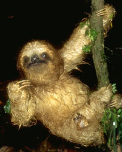

# Edentata

## Anteaters, sloths, armadillos 

## Phylogeny 

-   « Ancestral Groups  
    -   [Eutheria](Eutheria.md)
    -   [Mammal](Mammal.md)
    -   [Therapsida](../../../Therapsida.md)
    -   [Synapsida](../../../../Synapsida.md)
    -   [Amniota](../../../../../Amniota.md)
    -   [Terrestrial Vertebrates](../../../../../../Terrestrial.md)
    -   [Sarcopterygii](../../../../../../../Sarc.md)
    -   [Gnathostomata](../../../../../../../../Gnath.md)
    -   [Vertebrata](../../../../../../../../../Vertebrata.md)
    -   [Craniata](../../../../../../../../../../Craniata.md)
    -   [Chordata](../../../../../../../../../../../Chordata.md)
    -   [Deuterostomia](../../../../../../../../../../../../Deutero.md)
    -   [Bilateria](Bilateria)
    -   [Animals](Animals)
    -   [Eukaryotes](Eukaryotes)
    -   [Tree of Life](../../../../../../../../../../../../../../../Tree_of_Life.md)

-   ◊ Sibling Groups of  Eutheria
    -   Edentata
    -   [Pholidota](Pholidota.md)
    -   [Lagomorpha](Lagomorpha.md)
    -   [Rodentia](Rodentia.md)
    -   [Macroscelididae](Macroscelididae.md)
    -   [Primates](Primates.md)
    -   [Scandentia](Scandentia.md)
    -   [Chiroptera](Chiroptera.md)
    -   [Dermoptera](Dermoptera.md)
    -   [Insectivora](Insectivora.md)
    -   [Carnivora](Carnivora.md)
    -   [Artiodactyla](Artiodactyla.md)
    -   [Whale](Whale.md)
    -   [Tubulidentata](Tubulidentata.md)
    -   [Perissodactyla](Perissodactyla.md)
    -   [Hyracoidea](Hyracoidea.md)
    -   [Sirenia](Sirenia.md)
    -   [Proboscidea](Eukaryotes/Animals/Bilateria/Deutero/Chordata/Craniata/Vertebrata/Gnath/Sarc/Terrestrial/Amniota/Synapsida/Therapsida/Mammal/Eutheria/Proboscidea.md)

-   » Sub-Groups 

### Information on the Internet

-   [Order     Xenarthra](http://animaldiversity.ummz.umich.edu/chordata/mammalia/xenarthra.html).
    Animal Diversity Web. University of Michigan Museum of Zoology.
-   [Anteaters](http://library.thinkquest.org/11922/mammals/anteater.htm).
    Virtual Zoo.
-   [The Sloth     Website](http://www.museum.state.il.us/exhibits/larson/sloth.html).
-   [Ground     Sloths](http://www.museum.state.il.us/exhibits/larson/sloth.html).
    Illinois State Museum.
-   [Armadillo Central](http://www.everwonder.com/david/armadillo/).
-   [Armadillo Online](http://www.msu.edu/%7Enixonjos/armadillo/).

## Title Illustrations

-   Three-toed sloth (Bradypus variegatus, Bradypodidae) in lowland rain
forest, La Selva Biological Station, Costa Rica.\
Photograph copyright © 2000 [Greg and Mary Beth     Dimijian](http://www.dimijianimages.com/).
-   Armadillo, Sequoyah National Wildlife Refuge, Oklahoma.\
Photograph by John and Karen Hollingsworth. Courtesy of U.S. Fish
and Wildlife Service.
-   Tamandua or lesser anteater (Tamandua mexicana, Myrmecophagidae)
feeding on ants on tree trunk close to ground in lowland tropical
rain forest, La Selva Biological Station, Costa Rica.\
Photograph copyright © 2000 [Greg and Mary Beth     Dimijian](http://www.dimijianimages.com/).

----------------------------------------------------------------------------

Copyright ::   © 2000 [Greg and Marybeth Dimijian](http://www.dimijianimages.com/) 

Copyright ::   © 2000 [Greg and Marybeth Dimijian](http://www.dimijianimages.com/) 

## Confidential Links & Embeds: 

### [Edentata](/_Standards/bio/bio~Domain/Eukaryotes/Animals/Bilateria/Deutero/Chordata/Craniata/Vertebrata/Gnath/Sarc/Tetrapods/Amniota/Synapsida/Therapsida/Mammal/Eutheria/Edentata.md) 

### [Edentata.public](/_public/bio/bio~Domain/Eukaryotes/Animals/Bilateria/Deutero/Chordata/Craniata/Vertebrata/Gnath/Sarc/Tetrapods/Amniota/Synapsida/Therapsida/Mammal/Eutheria/Edentata.public.md) 

### [Edentata.internal](/_internal/bio/bio~Domain/Eukaryotes/Animals/Bilateria/Deutero/Chordata/Craniata/Vertebrata/Gnath/Sarc/Tetrapods/Amniota/Synapsida/Therapsida/Mammal/Eutheria/Edentata.internal.md) 

### [Edentata.protect](/_protect/bio/bio~Domain/Eukaryotes/Animals/Bilateria/Deutero/Chordata/Craniata/Vertebrata/Gnath/Sarc/Tetrapods/Amniota/Synapsida/Therapsida/Mammal/Eutheria/Edentata.protect.md) 

### [Edentata.private](/_private/bio/bio~Domain/Eukaryotes/Animals/Bilateria/Deutero/Chordata/Craniata/Vertebrata/Gnath/Sarc/Tetrapods/Amniota/Synapsida/Therapsida/Mammal/Eutheria/Edentata.private.md) 

### [Edentata.personal](/_personal/bio/bio~Domain/Eukaryotes/Animals/Bilateria/Deutero/Chordata/Craniata/Vertebrata/Gnath/Sarc/Tetrapods/Amniota/Synapsida/Therapsida/Mammal/Eutheria/Edentata.personal.md) 

### [Edentata.secret](/_secret/bio/bio~Domain/Eukaryotes/Animals/Bilateria/Deutero/Chordata/Craniata/Vertebrata/Gnath/Sarc/Tetrapods/Amniota/Synapsida/Therapsida/Mammal/Eutheria/Edentata.secret.md)

