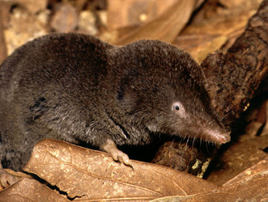

# [[Insectivora]] 

## #has_/text_of_/abstract 

> The order **Insectivora** (from Latin insectum "insect" and vorare "to eat") 
> is a now-abandoned biological grouping within the class of mammals. 
> 
> Some species have now been moved out, leaving the remaining ones in the order Eulipotyphla within the larger clade Laurasiatheria, which makes up one of the basal clades of placental mammals.
>
> [Wikipedia](https://en.wikipedia.org/wiki/Insectivora)

## Phylogeny 

-   « Ancestral Groups  
    -   [Eutheria](Eutheria.md)
    -   [Mammal](Mammal.md)
    -   [Therapsida](../../../Therapsida.md)
    -   [Synapsida](../../../../Synapsida.md)
    -   [Amniota](../../../../../Amniota.md)
    -   [Terrestrial Vertebrates](../../../../../../Terrestrial.md)
    -   [Sarcopterygii](../../../../../../../Sarc.md)
    -   [Gnathostomata](../../../../../../../../Gnath.md)
    -   [Vertebrata](../../../../../../../../../Vertebrata.md)
    -   [Craniata](../../../../../../../../../../Craniata.md)
    -   [Chordata](../../../../../../../../../../../Chordata.md)
    -   [Deuterostomia](../../../../../../../../../../../../Deutero.md)
    -   [Bilateria](Bilateria)
    -   [Animals](Animals)
    -   [Eukaryotes](Eukaryotes)
    -   [Tree of Life](../../../../../../../../../../../../../../../Tree_of_Life.md)

-   ◊ Sibling Groups of  Eutheria
    -   [Edentata](Edentata.md)
    -   [Pholidota](Pholidota.md)
    -   [Lagomorpha](Lagomorpha.md)
    -   [Rodentia](Rodentia.md)
    -   [Macroscelididae](Macroscelididae.md)
    -   [Primates](Primates.md)
    -   [Scandentia](Scandentia.md)
    -   [Chiroptera](Chiroptera.md)
    -   [Dermoptera](Dermoptera.md)
    -   Insectivora
    -   [Carnivora](Carnivora.md)
    -   [Artiodactyla](Artiodactyla.md)
    -   [Whale](Whale.md)
    -   [Tubulidentata](Tubulidentata.md)
    -   [Perissodactyla](Perissodactyla.md)
    -   [Hyracoidea](Hyracoidea.md)
    -   [Sirenia](Sirenia.md)
    -   [Proboscidea](Eukaryotes/Animals/Bilateria/Deutero/Chordata/Craniata/Vertebrata/Gnath/Sarc/Terrestrial/Amniota/Synapsida/Therapsida/Mammal/Eutheria/Proboscidea.md)

-   » Sub-Groups
    -   [Chrysochloridae](Chrysochloridae.md)
    -   [Tenrecidae](Tenrecidae.md)

	-   *Sespedectidae* †
	-   *Amphilemuridae* †
	-   *Adapisoricidae* †
	-   *Creotarsidae* †
	-   *Proscalopidae* †
	-   *Dimylidae* †
	-   *Otlestidae* †
	-   *Geolabididae* †
	-   *Nesophontidae* † [(West Indian shrews)]
	-   *Micropternodontidae* †
	-   *Apternodontidae* †
	-   *Plesiosoricidae* †
	-   *Nyctitheriidae* †

### Information on the Internet

-   [Order     Insectivora](http://animaldiversity.ummz.umich.edu/chordata/mammalia/insectivora.html).
    Animal Diversity Web. University of Michigan Museum of Zoology.
-   [Insectivore Specialist     Group](http://members.vienna.at/shrew/itses.html). IUCN - The World
    Conservation Union. Species Survival Commission.
-   [Afrotheria Specialist     Group](http://www.calacademy.org/research/bmammals/afrotheria/ASG.html).
    IUCN - The World Conservation Union. Species Survival Commission.
-   [European Hedgehog Research     Group](http://www.ngo.grida.no/ngo/hedgehog/).
-   [The Shrew(-ist\'s)     Site](http://members.vienna.at/shrew/index.html). A Contribution to
    Promote the Investigation of the Biology of the Soricidae
    (Insectivora - Mammalia).

## Title Illustrations

-----------------------------------------------------------------------

Scientific Name ::     Blarina carolinensis
Location ::           Durham, North Carolina, USA
Comments             Found while raking leaves\--captured briefly, posed, and released. Identified as Blarina carolinesis based on Webster et al., Mammals of the Carolinas, Virginia, and Maryland.
Specimen Condition   Live Specimen
Identified By        Patrick Coin
Source               [Southern Short-tailed Shrew](http://flickr.com/photos/pcoin/99051987)
Source Collection    [Flickr](http://flickr.com/)
Image Use ::    [Attribution-NonCommercial-NoDerivs 2.5 Creative Commons License](http://creativecommons.org/licenses/by-nc-nd/2.5/).
Copyright ::            © 2004 [Patrick Coin](http://cotinis.com/) 

-----------------------------------------------------------------------

Scientific Name ::     Atelerix albiventris
Location ::           Serengeti NP, Tanzania
Specimen Condition   Live Specimen
Identified By        self
Behavior             walking
Life Cycle Stage ::     adult
Body Part            whole
View                 ventral
Copyright ::            © 2006 [David Bygott](mailto:davidbygott@yahoo.com) 

