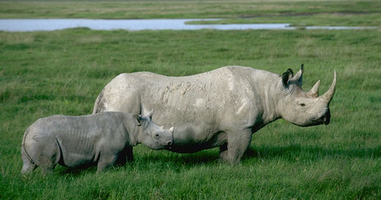

# [[Perissodactyla]]

## Odd-toed ungulates 

## #has_/text_of_/abstract 

> **Perissodactyla** (, from Ancient Greek  περισσός, perissós 'odd' and  δάκτυλος, dáktylos 'finger, toe'), or odd-toed ungulates, is an order of ungulates. The order includes about 17 living species divided into three families: Equidae (horses, asses, and zebras), Rhinocerotidae (rhinoceroses), and Tapiridae (tapirs). They typically have reduced the weight-bearing toes to three or one of the five original toes, though tapirs retain four toes on their front feet. The nonweight-bearing toes are either present, absent, vestigial, or positioned posteriorly. By contrast, artiodactyls (even-toed ungulates) bear most of their weight equally on four or two (an even number) of the five toes: their third and fourth toes. Another difference between the two is that perissodactyls digest plant cellulose in their intestines, rather than in one or more stomach chambers as artiodactyls, with the exception of Suina, do.
>
> The order was considerably more diverse in the past, with notable extinct groups including the brontotheres, palaeotheres, chalicotheres, and the paraceratheres, with the paraceratheres including the largest known land mammals to have ever existed.
>
> Despite their very different appearances, they were recognized as related families in the 19th century by the zoologist Richard Owen, who also coined the order's name.
>
> [Wikipedia](https://en.wikipedia.org/wiki/Perissodactyla) 

## Phylogeny 

-   « Ancestral Groups  
    -   [Eutheria](Eutheria.md)
    -   [Mammal](Mammal.md)
    -   [Therapsida](../../../Therapsida.md)
    -   [Synapsida](../../../../Synapsida.md)
    -   [Amniota](../../../../../Amniota.md)
    -   [Terrestrial Vertebrates](../../../../../../Terrestrial.md)
    -   [Sarcopterygii](../../../../../../../Sarc.md)
    -   [Gnathostomata](../../../../../../../../Gnath.md)
    -   [Vertebrata](../../../../../../../../../Vertebrata.md)
    -   [Craniata](../../../../../../../../../../Craniata.md)
    -   [Chordata](../../../../../../../../../../../Chordata.md)
    -   [Deuterostomia](../../../../../../../../../../../../Deutero.md)
    -   [Bilateria](Bilateria)
    -   [Animals](Animals)
    -   [Eukaryotes](Eukaryotes)
    -   [Tree of Life](../../../../../../../../../../../../../../../Tree_of_Life.md)

-   ◊ Sibling Groups of  Eutheria
    -   [Edentata](Edentata.md)
    -   [Pholidota](Pholidota.md)
    -   [Lagomorpha](Lagomorpha.md)
    -   [Rodentia](Rodentia.md)
    -   [Macroscelididae](Macroscelididae.md)
    -   [Primates](Primates.md)
    -   [Scandentia](Scandentia.md)
    -   [Chiroptera](Chiroptera.md)
    -   [Dermoptera](Dermoptera.md)
    -   [Insectivora](Insectivora.md)
    -   [Carnivora](Carnivora.md)
    -   [Artiodactyla](Artiodactyla.md)
    -   [Whale](Whale.md)
    -   [Tubulidentata](Tubulidentata.md)
    -   Perissodactyla
    -   [Hyracoidea](Hyracoidea.md)
    -   [Sirenia](Sirenia.md)
    -   [Proboscidea](Eukaryotes/Animals/Bilateria/Deutero/Chordata/Craniata/Vertebrata/Gnath/Sarc/Terrestrial/Amniota/Synapsida/Therapsida/Mammal/Eutheria/Proboscidea.md)

-   » Sub-Groups 

	-   *[Equidae](Perissodactyla/Equidae.md)* (horses, zebras, asses & extinct relatives)
	-   *Palaeotheriidae* †
	-   *Brontotheriidae* †
	-   *Anchilophidae* †
	-   *Eomoropidae* †
	-   *Chalicotheriidae* †
	-   *Hyracodontidae* †
	-   *[Rhinoceros](Perissodactyla/Rhinoceros.md)* (rhinoceroses & extinct relatives)
	-   *Helaletidae* †
	-   *Isectolophidae* †
	-   *Lophiodontidae* †
	-   *Deperetellidae* †
	-   *Lophialetidae* †
	-   *[Tapir](Perissodactyla/Tapir.md)* (tapirs & extinct relatives)

### Information on the Internet

-   [Introduction to the     Perissodactyla](http://www.ucmp.berkeley.edu/mammal/mesaxonia/perissodactyla.html).
    UCMP Berkeley.
-   [Order     Perissodactyla](http://animaldiversity.ummz.umich.edu/chordata/mammalia/perissodactyla.html).
    Animal Diversity Web. University of Michigan Museum of Zoology.
-   [Perissodactyla](http://www.ultimateungulate.com/perissodactyla.html).
    The Ultimate Ungulate Page.
-   [Horse     Evolution](http://www.talkorigins.org/faqs/horses/horse_evol.html).
    by Kathleen Hunt, the Talk.Origins Archive.
-   [Fossil Horses in     Cyberspace](http://www.flmnh.ufl.edu/natsci/vertpaleo/fhc/fhc.htm).
    Florida Museum of Natural History.
-   [International Museum of the     Horse](http://www.imh.org/imh/imhmain.html). Kentucky Horse Park.
-   [Herds of Information About     Zebras](http://www.alumni.caltech.edu/%7Ekantner/zebras/).
-   [The Quagga Project](http://www.quaggaproject.org/). South African
    Museum.
-   [International Rhino Foundation](http://www.rhinos-irf.org/).
-   [SOS Rhino](http://www.sosrhino.org/index.php).
-   [The Tapir Gallery](http://www.tapirback.com/tapirgal/).
-   [Tapir Specialist Group](http://www.tapirspecialistgroup.org/).
    IUCN - The World Conservation Union. Species Survival Commission.
-   [What\'s a Tapir?](http://www.tapir.org/about_tapir.html)

## Title Illustrations

------------------------------------------------------------------------------

Scientific Name ::     Diceros bicornis
Specimen Condition   Live Specimen
Copyright ::            © 2000 [Greg and Marybeth Dimijian](http://www.dimijianimages.com/) 

## Confidential Links & Embeds: 

### [Perissodactyla](/_Standards/bio/bio~Domain/Eukaryotes/Animals/Bilateria/Deutero/Chordata/Craniata/Vertebrata/Gnath/Sarc/Tetrapods/Amniota/Synapsida/Therapsida/Mammal/Eutheria/Perissodactyla.md) 

### [Perissodactyla.public](/_public/bio/bio~Domain/Eukaryotes/Animals/Bilateria/Deutero/Chordata/Craniata/Vertebrata/Gnath/Sarc/Tetrapods/Amniota/Synapsida/Therapsida/Mammal/Eutheria/Perissodactyla.public.md) 

### [Perissodactyla.internal](/_internal/bio/bio~Domain/Eukaryotes/Animals/Bilateria/Deutero/Chordata/Craniata/Vertebrata/Gnath/Sarc/Tetrapods/Amniota/Synapsida/Therapsida/Mammal/Eutheria/Perissodactyla.internal.md) 

### [Perissodactyla.protect](/_protect/bio/bio~Domain/Eukaryotes/Animals/Bilateria/Deutero/Chordata/Craniata/Vertebrata/Gnath/Sarc/Tetrapods/Amniota/Synapsida/Therapsida/Mammal/Eutheria/Perissodactyla.protect.md) 

### [Perissodactyla.private](/_private/bio/bio~Domain/Eukaryotes/Animals/Bilateria/Deutero/Chordata/Craniata/Vertebrata/Gnath/Sarc/Tetrapods/Amniota/Synapsida/Therapsida/Mammal/Eutheria/Perissodactyla.private.md) 

### [Perissodactyla.personal](/_personal/bio/bio~Domain/Eukaryotes/Animals/Bilateria/Deutero/Chordata/Craniata/Vertebrata/Gnath/Sarc/Tetrapods/Amniota/Synapsida/Therapsida/Mammal/Eutheria/Perissodactyla.personal.md) 

### [Perissodactyla.secret](/_secret/bio/bio~Domain/Eukaryotes/Animals/Bilateria/Deutero/Chordata/Craniata/Vertebrata/Gnath/Sarc/Tetrapods/Amniota/Synapsida/Therapsida/Mammal/Eutheria/Perissodactyla.secret.md)

