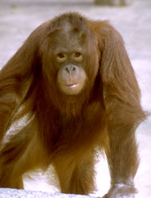
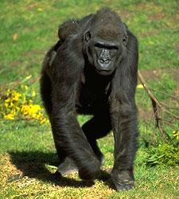

# [[Hominidae]]

#is_/instance_of :: [[../../../../../../../../../../../../../../../bio~Domain/Eukaryotes/Animals/Bilateria/bio~Class/bio~Order/bio~Family|bio~Family]] 

## Humans, great apes, and their extinct relatives 

   

Hominidae is a biological family commonly referred to as the great apes or hominids. This family includes humans (Homo sapiens) as well as several other closely related species. Hominidae belongs to the order Primates and the superfamily Hominoidea.

## #has_/text_of_/abstract 

> The **Hominidae** (), whose members are known as the great apes or hominids, 
> are a taxonomic family of primates that includes eight extant species in four genera: 
> - Pongo (the Bornean, Sumatran and Tapanuli orangutan); 
> - Gorilla (the eastern and western gorilla); 
> - Pan (the chimpanzee and the bonobo); and 
> - Homo, of which only modern humans (Homo sapiens) remain.
>
> Numerous revisions in classifying the great apes have caused the use of the term hominid to change over time. The original meaning of "hominid" referred only to humans (Homo) and their closest extinct relatives. However, by the 1990s humans and other apes were considered to be "hominids".
>
> The earlier restrictive meaning has now been largely assumed by the term hominin, which comprises all members of the human clade after the split from the chimpanzees (Pan). The current meaning of "hominid" includes all the great apes including humans. Usage still varies, however, and some scientists and laypersons still use "hominid" in the original restrictive sense; the scholarly literature generally shows the traditional usage until the turn of the 21st century.
>
> Within the taxon Hominidae, a number of extant and extinct genera are grouped with the humans, chimpanzees, and gorillas in the subfamily Homininae; others with orangutans in the subfamily Ponginae (see classification graphic below). The most recent common ancestor of all Hominidae lived roughly 14 million years ago, when the ancestors of the orangutans speciated from the ancestral line of the other three genera. Those ancestors of the family Hominidae had already speciated from the family Hylobatidae (the gibbons), perhaps 15 to 20 million years ago.
>
> Due to the close genetic relationship between humans and the other great apes, certain animal rights organizations, such as the Great Ape Project, argue that nonhuman great apes are persons and should be given basic human rights. Twenty-nine countries have instituted research bans to protect great apes from any kind of scientific testing.
>
> [Wikipedia](https://en.wikipedia.org/wiki/Hominidae) 

## SubSpecies 

Key members of the Hominidae family include:

### Homo sapiens (humans):
The only surviving species of the genus Homo, characterized by their bipedal locomotion, large brains, and complex social behaviors. Humans are widespread and highly adaptable, inhabiting diverse environments around the world.

### Pan troglodytes (chimpanzees):
Chimpanzees are native to the forests of central and west Africa. They are highly intelligent and exhibit complex social behaviors, including tool use and cultural traditions. Chimpanzees are our closest living relatives, sharing a common ancestor with humans approximately 6-8 million years ago.

### Pan paniscus (bonobos): 
Bonobos, also known as pygmy chimpanzees, are closely related to chimpanzees and share approximately 98% of their DNA with humans. They are native to the forests of the Democratic Republic of Congo in central Africa. Bonobos are known for their peaceful and egalitarian social structure, as well as their frequent use of sexual behavior for conflict resolution.

### Gorilla spp. (gorillas): 
Gorillas are the largest living primates and are native to the forests of central Africa. They are divided into two species: the eastern gorilla (Gorilla beringei) and the western gorilla (Gorilla gorilla). Gorillas are primarily herbivorous and live in stable social groups led by dominant males.

### Pongo spp. (orangutans): 
Orangutans are native to the forests of Indonesia and Malaysia in Southeast Asia. They are the only great apes found outside of Africa. Orangutans are highly arboreal, spending most of their time in trees, and are known for their distinctive reddish-brown hair and long arms.

Hominidae species share many anatomical and behavioral traits, including opposable thumbs, complex social structures, and the ability to use tools. They also exhibit diverse forms of communication and cognitive abilities.

Studying Hominidae species provides insights into human evolution, behavior, and biology, as well as our relationships with other primates and our impact on the natural world.

## Phylogeny 

## Phylogeny 

-   « Ancestral Groups  
    -   [Catarrhini](Catarrhini.md)
    -   [Primates](Primates.md)
    -   [Eutheria](Eutheria.md)
    -   [Mammal](Mammal.md)
    -   [Therapsida](../../../../../Therapsida.md)
    -   [Synapsida](../../../../../../Synapsida.md)
    -   [Amniota](../../../../../../../Amniota.md)
    -   [Terrestrial Vertebrates](../../../../../../../../Terrestrial.md)
    -   [Sarcopterygii](../../../../../../../../../Sarc.md)
    -   [Gnathostomata](../../../../../../../../../../Gnath.md)
    -   [Vertebrata](../../../../../../../../../../../Vertebrata.md)
    -   [Craniata](../../../../../../../../../../../../Craniata.md)
    -   [Chordata](../../../../../../../../../../../../../Chordata.md)
    -   [Deuterostomia](../../../../../../../../../../../../../../Deutero.md)
    -   [Bilateria](Bilateria)
    -   [Animals](Animals)
    -   [Eukaryotes](Eukaryotes)
    -   [Tree of Life](../../../../../../../../../../../../../../../../../Tree_of_Life.md)

-   ◊ Sibling Groups of  Catarrhini
    -   [Cercopithecidae](Cercopithecidae.md)
    -   Hominidae
    -   [Gibbon](Gibbon.md)

-   » Sub-Groups
    -   [Orangutan](Hominidae/Orangutan.md)
    -   [Pan](Pan.md)
    -   [Homo](Homo.md)
    -   [Gorilla](Gorilla.md)

## Title Illustrations 

  ------------------------------------------------------------------------------
  Scientific Name ::     Pan troglodytes
  Location ::           Sweetwaters Game Reserve, Kenya
  Comments             chimpanzee
  Creator              Photograph by Gerald and Buff Corsi
  Specimen Condition   Live Specimen
  Source Collection    [CalPhotos](http://calphotos.berkeley.edu/)
  Copyright ::            © 2002 [California Academy of Sciences](http://www.calacademy.org/) 
  ------------------------------------------------------------------------------

  ------------------------------------------------------------------------------
  Scientific Name ::     Gorilla gorilla gorilla
  Location ::           San Francisco Zoo, San Francisco, California (US)
  Comments             Lowland gorilla
  Creator              Photograph by Gerald and Buff Corsi
  Specimen Condition   Live Specimen
  Source Collection    [CalPhotos](http://calphotos.berkeley.edu/)
  Copyright ::            © 2001 [California Academy of Sciences](http://www.calacademy.org/) 
  ------------------------------------------------------------------------------

  ------------------------------------------------------------------------------
  Scientific Name ::     Pongo pygmaeus
  Location ::           San Francisco Zoo, San Francisco, California (US)
  Comments             Orangutan
  Creator              Photo by H. Vannoy Davis
  Specimen Condition   Live Specimen
  Source Collection    [CalPhotos](http://calphotos.berkeley.edu/)
  Copyright ::            © 2001 [California Academy of Sciences](http://www.calacademy.org/) 
  ------------------------------------------------------------------------------

## Confidential Links & Embeds: 

### #is_/same_as :: [Hominidae](/_Standards/bio/bio~Domain/Eukaryotes/Animals/Bilateria/Deutero/Chordata/Craniata/Vertebrata/Gnath/Sarc/Tetrapods/Amniota/Synapsida/Therapsida/Mammal/Eutheria/Primates/Catarrhini/Hominidae.md) 

### #is_/same_as :: [Hominidae.public](/_public/bio/bio~Domain/Eukaryotes/Animals/Bilateria/Deutero/Chordata/Craniata/Vertebrata/Gnath/Sarc/Tetrapods/Amniota/Synapsida/Therapsida/Mammal/Eutheria/Primates/Catarrhini/Hominidae.public.md) 

### #is_/same_as :: [Hominidae.internal](/_internal/bio/bio~Domain/Eukaryotes/Animals/Bilateria/Deutero/Chordata/Craniata/Vertebrata/Gnath/Sarc/Tetrapods/Amniota/Synapsida/Therapsida/Mammal/Eutheria/Primates/Catarrhini/Hominidae.internal.md) 

### #is_/same_as :: [Hominidae.protect](/_protect/bio/bio~Domain/Eukaryotes/Animals/Bilateria/Deutero/Chordata/Craniata/Vertebrata/Gnath/Sarc/Tetrapods/Amniota/Synapsida/Therapsida/Mammal/Eutheria/Primates/Catarrhini/Hominidae.protect.md) 

### #is_/same_as :: [Hominidae.private](/_private/bio/bio~Domain/Eukaryotes/Animals/Bilateria/Deutero/Chordata/Craniata/Vertebrata/Gnath/Sarc/Tetrapods/Amniota/Synapsida/Therapsida/Mammal/Eutheria/Primates/Catarrhini/Hominidae.private.md) 

### #is_/same_as :: [Hominidae.personal](/_personal/bio/bio~Domain/Eukaryotes/Animals/Bilateria/Deutero/Chordata/Craniata/Vertebrata/Gnath/Sarc/Tetrapods/Amniota/Synapsida/Therapsida/Mammal/Eutheria/Primates/Catarrhini/Hominidae.personal.md) 

### #is_/same_as :: [Hominidae.secret](/_secret/bio/bio~Domain/Eukaryotes/Animals/Bilateria/Deutero/Chordata/Craniata/Vertebrata/Gnath/Sarc/Tetrapods/Amniota/Synapsida/Therapsida/Mammal/Eutheria/Primates/Catarrhini/Hominidae.secret.md)

