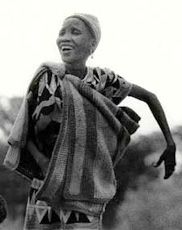

#is_/instance_of :: [[../../../../../../../../../../../../../../../../../bio~Domain/Eukaryotes/Animals/Bilateria/bio~Class/bio~Order/bio~Family/bio~Genus/bio~Species|bio~Species]] 

# [[Homo_sapiens]] 

## Modern humans 

      

## #has_/text_of_/abstract 

> Humans (**Homo sapiens**) or modern humans are the most common and 
> widespread species of primate, and the last surviving species of the genus Homo. 
> 
> They are great apes characterized by their hairlessness, bipedalism, and high intelligence. 
> 
> Humans have large brains, enabling more advanced cognitive skills 
> that facilitate successful adaptation to varied environments, 
> development of sophisticated tools, 
> and formation of complex social structures and civilizations. 
>
> Humans are highly social, with individual humans tending to 
> belong to a multi-layered network of distinct social groups — 
> from families and peer groups to corporations and political states. 
> 
> As such, social interactions between humans have established a wide variety of values, social norms, languages, and traditions (collectively termed institutions), each of which bolsters human society. Humans are also highly curious: the desire to understand and influence phenomena has motivated humanity's development of science, technology, philosophy, mythology, religion, and other frameworks of knowledge; humans also study themselves through such domains as anthropology, social science, history, psychology, and medicine. As of 2025, there are estimated to be more than 8 billion living humans.
>
> For most of their history, humans were nomadic hunter-gatherers. Humans began exhibiting behavioral modernity about 160,000–60,000 years ago. The Neolithic Revolution occurred independently in multiple locations, the earliest in Southwest Asia 13,000 years ago, and saw the emergence of agriculture and permanent human settlement; in turn, this led to the development of civilization and kickstarted a period of continuous (and ongoing) population growth and rapid technological change. Since then, a number of civilizations have risen and fallen, while a number of sociocultural and technological developments have resulted in significant changes to the human lifestyle. 
>
> Humans are omnivorous, capable of consuming a wide variety of plant and animal material, and have used fire and other forms of heat to prepare and cook food since the time of Homo erectus. Humans are generally diurnal, sleeping on average seven to nine hours per day. Humans have had a dramatic effect on the environment. They are apex predators, being rarely preyed upon by other species. Human population growth, industrialization, land development, overconsumption and combustion of fossil fuels have led to environmental destruction and pollution that significantly contributes to the ongoing mass extinction of other forms of life. Within the last century, humans have explored challenging environments such as Antarctica, the deep sea, and outer space, though human habitation in these environments is typically limited in duration and restricted to scientific, military, or industrial expeditions. Humans have visited the Moon and sent human-made spacecraft to other celestial bodies, becoming the first known species to do so.
>
> Although the term "humans" technically equates with all members of the genus Homo, in common usage it generally refers to Homo sapiens, the only extant member. All other members of the genus Homo, which are now extinct, are known as archaic humans, and the term "modern human" is used to distinguish Homo sapiens from archaic humans. Anatomically modern humans emerged around 300,000 years ago in Africa, evolving from Homo heidelbergensis or a similar species. Migrating out of Africa, they gradually replaced and interbred with local populations of archaic humans. Multiple hypotheses for the extinction of archaic human species such as Neanderthals include competition, violence, interbreeding with Homo sapiens, or inability to adapt to climate change. Genes and the environment influence human biological variation in visible characteristics, physiology, disease susceptibility, mental abilities, body size, and life span. Though humans vary in many traits (such as genetic predispositions and physical features), humans are among the least genetically diverse primates. Any two humans are at least 99% genetically similar.
>
> Humans are sexually dimorphic: generally, males have greater body strength and females have a higher body fat percentage. At puberty, humans develop secondary sex characteristics. Females are capable of pregnancy, usually between puberty, at around 12 years old, and menopause, around the age of 50. Childbirth is dangerous, with a high risk of complications and death. Often, both the mother and the father provide care for their children, who are helpless at birth.
>
> [Wikipedia](https://en.wikipedia.org/wiki/Human) 

## Phylogeny 

-   « Ancestral Groups  in ascending Order 
    -   [Homo](Homo.md)
    -   [Hominidae](Hominidae.md)
    -   [Catarrhini](Catarrhini.md)
    -   [Primates](Primates.md)
    -   [Eutheria](Eutheria.md)
    -   [Mammal](Mammal.md)
    -   [Therapsida](../../../../../../../Therapsida.md)
    -   [Synapsida](../../../../../../../../Synapsida.md)
    -   [Amniota](../../../../../../../../../Amniota.md)
    -   [Terrestrial Vertebrates](../../../../../../../../../../Terrestrial.md)
    -   [Sarcopterygii](../../../../../../../../../../../Sarc.md)
    -   [Gnathostomata](../../../../../../../../../../../../Gnath.md)
    -   [Vertebrata](../../../../../../../../../../../../../Vertebrata.md)
    -   [Craniata](../../../../../../../../../../../../../../Craniata.md)
    -   [Chordata](../../../../../../../../../../../../../../../Chordata.md)
    -   [Deuterostomia](../../../../../../../../../../../../../../../../Deutero.md)
    -   [Bilateria](Bilateria)
    -   [Animals](Animals)
    -   [Eukaryotes](Eukaryotes)
    -   [Tree of Life](../../../../../../../../../../../../../../../../../../../Tree_of_Life.md)

-   ◊ No Sibling Groups of  Homo

-   » No Sub-Groups of Homo 

## Title Illustrations

  ------------------------------------------
  Scientific Name ::   Homo sapiens
  Location ::         England
  Comments           A European male. Charles Darwin at age 72 on the veranda at Down.
  Creator            Photograph by J. Kirschner
  Acknowledgements   Courtesy Department of Library Services [American Museum of Natural History](http://www.amnh.org/) (Neg. No. 105168).
  ------------------------------------------

  --------------------------
  Scientific Name ::   Homo sapiens
  Location ::         Xishuangbana, Yunnan Province, China
  Comments           Children of the Dai minority in a schoolyard
  Sex ::              Female
  Life Cycle Stage ::   children
  Copyright ::          © 1993 [Ethan Michelson](http://www.indiana.edu/%7Eemsoc/index.html)
  --------------------------

  ----------------------
  Scientific Name ::  Homo sapiens
  Location ::        Botswana
  Comments          Woman of the !Kung bushmen
  Copyright ::         © 1997 [Rodney Barnett](http://www.arts-net.com/barnett/)
  ----------------------

## Confidential Links & Embeds: 

### #is_/same_as :: [Homo_sapiens](/_Standards/bio/bio~Domain/Eukaryotes/Animals/Bilateria/Deutero/Chordata/Craniata/Vertebrata/Gnath/Sarc/Tetrapods/Amniota/Synapsida/Therapsida/Mammal/Eutheria/Primates/Catarrhini/Hominidae/Homo/Homo_sapiens.md) 

### #is_/same_as :: [Homo_sapiens.public](/_public/bio/bio~Domain/Eukaryotes/Animals/Bilateria/Deutero/Chordata/Craniata/Vertebrata/Gnath/Sarc/Tetrapods/Amniota/Synapsida/Therapsida/Mammal/Eutheria/Primates/Catarrhini/Hominidae/Homo/Homo_sapiens.public.md) 

### #is_/same_as :: [Homo_sapiens.internal](/_internal/bio/bio~Domain/Eukaryotes/Animals/Bilateria/Deutero/Chordata/Craniata/Vertebrata/Gnath/Sarc/Tetrapods/Amniota/Synapsida/Therapsida/Mammal/Eutheria/Primates/Catarrhini/Hominidae/Homo/Homo_sapiens.internal.md) 

### #is_/same_as :: [Homo_sapiens.protect](/_protect/bio/bio~Domain/Eukaryotes/Animals/Bilateria/Deutero/Chordata/Craniata/Vertebrata/Gnath/Sarc/Tetrapods/Amniota/Synapsida/Therapsida/Mammal/Eutheria/Primates/Catarrhini/Hominidae/Homo/Homo_sapiens.protect.md) 

### #is_/same_as :: [Homo_sapiens.private](/_private/bio/bio~Domain/Eukaryotes/Animals/Bilateria/Deutero/Chordata/Craniata/Vertebrata/Gnath/Sarc/Tetrapods/Amniota/Synapsida/Therapsida/Mammal/Eutheria/Primates/Catarrhini/Hominidae/Homo/Homo_sapiens.private.md) 

### #is_/same_as :: [Homo_sapiens.personal](/_personal/bio/bio~Domain/Eukaryotes/Animals/Bilateria/Deutero/Chordata/Craniata/Vertebrata/Gnath/Sarc/Tetrapods/Amniota/Synapsida/Therapsida/Mammal/Eutheria/Primates/Catarrhini/Hominidae/Homo/Homo_sapiens.personal.md) 

### #is_/same_as :: [Homo_sapiens.secret](/_secret/bio/bio~Domain/Eukaryotes/Animals/Bilateria/Deutero/Chordata/Craniata/Vertebrata/Gnath/Sarc/Tetrapods/Amniota/Synapsida/Therapsida/Mammal/Eutheria/Primates/Catarrhini/Hominidae/Homo/Homo_sapiens.secret.md)

