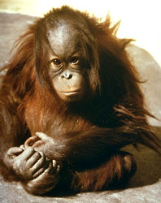

# [[Orangutan]]

#is_/same_as ::  [[../../../../../../../../../../../../../../../../../WikiData/WD~Orangutan,41050|WD~Orangutan,41050]]

## #has_/text_of_/abstract 

> **Orangutan**s are great apes native to the rainforests of Indonesia and Malaysia. They are now found only in parts of Borneo and Sumatra, but during the Pleistocene they ranged throughout Southeast Asia and South China. Classified in the genus Pongo, orangutans were originally considered to be one species. In 1996, they were divided into two species: the Bornean orangutan (P. pygmaeus, with three subspecies) and the Sumatran orangutan (P. abelii); a third species, the Tapanuli orangutan (P. tapanuliensis), was identified definitively in 2017. The orangutans are the only surviving members of the subfamily Ponginae, which diverged genetically from the other hominids (gorillas, chimpanzees, and humans) between 19.3 and 15.7 million years ago.
>
> The most arboreal of the great apes, orangutans spend most of their time in trees. They have proportionally long arms and short legs, and have reddish-brown hair covering their bodies. Adult males weigh about 75 kg (165 lb), while females weigh about 37 kg (82 lb). Dominant adult males develop distinctive cheek pads or flanges and make long calls that attract females and intimidate rivals; younger subordinate males do not and more resemble adult females. Orangutans are the most solitary of the great apes: social bonds occur primarily between mothers and their dependent offspring. Fruit is the most important component of an orangutan's diet, but they will also eat vegetation, bark, honey, insects and bird eggs. They can live over 30 years, both in the wild and in captivity.
>
> Orangutans are among the most intelligent primates. They use a variety of sophisticated tools and construct elaborate sleeping nests each night from branches and foliage. The apes' learning abilities have been studied extensively. There may be distinctive cultures within populations. Orangutans have been featured in literature and art since at least the 18th century, particularly in works that comment on human society. Field studies of the apes were pioneered by primatologist Birutė Galdikas and they have been kept in captive facilities around the world since at least the early 19th century.
>
> All three orangutan species are considered critically endangered. Human activities have caused severe declines in populations and ranges. Threats to wild orangutan populations include poaching (for bushmeat and retaliation for consuming crops), habitat destruction and deforestation (for palm oil cultivation and logging), and the illegal pet trade. Several conservation and rehabilitation organisations are dedicated to the survival of orangutans in the wild.
>
> [Wikipedia](https://en.wikipedia.org/wiki/Orangutan) 

## Phylogeny 

-   « Ancestral Groups  
    -   [Hominidae](Hominidae.md)
    -   [Catarrhini](Catarrhini.md)
    -   [Primates](Primates.md)
    -   [Eutheria](Eutheria.md)
    -   [Mammal](Mammal.md)
    -   [Therapsida](../../../../../../Therapsida.md)
    -   [Synapsida](../../../../../../../Synapsida.md)
    -   [Amniota](../../../../../../../../Amniota.md)
    -   [Terrestrial Vertebrates](../../../../../../../../../Terrestrial.md)
    -   [Sarcopterygii](../../../../../../../../../../Sarc.md)
    -   [Gnathostomata](../../../../../../../../../../../Gnath.md)
    -   [Vertebrata](../../../../../../../../../../../../Vertebrata.md)
    -   [Craniata](../../../../../../../../../../../../../Craniata.md)
    -   [Chordata](../../../../../../../../../../../../../../Chordata.md)
    -   [Deuterostomia](../../../../../../../../../../../../../../../Deutero.md)
    -   [Bilateria](Bilateria)
    -   [Animals](Animals)
    -   [Eukaryotes](Eukaryotes)
    -   [Tree of Life](../../../../../../../../../../../../../../../../../../Tree_of_Life.md)

-   ◊ Sibling Groups of  Hominidae
    -   Pongo
    -   [Pan](Pan.md)
    -   [Homo](Homo.md)
    -   [Gorilla](Gorilla.md)

-   » Sub-Groups 
	-   *Pongo abelii*
	-   *Pongo pygmaeus*
	

### Information on the Internet

-   [The Borneo Orangutan Survival Foundation     (BOS)](http://www.savetheorangutan.info/index_int.php)
-   [Sepilok Orangutan Appeal     UK](http://www.orangutan-appeal.org.uk/default.php)
-   [Orangutan and Primate Information     Center](http://www.grungyape.com/)

## Title Illustrations

  ------------------------------------------------------------------------------
  Scientific Name ::     Pongo pygmaeus
  Creator              John H. Tashjian
  Specimen Condition   Live Specimen
  Source Collection    [CalPhotos](http://calphotos.berkeley.edu/)
  Copyright ::            © 2001 [California Academy of Sciences](http://www.calacademy.org/) 
  ------------------------------------------------------------------------------

## Confidential Links & Embeds: 

### [Orangutan](/_Standards/bio/bio~Domain/Eukaryotes/Animals/Bilateria/Deutero/Chordata/Craniata/Vertebrata/Gnath/Sarc/Tetrapods/Amniota/Synapsida/Therapsida/Mammal/Eutheria/Primates/Catarrhini/Hominidae/Orangutan.md) 

### [Orangutan.public](/_public/bio/bio~Domain/Eukaryotes/Animals/Bilateria/Deutero/Chordata/Craniata/Vertebrata/Gnath/Sarc/Tetrapods/Amniota/Synapsida/Therapsida/Mammal/Eutheria/Primates/Catarrhini/Hominidae/Orangutan.public.md) 

### [Orangutan.internal](/_internal/bio/bio~Domain/Eukaryotes/Animals/Bilateria/Deutero/Chordata/Craniata/Vertebrata/Gnath/Sarc/Tetrapods/Amniota/Synapsida/Therapsida/Mammal/Eutheria/Primates/Catarrhini/Hominidae/Orangutan.internal.md) 

### [Orangutan.protect](/_protect/bio/bio~Domain/Eukaryotes/Animals/Bilateria/Deutero/Chordata/Craniata/Vertebrata/Gnath/Sarc/Tetrapods/Amniota/Synapsida/Therapsida/Mammal/Eutheria/Primates/Catarrhini/Hominidae/Orangutan.protect.md) 

### [Orangutan.private](/_private/bio/bio~Domain/Eukaryotes/Animals/Bilateria/Deutero/Chordata/Craniata/Vertebrata/Gnath/Sarc/Tetrapods/Amniota/Synapsida/Therapsida/Mammal/Eutheria/Primates/Catarrhini/Hominidae/Orangutan.private.md) 

### [Orangutan.personal](/_personal/bio/bio~Domain/Eukaryotes/Animals/Bilateria/Deutero/Chordata/Craniata/Vertebrata/Gnath/Sarc/Tetrapods/Amniota/Synapsida/Therapsida/Mammal/Eutheria/Primates/Catarrhini/Hominidae/Orangutan.personal.md) 

### [Orangutan.secret](/_secret/bio/bio~Domain/Eukaryotes/Animals/Bilateria/Deutero/Chordata/Craniata/Vertebrata/Gnath/Sarc/Tetrapods/Amniota/Synapsida/Therapsida/Mammal/Eutheria/Primates/Catarrhini/Hominidae/Orangutan.secret.md)

