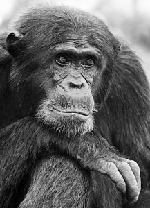
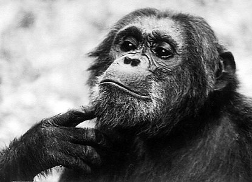

# [[Pan]] 

#is_/same_as :: [[../../../../../../../../../../../../../../../../../WikiData/WD~Pan,80174|WD~Pan,80174]] 

## Phylogeny 

-   « Ancestral Groups  
    -   [Hominidae](Hominidae.md)
    -   [Catarrhini](Catarrhini.md)
    -   [Primates](Primates.md)
    -   [Eutheria](Eutheria.md)
    -   [Mammal](Mammal.md)
    -   [Therapsida](../../../../../../Therapsida.md)
    -   [Synapsida](../../../../../../../Synapsida.md)
    -   [Amniota](../../../../../../../../Amniota.md)
    -   [Terrestrial Vertebrates](../../../../../../../../../Terrestrial.md)
    -   [Sarcopterygii](../../../../../../../../../../Sarc.md)
    -   [Gnathostomata](../../../../../../../../../../../Gnath.md)
    -   [Vertebrata](../../../../../../../../../../../../Vertebrata.md)
    -   [Craniata](../../../../../../../../../../../../../Craniata.md)
    -   [Chordata](../../../../../../../../../../../../../../Chordata.md)
    -   [Deuterostomia](../../../../../../../../../../../../../../../Deutero.md)
    -   [Bilateria](Bilateria)
    -   [Animals](Animals)
    -   [Eukaryotes](Eukaryotes)
    -   [Tree of Life](../../../../../../../../../../../../../../../../../../Tree_of_Life.md)

-   ◊ Sibling Groups of  Hominidae
    -   [Orangutan](Orangutan.md)
    -   Pan
    -   [Homo](Homo.md)
    -   [Gorilla](Gorilla.md)

-   » Sub-Groups 

	-   *Pan paniscus* [(bonobo or pygmy chimpanzee)]
	-   *Pan troglodytes* [(chimpanzee)]

### Information on the Internet

-   [The Jane Goodall Institute](http://www.janegoodall.org/).
-   [Discovering     Chimps](http://www.discoverchimpanzees.org/home/home.php). Jane
    Goodall Institute\'s Center For Primate Studies.

## Title Illustrations

-------------------------------------------------------------------------

Scientific Name ::     Pan troglodytes schweinfurthii
Location ::           Gombe National Park, Tanzania
Comments             Portrait of a prime high-ranking wild adult male
Specimen Condition   Live Specimen
Identified By        David Bygott
Sex ::                Male
Life Cycle Stage ::     Adult
Body Part            Head
View                 Frontal
Copyright ::            © 2005 [David Bygott](mailto:davidbygott@yahoo.com) 

-------------------------------------------------------------------------

Scientific Name ::     Pan troglodytes schweinfurthii
Location ::           Gombe National Park, Tanzania
Comments             Portrait of a prime high-ranking wild adult male
Specimen Condition   Live Specimen
Identified By        David Bygott
Sex ::                Male
Life Cycle Stage ::     Adult
Body Part            Head
Copyright ::            © 2005 [David Bygott](mailto:davidbygott@yahoo.com) 

## Confidential Links & Embeds: 

### #is_/same_as :: [Pan](/_Standards/bio/bio~Domain/Eukaryotes/Animals/Bilateria/Deutero/Chordata/Craniata/Vertebrata/Gnath/Sarc/Tetrapods/Amniota/Synapsida/Therapsida/Mammal/Eutheria/Primates/Catarrhini/Hominidae/Pan.md) 

### #is_/same_as :: [Pan.public](/_public/bio/bio~Domain/Eukaryotes/Animals/Bilateria/Deutero/Chordata/Craniata/Vertebrata/Gnath/Sarc/Tetrapods/Amniota/Synapsida/Therapsida/Mammal/Eutheria/Primates/Catarrhini/Hominidae/Pan.public.md) 

### #is_/same_as :: [Pan.internal](/_internal/bio/bio~Domain/Eukaryotes/Animals/Bilateria/Deutero/Chordata/Craniata/Vertebrata/Gnath/Sarc/Tetrapods/Amniota/Synapsida/Therapsida/Mammal/Eutheria/Primates/Catarrhini/Hominidae/Pan.internal.md) 

### #is_/same_as :: [Pan.protect](/_protect/bio/bio~Domain/Eukaryotes/Animals/Bilateria/Deutero/Chordata/Craniata/Vertebrata/Gnath/Sarc/Tetrapods/Amniota/Synapsida/Therapsida/Mammal/Eutheria/Primates/Catarrhini/Hominidae/Pan.protect.md) 

### #is_/same_as :: [Pan.private](/_private/bio/bio~Domain/Eukaryotes/Animals/Bilateria/Deutero/Chordata/Craniata/Vertebrata/Gnath/Sarc/Tetrapods/Amniota/Synapsida/Therapsida/Mammal/Eutheria/Primates/Catarrhini/Hominidae/Pan.private.md) 

### #is_/same_as :: [Pan.personal](/_personal/bio/bio~Domain/Eukaryotes/Animals/Bilateria/Deutero/Chordata/Craniata/Vertebrata/Gnath/Sarc/Tetrapods/Amniota/Synapsida/Therapsida/Mammal/Eutheria/Primates/Catarrhini/Hominidae/Pan.personal.md) 

### #is_/same_as :: [Pan.secret](/_secret/bio/bio~Domain/Eukaryotes/Animals/Bilateria/Deutero/Chordata/Craniata/Vertebrata/Gnath/Sarc/Tetrapods/Amniota/Synapsida/Therapsida/Mammal/Eutheria/Primates/Catarrhini/Hominidae/Pan.secret.md)

