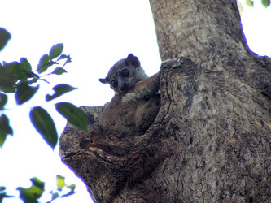

# [[Lemuridae]] 

## #has_/text_of_/abstract 

> **Lemuridae** is a family of strepsirrhine primates native to Madagascar and the Comoros. They are represented by the Lemuriformes in Madagascar with one of the highest concentration of the lemurs. One of five families commonly known as lemurs, these animals were once thought to be the evolutionary predecessors of monkeys and apes, but this is no longer considered correct. They are formally referred to as lemurids.
>
> [Wikipedia](https://en.wikipedia.org/wiki/Lemuridae)

## Phylogeny 

-   « Ancestral Groups  
    -   [Strepsirrhini](Strepsirrhini.md)
    -   [Primates](Primates.md)
    -   [Eutheria](Eutheria.md)
    -   [Mammal](Mammal.md)
    -   [Therapsida](../../../../../Therapsida.md)
    -   [Synapsida](../../../../../../Synapsida.md)
    -   [Amniota](../../../../../../../Amniota.md)
    -   [Terrestrial Vertebrates](../../../../../../../../Terrestrial.md)
    -   [Sarcopterygii](../../../../../../../../../Sarc.md)
    -   [Gnathostomata](../../../../../../../../../../Gnath.md)
    -   [Vertebrata](../../../../../../../../../../../Vertebrata.md)
    -   [Craniata](../../../../../../../../../../../../Craniata.md)
    -   [Chordata](../../../../../../../../../../../../../Chordata.md)
    -   [Deuterostomia](../../../../../../../../../../../../../../Deutero.md)
    -   [Bilateria](Bilateria)
    -   [Animals](Animals)
    -   [Eukaryotes](Eukaryotes)
    -   [Tree of Life](../../../../../../../../../../../../../../../../../Tree_of_Life.md)

-   ◊ Sibling Groups of  Strepsirrhini
    -   Lemuridae
    -   [Indridae](Indridae.md)
    -   [Palaeopropithecidae](Palaeopropithecidae.md)
    -   [Cheirogaleidae](Cheirogaleidae.md)
    -   [Lepilemur](Lepilemur.md)
    -   [Lorisiformes](Lorisiformes.md)

-   » Sub-Groups 

## Title Illustrations

---------------------------------------------------------------------------------

Scientific Name ::     Lepilemur
Location ::           Ankarafantsika nature reserve, Madagascar
Comments             Sportive lemur
Creator              Jean-Francois Dallaire
Specimen Condition   Live Specimen
Identified By        Jean-Francois Dallaire with the help of a guide
Copyright ::            © 2006 [Jean-François Dallaire](mailto:jeanfrancois_dallaire@hotmail.com) 

---------------------------------------------------------------------------------

Scientific Name ::     Eulemur coronatus
Location ::           Ankarana special reserve, Madagascar
Comments             Crowned lemur
Creator              Jean-Fran?ois Dallaire
Specimen Condition   Live Specimen
Identified By        Jean-Fran?ois Dallaire with the help of a guide
Sex ::                Female
Copyright ::            © 2006 [Jean-François Dallaire](mailto:jeanfrancois_dallaire@hotmail.com) 

## Confidential Links & Embeds: 

### #is_/same_as :: [Lemuridae](/_Standards/bio/bio~Domain/Eukaryotes/Animals/Bilateria/Deutero/Chordata/Craniata/Vertebrata/Gnath/Sarc/Tetrapods/Amniota/Synapsida/Therapsida/Mammal/Eutheria/Primates/Strepsirrhini/Lemuridae.md) 

### #is_/same_as :: [Lemuridae.public](/_public/bio/bio~Domain/Eukaryotes/Animals/Bilateria/Deutero/Chordata/Craniata/Vertebrata/Gnath/Sarc/Tetrapods/Amniota/Synapsida/Therapsida/Mammal/Eutheria/Primates/Strepsirrhini/Lemuridae.public.md) 

### #is_/same_as :: [Lemuridae.internal](/_internal/bio/bio~Domain/Eukaryotes/Animals/Bilateria/Deutero/Chordata/Craniata/Vertebrata/Gnath/Sarc/Tetrapods/Amniota/Synapsida/Therapsida/Mammal/Eutheria/Primates/Strepsirrhini/Lemuridae.internal.md) 

### #is_/same_as :: [Lemuridae.protect](/_protect/bio/bio~Domain/Eukaryotes/Animals/Bilateria/Deutero/Chordata/Craniata/Vertebrata/Gnath/Sarc/Tetrapods/Amniota/Synapsida/Therapsida/Mammal/Eutheria/Primates/Strepsirrhini/Lemuridae.protect.md) 

### #is_/same_as :: [Lemuridae.private](/_private/bio/bio~Domain/Eukaryotes/Animals/Bilateria/Deutero/Chordata/Craniata/Vertebrata/Gnath/Sarc/Tetrapods/Amniota/Synapsida/Therapsida/Mammal/Eutheria/Primates/Strepsirrhini/Lemuridae.private.md) 

### #is_/same_as :: [Lemuridae.personal](/_personal/bio/bio~Domain/Eukaryotes/Animals/Bilateria/Deutero/Chordata/Craniata/Vertebrata/Gnath/Sarc/Tetrapods/Amniota/Synapsida/Therapsida/Mammal/Eutheria/Primates/Strepsirrhini/Lemuridae.personal.md) 

### #is_/same_as :: [Lemuridae.secret](/_secret/bio/bio~Domain/Eukaryotes/Animals/Bilateria/Deutero/Chordata/Craniata/Vertebrata/Gnath/Sarc/Tetrapods/Amniota/Synapsida/Therapsida/Mammal/Eutheria/Primates/Strepsirrhini/Lemuridae.secret.md)

