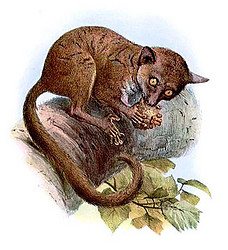
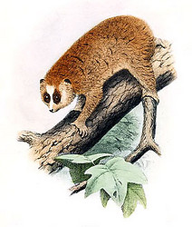

# Lorisiformes

## Bush Babies and Lorises 

      

## Phylogeny 

-   « Ancestral Groups  
    -   [Strepsirrhini](Strepsirrhini.md)
    -   [Primates](Primates.md)
    -   [Eutheria](Eutheria.md)
    -   [Mammal](Mammal.md)
    -   [Therapsida](../../../../../Therapsida.md)
    -   [Synapsida](../../../../../../Synapsida.md)
    -   [Amniota](../../../../../../../Amniota.md)
    -   [Terrestrial Vertebrates](../../../../../../../../Terrestrial.md)
    -   [Sarcopterygii](../../../../../../../../../Sarc.md)
    -   [Gnathostomata](../../../../../../../../../../Gnath.md)
    -   [Vertebrata](../../../../../../../../../../../Vertebrata.md)
    -   [Craniata](../../../../../../../../../../../../Craniata.md)
    -   [Chordata](../../../../../../../../../../../../../Chordata.md)
    -   [Deuterostomia](../../../../../../../../../../../../../../Deutero.md)
    -   [Bilateria](Bilateria)
    -   [Animals](Animals)
    -   [Eukaryotes](Eukaryotes)
    -   [Tree of Life](../../../../../../../../../../../../../../../../../Tree_of_Life.md)

-   ◊ Sibling Groups of  Strepsirrhini
    -   [Lemuridae](Lemuridae.md)
    -   [Indridae](Indridae.md)
    -   [Palaeopropithecidae](Palaeopropithecidae.md)
    -   [Cheirogaleidae](Cheirogaleidae.md)
    -   [Lepilemur](Lepilemur.md)
    -   Lorisiformes

-   » Sub-Groups 

### Information on the Internet

-   [loris-conservation.org](http://www.loris-conservation.org/)
-   [Galagonidae](http://animaldiversity.ummz.umich.edu/chordata/mammalia/primates/galagonidae.html)
    (Galagos, Bushbabies). University of Michigan Museum of Zoology
    Animal Diversity Web.
-   [Loridae](http://animaldiversity.ummz.umich.edu/chordata/mammalia/primates/loridae.html)
    (Lorises, Slow Lorises, Pottos, Angwantibos). University of Michigan
    Museum of Zoology Animal Diversity Web.

## Title Illustrations

---------------------------------

Scientific Name ::  Galago demidoff
Reference         Elliot, D. G. 1913. A Review of The Primates. American Museum of Natural History. New York.

---------------------------------

Scientific Name ::  Nycticebus pygmaeus
Creator           H. Goodchile (1907)

---------

Scientific Name ::  Euoticus elegantulus
Reference         Elliot, D. G. 1913. A Review of The Primates. American Museum of Natural History. New York.

