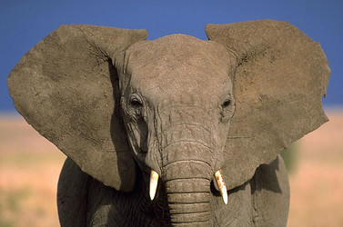

---
title: Proboscidea
---

# [[Proboscidea]] 

## Elephants, mammoths, mastodons, etc. 

    

## #has_/text_of_/abstract 

> **Proboscidea** (;  from Latin  proboscis, from Ancient Greek  προβοσκίς (proboskís) 'elephant's trunk') is a taxonomic order of afrotherian mammals containing one living family (Elephantidae) and several extinct families. First described by J. Illiger in 1811, it encompasses the elephants and their close relatives. Three living species of elephant are currently recognised: the African bush elephant, the African forest elephant, and the Asian elephant.
>
> Extinct members of Proboscidea include the deinotheres, mastodons, gomphotheres and stegodonts. The family Elephantidae also contains several extinct groups, including mammoths and Palaeoloxodon. Proboscideans include some of the largest known land mammals, with the elephant Palaeoloxodon namadicus and mastodon "Mammut" borsoni suggested to have body masses surpassing 16 tonnes (35,000 lb), rivalling or exceeding paraceratheres (the otherwise largest known land mammals) in size. The largest extant proboscidean is the African bush elephant, with a world record of size of 4 m (13.1 ft) at the shoulder and 10.4 t (11.5 short tons). In addition to their enormous size, later proboscideans are distinguished by tusks and long, muscular trunks, which were less developed or absent in early proboscideans.
>
> [Wikipedia](https://en.wikipedia.org/wiki/Proboscidea)

## Phylogeny 

-   « Ancestral Groups  
    -   [Eutheria](Eutheria.md)
    -   [Mammal](Mammal.md)
    -   [Therapsida](../../../Therapsida.md)
    -   [Synapsida](../../../../Synapsida.md)
    -   [Amniota](../../../../../Amniota.md)
    -   [Terrestrial Vertebrates](../../../../../../Terrestrial.md)
    -   [Sarcopterygii](../../../../../../../Sarc.md)
    -   [Gnathostomata](../../../../../../../../Gnath.md)
    -   [Vertebrata](../../../../../../../../../Vertebrata.md)
    -   [Craniata](../../../../../../../../../../Craniata.md)
    -   [Chordata](../../../../../../../../../../../Chordata.md)
    -   [Deuterostomia](../../../../../../../../../../../../Deutero.md)
    -   [Bilateria](Bilateria)
    -   [Animals](Animals)
    -   [Eukaryotes](Eukaryotes)
    -   [Tree of Life](../../../../../../../../../../../../../../../Tree_of_Life.md)

-   ◊ Sibling Groups of  Eutheria
    -   [Edentata](Edentata.md)
    -   [Pholidota](Pholidota.md)
    -   [Lagomorpha](Lagomorpha.md)
    -   [Rodentia](Rodentia.md)
    -   [Macroscelididae](Macroscelididae.md)
    -   [Primates](Primates.md)
    -   [Scandentia](Scandentia.md)
    -   [Chiroptera](Chiroptera.md)
    -   [Dermoptera](Dermoptera.md)
    -   [Insectivora](Insectivora.md)
    -   [Carnivora](Carnivora.md)
    -   [Artiodactyla](Artiodactyla.md)
    -   [Whale](Whale.md)
    -   [Tubulidentata](Tubulidentata.md)
    -   [Perissodactyla](Perissodactyla.md)
    -   [Hyracoidea](Hyracoidea.md)
    -   [Sirenia](Sirenia.md)
    -   Proboscidea

-   » Sub-Groups
    -   [Elephantidae](Elephantidae.md)
	-   *Numidotheriidae* †
	-   *Moeritheriidae* †
	-   *Barytheriidae* †
	-   *Deinotheriidae* †
	-   *Elephantiformes*
	    -   *Mammutidae* †
	        [(mastodons)]
	    -   *Gomphotheriidae* †
	    -   *Stegodontidae* †
	    -   *[Elephantidae](Elephantidae.md "go to ToL page")*
	        [(elephants and mammoths)]

### Information on the Internet

-   [Order     Proboscidea](http://animaldiversity.ummz.umich.edu/chordata/mammalia/proboscidea.html).
    Animal Diversity Web. University of Michigan Museum of Zoology.
-   [Introduction to the     Proboscidea](http://www.ucmp.berkeley.edu/mammal/mesaxonia/proboscidea.html).
    UCMP Berkeley.
-   [Timetable of Proboscid     Genera](http://www.il-st-acad-sci.org/mammals/mami004v.html).
    Kingdoms Project\'s Natural Sciences Databases.
-   [1991 Mastodon     Discovery](http://museum.gov.ns.ca/mnh/backstge/research/mastodon/mast1.htm).
    Nova Scotia Museum of Natural History.
-   [Mastodons along the     Mississippi](http://www.greatriver.com/mastodon.htm). Greatriver
    Publishing.

## Title Illustrations

-----------------------------
Scientific Name ::     Mastodon americanus
Comments             American mastodon
Reference            Lankester, E. R. 1905. Extinct Animals. Archibald Constable & Co. Ltd., London
Specimen Condition   Fossil
Body Part            skeleton
-----------------------------

----------------------------------------------------------------------------
Scientific Name ::  Loxodonta africana
Location ::        Southern Serengeti
Body Part         Face
Copyright ::         © [Greg and Marybeth Dimijian](http://www.dimijianimages.com/) 
----------------------------------------------------------------------------

## Confidential Links & Embeds: 

### #is_/same_as :: [Proboscidea](/_Standards/bio/bio~Domain/Eukaryotes/Animals/Bilateria/Deutero/Chordata/Craniata/Vertebrata/Gnath/Sarc/Tetrapods/Amniota/Synapsida/Therapsida/Mammal/Eutheria/Proboscidea.md) 

### #is_/same_as :: [Proboscidea.public](/_public/bio/bio~Domain/Eukaryotes/Animals/Bilateria/Deutero/Chordata/Craniata/Vertebrata/Gnath/Sarc/Tetrapods/Amniota/Synapsida/Therapsida/Mammal/Eutheria/Proboscidea.public.md) 

### #is_/same_as :: [Proboscidea.internal](/_internal/bio/bio~Domain/Eukaryotes/Animals/Bilateria/Deutero/Chordata/Craniata/Vertebrata/Gnath/Sarc/Tetrapods/Amniota/Synapsida/Therapsida/Mammal/Eutheria/Proboscidea.internal.md) 

### #is_/same_as :: [Proboscidea.protect](/_protect/bio/bio~Domain/Eukaryotes/Animals/Bilateria/Deutero/Chordata/Craniata/Vertebrata/Gnath/Sarc/Tetrapods/Amniota/Synapsida/Therapsida/Mammal/Eutheria/Proboscidea.protect.md) 

### #is_/same_as :: [Proboscidea.private](/_private/bio/bio~Domain/Eukaryotes/Animals/Bilateria/Deutero/Chordata/Craniata/Vertebrata/Gnath/Sarc/Tetrapods/Amniota/Synapsida/Therapsida/Mammal/Eutheria/Proboscidea.private.md) 

### #is_/same_as :: [Proboscidea.personal](/_personal/bio/bio~Domain/Eukaryotes/Animals/Bilateria/Deutero/Chordata/Craniata/Vertebrata/Gnath/Sarc/Tetrapods/Amniota/Synapsida/Therapsida/Mammal/Eutheria/Proboscidea.personal.md) 

### #is_/same_as :: [Proboscidea.secret](/_secret/bio/bio~Domain/Eukaryotes/Animals/Bilateria/Deutero/Chordata/Craniata/Vertebrata/Gnath/Sarc/Tetrapods/Amniota/Synapsida/Therapsida/Mammal/Eutheria/Proboscidea.secret.md)

