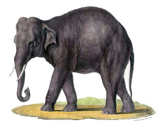

# [[Elephantidae]] 

## Elephants and mammoths 

     

#is_/same_as :: [[../../../../../../../../../../../../../../../../WikiData/WD~Elephantidae,2372824|WD~Elephantidae,2372824]] 

## #has_/text_of_/abstract 

> **Elephantidae** is a family of large, herbivorous proboscidean mammals which includes the living elephants (belonging to the genera Elephas and Loxodonta), as well as a number of extinct genera like Mammuthus (mammoths) and Palaeoloxodon. They are large terrestrial mammals with a snout modified into a trunk and teeth modified into tusks. Most genera and species in the family are extinct.
>
> The family was first described by John Edward Gray in 1821, and later assigned to taxonomic ranks within the order Proboscidea. Elephantidae has been revised by various authors to include or exclude other extinct proboscidean genera.
>
> [Wikipedia](https://en.wikipedia.org/wiki/Elephantidae) 

## Phylogeny 

-   « Ancestral Groups  
    -   [Proboscidea](Eukaryotes/Animals/Bilateria/Deutero/Chordata/Craniata/Vertebrata/Gnath/Sarc/Terrestrial/Amniota/Synapsida/Therapsida/Mammal/Eutheria/Proboscidea.md)
    -   [Eutheria](Eutheria.md)
    -   [Mammal](Mammal.md)
    -   [Therapsida](../../../../Therapsida.md)
    -   [Synapsida](../../../../../Synapsida.md)
    -   [Amniota](../../../../../../Amniota.md)
    -   [Terrestrial Vertebrates](../../../../../../../Terrestrial.md)
    -   [Sarcopterygii](../../../../../../../../Sarc.md)
    -   [Gnathostomata](../../../../../../../../../Gnath.md)
    -   [Vertebrata](../../../../../../../../../../Vertebrata.md)
    -   [Craniata](../../../../../../../../../../../Craniata.md)
    -   [Chordata](../../../../../../../../../../../../Chordata.md)
    -   [Deuterostomia](../../../../../../../../../../../../../Deutero.md)
    -   [Bilateria](Bilateria)
    -   [Animals](Animals)
    -   [Eukaryotes](Eukaryotes)
    -   [Tree of Life](../../../../../../../../../../../../../../../../Tree_of_Life.md)

-   ◊ Sibling Groups of  Proboscidea
    -   Elephantidae

-   » Sub-Groups
    -   [Elephas maximus](Elephas_maximus.md)
    -   [Mammoth](Elephantidae/Mammoth.md)
    -   [Loxodonta africana](Loxodonta_africana.md)
	-   *Primelephas* †

### Information on the Internet

-   [Elephant Information Repository](http://elephant.elehost.com/).
-   [Save the Elephants](http://www.savetheelephants.org/).

## Title Illustrations

----------------------------------------------------------------------------

Scientific Name ::  Loxodonta africana
Location ::        Masai Mara, Kenya
Copyright ::         © [Greg and Marybeth Dimijian](http://www.dimijianimages.com/) 

---------------

Scientific Name ::  Elephas maximus
Reference         The Natural History of Mammals 1827
Creator           Carl Brodtmann

## Confidential Links & Embeds: 

### [Elephantidae](/_Standards/bio/bio~Domain/Eukaryotes/Animals/Bilateria/Deutero/Chordata/Craniata/Vertebrata/Gnath/Sarc/Tetrapods/Amniota/Synapsida/Therapsida/Mammal/Eutheria/Proboscidea/Elephantidae.md) 

### [Elephantidae.public](/_public/bio/bio~Domain/Eukaryotes/Animals/Bilateria/Deutero/Chordata/Craniata/Vertebrata/Gnath/Sarc/Tetrapods/Amniota/Synapsida/Therapsida/Mammal/Eutheria/Proboscidea/Elephantidae.public.md) 

### [Elephantidae.internal](/_internal/bio/bio~Domain/Eukaryotes/Animals/Bilateria/Deutero/Chordata/Craniata/Vertebrata/Gnath/Sarc/Tetrapods/Amniota/Synapsida/Therapsida/Mammal/Eutheria/Proboscidea/Elephantidae.internal.md) 

### [Elephantidae.protect](/_protect/bio/bio~Domain/Eukaryotes/Animals/Bilateria/Deutero/Chordata/Craniata/Vertebrata/Gnath/Sarc/Tetrapods/Amniota/Synapsida/Therapsida/Mammal/Eutheria/Proboscidea/Elephantidae.protect.md) 

### [Elephantidae.private](/_private/bio/bio~Domain/Eukaryotes/Animals/Bilateria/Deutero/Chordata/Craniata/Vertebrata/Gnath/Sarc/Tetrapods/Amniota/Synapsida/Therapsida/Mammal/Eutheria/Proboscidea/Elephantidae.private.md) 

### [Elephantidae.personal](/_personal/bio/bio~Domain/Eukaryotes/Animals/Bilateria/Deutero/Chordata/Craniata/Vertebrata/Gnath/Sarc/Tetrapods/Amniota/Synapsida/Therapsida/Mammal/Eutheria/Proboscidea/Elephantidae.personal.md) 

### [Elephantidae.secret](/_secret/bio/bio~Domain/Eukaryotes/Animals/Bilateria/Deutero/Chordata/Craniata/Vertebrata/Gnath/Sarc/Tetrapods/Amniota/Synapsida/Therapsida/Mammal/Eutheria/Proboscidea/Elephantidae.secret.md)

