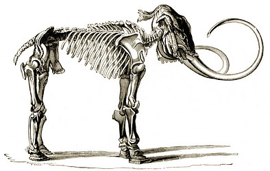

# [[Mammoth]] 

Mammoths 

 

## #has_/text_of_/abstract 

> A mammoth is any species of the extinct elephantid genus **Mammuthus**. They lived from the late Miocene epoch (from around 6.2 million years ago) into the Holocene until about 4,000 years ago, with mammoth species at various times inhabiting Africa, Asia, Europe, and North America. Mammoths are distinguished from living elephants by their (typically large) spirally twisted tusks and in some later species, the development of numerous adaptions to living in cold environments, including a thick layer of fur.
>
> Mammoths and Asian elephants are more closely related to each other than they are to African elephants. The oldest mammoth representative, Mammuthus subplanifrons, appeared around 6 million years ago during the late Miocene in what is now southern and Eastern Africa. Later in the Pliocene, by about three million years ago, mammoths dispersed into Eurasia, eventually covering most of Eurasia before migrating into North America around 1.5–1.3 million years ago, becoming ancestral to the Columbian mammoth (M. columbi). The woolly mammoth (M. primigenius) evolved about 700–400,000 years ago in Siberia, with some surviving on Russia's Wrangel Island in the Arctic Ocean until as recently as 4,000 years ago, still extant during the existence of the earliest civilisations in ancient Egypt and Mesopotamia.
>
> [Wikipedia](https://en.wikipedia.org/wiki/Mammoth)

## Phylogeny 

-   « Ancestral Groups  
    -   [Elephantidae](Elephantidae.md)
    -   [proboscidea](../../../../../../../../../../../../../../../bio~Domain/Eukaryotes/Protist/Apusomonads/Apusomonas/proboscidea.md)
    -   [Eutheria](Eutheria.md)
    -   [Mammal](Mammal.md)
    -   [Therapsida](../../../../../Therapsida.md)
    -   [Synapsida](../../../../../../Synapsida.md)
    -   [Amniota](../../../../../../../Amniota.md)
    -   [Terrestrial Vertebrates](../../../../../../../../Terrestrial.md)
    -   [Sarcopterygii](../../../../../../../../../Sarc.md)
    -   [Gnathostomata](../../../../../../../../../../Gnath.md)
    -   [Vertebrata](../../../../../../../../../../../Vertebrata.md)
    -   [Craniata](../../../../../../../../../../../../Craniata.md)
    -   [Chordata](../../../../../../../../../../../../../Chordata.md)
    -   [Deuterostomia](../../../../../../../../../../../../../../Deutero.md)
    -   [Bilateria](Bilateria)
    -   [Animals](Animals)
    -   [Eukaryotes](Eukaryotes)
    -   [Tree of Life](../../../../../../../../../../../../../../../../../Tree_of_Life.md)

-   ◊ Sibling Groups of  Elephantidae
    -   [Elephas maximus](Elephas_maximus.md)
    -   Mammuthus
    -   [Loxodonta africana](Loxodonta_africana.md)

-   » Sub-Groups 

	-   *Mammuthus columbi* †
	    [(Columbian mammoth)]
	-   *Mammuthus exilis* † [(pygmy
	    mammoth)]
	-   *Mammuthus jeffersonii* †
	    [(Jefferson\'s mammoth)]
	-   *Mammuthus lamarmorae* †
	    [(Sardinian dwarf mammoth)]
	-   *Mammuthus meridionalis* †
	-   *Mammuthus primigenius* †
	    [(woolly mammoth)]

### Information on the Internet

-   [What Killed the     Mammoths?](http://sciencebulletins.amnh.org/biobulletin/biobulletin/story981.html).
    American Museum of Natural History.
-   [Mammoth Site of Hot Springs, SD](http://www.mammothsite.com/).

## Title Illustrations

---------------------------------------------------------------------------------------

Scientific Name ::     Mammuthus
Location ::           Siberia
Comments             The skeleton of the Mammoth found frozen in Siberia and now in the museum of St. Petersburg. A good deal of the flesh and skin is preserved in a dried state on the head, whilst the feet are still encased in the great leathery pads which hide the separate toes.
Reference            Lankester, E. R. 1905. Extinct Animals. Archibald Constable & Co. Ltd., London
Specimen Condition   Fossil
Body Part            skeleton
View                 lateral

## Confidential Links & Embeds: 

### [Mammoth](/_Standards/bio/bio~Domain/Eukaryotes/Animals/Bilateria/Deutero/Chordata/Craniata/Vertebrata/Gnath/Sarc/Tetrapods/Amniota/Synapsida/Therapsida/Mammal/Eutheria/Proboscidea/Elephantidae/Mammoth.md) 

### [Mammoth.public](/_public/bio/bio~Domain/Eukaryotes/Animals/Bilateria/Deutero/Chordata/Craniata/Vertebrata/Gnath/Sarc/Tetrapods/Amniota/Synapsida/Therapsida/Mammal/Eutheria/Proboscidea/Elephantidae/Mammoth.public.md) 

### [Mammoth.internal](/_internal/bio/bio~Domain/Eukaryotes/Animals/Bilateria/Deutero/Chordata/Craniata/Vertebrata/Gnath/Sarc/Tetrapods/Amniota/Synapsida/Therapsida/Mammal/Eutheria/Proboscidea/Elephantidae/Mammoth.internal.md) 

### [Mammoth.protect](/_protect/bio/bio~Domain/Eukaryotes/Animals/Bilateria/Deutero/Chordata/Craniata/Vertebrata/Gnath/Sarc/Tetrapods/Amniota/Synapsida/Therapsida/Mammal/Eutheria/Proboscidea/Elephantidae/Mammoth.protect.md) 

### [Mammoth.private](/_private/bio/bio~Domain/Eukaryotes/Animals/Bilateria/Deutero/Chordata/Craniata/Vertebrata/Gnath/Sarc/Tetrapods/Amniota/Synapsida/Therapsida/Mammal/Eutheria/Proboscidea/Elephantidae/Mammoth.private.md) 

### [Mammoth.personal](/_personal/bio/bio~Domain/Eukaryotes/Animals/Bilateria/Deutero/Chordata/Craniata/Vertebrata/Gnath/Sarc/Tetrapods/Amniota/Synapsida/Therapsida/Mammal/Eutheria/Proboscidea/Elephantidae/Mammoth.personal.md) 

### [Mammoth.secret](/_secret/bio/bio~Domain/Eukaryotes/Animals/Bilateria/Deutero/Chordata/Craniata/Vertebrata/Gnath/Sarc/Tetrapods/Amniota/Synapsida/Therapsida/Mammal/Eutheria/Proboscidea/Elephantidae/Mammoth.secret.md)

