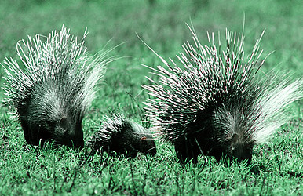

# Rodentia

## Rodents: mice, rats, hamsters, squirrels, gophers, porcupines, beavers, etc. 

## #has_/text_of_/abstract 

> **Rodent**s (from Latin rodere, 'to gnaw') are mammals of the order Rodentia ( roh-DEN-shə), which are characterized by a single pair of continuously growing incisors in each of the upper and lower jaws. About 40% of all mammal species are rodents. They are native to all major land masses except for Antarctica, and several oceanic islands, though they have subsequently been introduced to most of these land masses by human activity.
>
> Rodents are extremely diverse in their ecology and lifestyles and can be found in almost every terrestrial habitat, including human-made environments. Species can be arboreal, fossorial (burrowing), saltatorial/ricochetal (leaping on their hind legs), or semiaquatic. However, all rodents share several morphological features, including having only a single upper and lower pair of ever-growing incisors. Well-known rodents include mice, rats, squirrels, prairie dogs, porcupines, beavers, guinea pigs, and hamsters. However, rabbits, hares, and pikas, which also have incisors that grow continuously (but have two pairs of upper incisors instead of one), were once included with rodents, but are now considered to be in a separate order, the Lagomorpha. Nonetheless, Rodentia and Lagomorpha are sister groups, sharing a single common ancestor and forming the clade of Glires.
>
> Most rodents are small animals with robust bodies, short limbs, and long tails. They use their sharp incisors to gnaw food, excavate burrows, and defend themselves. Most eat seeds or other plant material, but some have more varied diets. They tend to be social animals and many species live in societies with complex ways of communicating with each other. Mating among rodents can vary from monogamy, to polygyny, to promiscuity. Many have litters of underdeveloped, altricial young, while others are precocial (relatively well developed) at birth.
>
> The rodent fossil record dates back to the Paleocene on the supercontinent of Laurasia. Rodents greatly diversified in the Eocene, as they spread across continents, sometimes even crossing oceans. Rodents reached both South America and Madagascar from Africa and, until the arrival of Homo sapiens, were the only terrestrial placental mammals to reach and colonize Australia.
>
> Rodents have been used as food, for clothing, as pets, and as laboratory animals in research. Some species, in particular, the brown rat, the black rat, and the house mouse, are serious pests, eating and spoiling food stored by humans and spreading diseases. Accidentally introduced species of rodents are often considered to be invasive and have caused the extinction of numerous species, such as island birds, the dodo being an example, previously isolated from land-based predators.
>
> [Wikipedia](https://en.wikipedia.org/wiki/Rodent)

### Information on the Internet

-   [Rodentia](http://animaldiversity.ummz.umich.edu/chordata/mammalia/rodentia.html).
    Animal Diversity Web. University of Michigan Museum of Zoology.
-   [The Mammals of Texas:     Rodents](http://www.nsrl.ttu.edu/tmot1/ordroden.htm).
-   [Rodent Genome     Databases](http://www.cbi.pku.edu.cn/mirror/GenomeWeb/rodent-gen-db.html).
-   [The Rodent     Zone](http://members.tripod.com/%7ECloveApple/rodent.html).
-   [The Squirrel Place](http://www.squirrels.org/).
-   [International Marmot     Network](http://cons-dev.univ-lyon1.fr/MARMOTTE/MARMOT.EN/marmotnetwork.html).
-   [National Gerbil Society (UK)](http://www.rodent.demon.co.uk/).
-   [The Dormouse Hollow](http://www.glirarium.de/dormouse/).
-   [The Capybara Page](http://www.rebsig.com/capybara/).

## Phylogeny 

-   « Ancestral Groups  
    -   [Eutheria](Eutheria.md)
    -   [Mammal](Mammal.md)
    -   [Therapsida](../../../Therapsida.md)
    -   [Synapsida](../../../../Synapsida.md)
    -   [Amniota](../../../../../Amniota.md)
    -   [Terrestrial Vertebrates](../../../../../../Terrestrial.md)
    -   [Sarcopterygii](../../../../../../../Sarc.md)
    -   [Gnathostomata](../../../../../../../../Gnath.md)
    -   [Vertebrata](../../../../../../../../../Vertebrata.md)
    -   [Craniata](../../../../../../../../../../Craniata.md)
    -   [Chordata](../../../../../../../../../../../Chordata.md)
    -   [Deuterostomia](../../../../../../../../../../../../Deutero.md)
    -   [Bilateria](Bilateria)
    -   [Animals](Animals)
    -   [Eukaryotes](Eukaryotes)
    -   [Tree of Life](../../../../../../../../../../../../../../../Tree_of_Life.md)

-   ◊ Sibling Groups of  Eutheria
    -   [Edentata](Edentata.md)
    -   [Pholidota](Pholidota.md)
    -   [Lagomorpha](Lagomorpha.md)
    -   Rodentia
    -   [Macroscelididae](Macroscelididae.md)
    -   [Primates](Primates.md)
    -   [Scandentia](Scandentia.md)
    -   [Chiroptera](Chiroptera.md)
    -   [Dermoptera](Dermoptera.md)
    -   [Insectivora](Insectivora.md)
    -   [Carnivora](Carnivora.md)
    -   [Artiodactyla](Artiodactyla.md)
    -   [Whale](Whale.md)
    -   [Tubulidentata](Tubulidentata.md)
    -   [Perissodactyla](Perissodactyla.md)
    -   [Hyracoidea](Hyracoidea.md)
    -   [Sirenia](Sirenia.md)
    -   [Proboscidea](Eukaryotes/Animals/Bilateria/Deutero/Chordata/Craniata/Vertebrata/Gnath/Sarc/Terrestrial/Amniota/Synapsida/Therapsida/Mammal/Eutheria/Proboscidea.md)

-   » Sub-Groups
    -   [Muroidea](Muroidea.md)
    -   [Squirrel](Rodentia/Squirrel.md)

## Title Illustrations

-------------------------------------------------------------------------

Scientific Name ::     Hystrix cristata
Location ::           Serengeti National Park
Comments             This was an unusual sighting, not only of a pair with young, but in open country at mid-day. Crested porcupines are mainly nocturnal.
Specimen Condition   Live Specimen
Identified By        David Bygott
Behavior             Parental
Sex ::                Presumed pair
Life Cycle Stage ::     Adults and young
View                 Frontal/lateral
Copyright ::            © 2005 [David Bygott](mailto:davidbygott@yahoo.com) 

-------------------------------------------------------------------------

Scientific Name ::     Spermophilus parryii
Comments             Arctic ground squirrel
Creator              Jim McCarthy
Acknowledgements     Photograph courtesy of the U.S. Fish and Wildlife Service
Specimen Condition   Live Specimen

