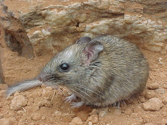
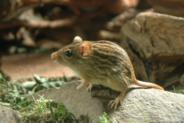

# [[Murinae]] 

## #has_/text_of_/abstract 

> The Old World rats and mice, part of the subfamily **Murinae** in the family Muridae, comprise at least 519 species. Members of this subfamily are called murines. In terms of species richness, this subfamily is larger than all mammal families except the Cricetidae and Muridae, and is larger than all mammal orders except the bats and the remainder of the rodents.
>
> [Wikipedia](https://en.wikipedia.org/wiki/Murinae) 

## Introduction

[Scott J. Steppan]()

The Old World Murinae contain well over 500 species and 110 genera.
Phylogenetics for this group have been perhaps the most difficult to
unravel of all major groups of mammals, to a large extent because of
this high level of diversity. Many genera are not listed here for lack
of sufficient information.

It should be noted that **Mus** and **Rattus**, containing the two most
common laboratory species, do not represent two branches of the earliest
split in Murinae. Their two lineages diverged several million years
after the initial radiation and as part of a rapid diversification that
may be associated with the expansion of murines from Southeast Asia into
Africa, Australia, and Eurasia.

## Phylogeny 

-   « Ancestral Groups  
    -   [Muroidea](Muroidea.md)
    -   [Rodentia](Rodentia.md)
    -   [Eutheria](Eutheria.md)
    -   [Mammal](Mammal.md)
    -   [Therapsida](../../../../../Therapsida.md)
    -   [Synapsida](../../../../../../Synapsida.md)
    -   [Amniota](../../../../../../../Amniota.md)
    -   [Terrestrial Vertebrates](../../../../../../../../Terrestrial.md)
    -   [Sarcopterygii](../../../../../../../../../Sarc.md)
    -   [Gnathostomata](../../../../../../../../../../Gnath.md)
    -   [Vertebrata](../../../../../../../../../../../Vertebrata.md)
    -   [Craniata](../../../../../../../../../../../../Craniata.md)
    -   [Chordata](../../../../../../../../../../../../../Chordata.md)
    -   [Deuterostomia](../../../../../../../../../../../../../../Deutero.md)
    -   [Bilateria](Bilateria)
    -   [Animals](Animals)
    -   [Eukaryotes](Eukaryotes)
    -   [Tree of Life](../../../../../../../../../../../../../../../../../Tree_of_Life.md)

-   ◊ Sibling Groups of  Muroidea
    -   Murinae
    -   [Deomyinae](Deomyinae.md)
    -   [Sigmodontinae](Sigmodontinae.md)
    -   [Tylomyinae](Tylomyinae.md)

-   » Sub-Groups
    -   [Praomys group](Praomys.md)
    -   [Arvicanthine group](Arvicanthine.md)
    -   [Rattus group](Rattus.md)
    -   [Australasian group](Australasian.md)

## Title Illustrations

--------------------------------------------------------------

Scientific Name ::     Zyzomys pedunculatus
Specimen Condition   Live Specimen
Source               [The extremely rare rodent, the Central Rock-rat (Zyzomys pedunculatus) found only in a few location around Ormiston Gorge.](http://www.flickr.com/photos/centralaustralia/327896667/)
Source Collection    [Flickr](http://flickr.com/)
Image Use ::    [Attribution-ShareAlike 2.0 Creative Commons License](http://creativecommons.org/licenses/by-sa/2.0/).
Copyright ::            © 2006 [Michael & Karen](http://flickr.com/people/44489466@N00)

--------------------------------------------------------------

Scientific Name ::     Lemniscomys striatus
Location ::           captive, Zoo München Hellabrunn
Specimen Condition   Live Specimen
Source               [DSC_8191-Mehrstreifen-Grasmaus](http://www.flickr.com/photos/64706470@N00/277642366/)
Source Collection    [Flickr](http://flickr.com/)
Image Use ::    [Attribution-NonCommercial-NoDerivs 2.0 Creative Commons License](http://creativecommons.org/licenses/by-nc-nd/2.0/).
Copyright ::            © 2006 [Ulrike](http://flickr.com/people/64706470@N00)

