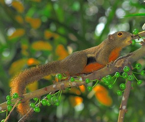
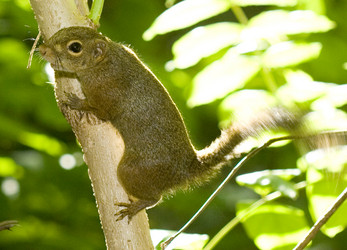

# [[Callosciurini]]  

## #has_/text_of_/abstract 

> **Callosciurini** is a tribe of tree squirrels mainly found in southern Asia.
>
> [Wikipedia](https://en.wikipedia.org/wiki/Callosciurini) 

## Phylogeny 

-   « Ancestral Groups  
    -   [Squirrel](../Squirrel.md)
    -   [Rodentia](Rodentia.md)
    -   [Eutheria](Eutheria.md)
    -   [Mammal](Mammal.md)
    -   [Therapsida](../../../../../Therapsida.md)
    -   [Synapsida](../../../../../../Synapsida.md)
    -   [Amniota](../../../../../../../Amniota.md)
    -   [Terrestrial Vertebrates](../../../../../../../../Terrestrial.md)
    -   [Sarcopterygii](../../../../../../../../../Sarc.md)
    -   [Gnathostomata](../../../../../../../../../../Gnath.md)
    -   [Vertebrata](../../../../../../../../../../../Vertebrata.md)
    -   [Craniata](../../../../../../../../../../../../Craniata.md)
    -   [Chordata](../../../../../../../../../../../../../Chordata.md)
    -   [Deuterostomia](../../../../../../../../../../../../../../Deutero.md)
    -   [Bilateria](Bilateria)
    -   [Animals](Animals)
    -   [Eukaryotes](Eukaryotes)
    -   [Tree of Life](../../../../../../../../../../../../../../../../../Tree_of_Life.md)

-   ◊ Sibling Groups of  Sciuridae
    -   Callosciurini
    -   [Xerinae](Xerinae.md)
    -   [Sciurini](Sciurini.md)
    -   [Pteromyini](Pteromyini.md)

-   » Sub-Groups 
	-   *Callosciurus*
	-   *Dremomys*
	-   *Exilisciurus*
	-   *Glyphotes*
	-   *Hyosciurus*
	-   *Lariscus*
	-   *Menetes*
	-   *Nannosciurus*
	-   *Prosciurillus*
	-   *Rubrisciurus*
	-   *Tamiops*
	-   *Sundasciurus*

## Title Illustrations

  --------------------------------------------------------
  Scientific Name ::     Callosciurus notatus
  Location ::           Lower Peirce Reservoir, Singapore
  Specimen Condition   Live Specimen
  Source               [Plantain Squirrel](http://www.flickr.com/photos/64684201@N00/267759125/)
  Source Collection    [Flickr](http://flickr.com/)
  Image Use ::    [Attribution 2.0 Creative Commons License](http://creativecommons.org/licenses/by/2.0/).
  Copyright ::            © 2006 [Jwee](http://flickr.com/people/64684201@N00)
  --------------------------------------------------------

  ------------------------------------------------------------------
  Scientific Name ::     Sundasciurus tenuis
  Specimen Condition   Live Specimen
  Source               [slender squirrel (Sundasciurus tenuis)](http://www.flickr.com/photos/budak/510893344/)
  Source Collection    [Flickr](http://flickr.com/)
  Image Use ::    [Attribution-NonCommercial-ShareAlike 2.0 Creative Commons License](http://creativecommons.org/licenses/by-nc-sa/2.0/).
  Copyright ::            © 2007 [budak](http://flickr.com/people/77246694@N00)
  ------------------------------------------------------------------
