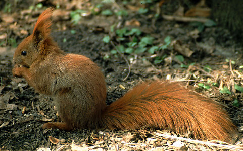

# [[Sciurini]] 

## #has_/text_of_/abstract 

> **Sciurini** is a tribe that includes about forty species of squirrels, mostly from the Americas. 
> It includes five living genera—the American dwarf squirrels, Microsciurus; the Bornean Rheithrosciurus; the widespread American and Eurasian tree squirrels of the genus Sciurus, which includes some of the best known squirrel species; the Central American Syntheosciurus; and the American pine squirrels, Tamiasciurus. Like other arboreal squirrels, they are sometimes referred to as tree squirrels.
>
> [Wikipedia](https://en.wikipedia.org/wiki/Sciurini) 

## Phylogeny 

-   « Ancestral Groups  
    -   [Squirrel](../Squirrel.md)
    -   [Rodentia](Rodentia.md)
    -   [Eutheria](Eutheria.md)
    -   [Mammal](Mammal.md)
    -   [Therapsida](../../../../../Therapsida.md)
    -   [Synapsida](../../../../../../Synapsida.md)
    -   [Amniota](../../../../../../../Amniota.md)
    -   [Terrestrial Vertebrates](../../../../../../../../Terrestrial.md)
    -   [Sarcopterygii](../../../../../../../../../Sarc.md)
    -   [Gnathostomata](../../../../../../../../../../Gnath.md)
    -   [Vertebrata](../../../../../../../../../../../Vertebrata.md)
    -   [Craniata](../../../../../../../../../../../../Craniata.md)
    -   [Chordata](../../../../../../../../../../../../../Chordata.md)
    -   [Deuterostomia](../../../../../../../../../../../../../../Deutero.md)
    -   [Bilateria](Bilateria)
    -   [Animals](Animals)
    -   [Eukaryotes](Eukaryotes)
    -   [Tree of Life](../../../../../../../../../../../../../../../../../Tree_of_Life.md)

-   ◊ Sibling Groups of  Sciuridae
    -   [Callosciurini](Callosciurini.md)
    -   [Xerinae](Xerinae.md)
    -   Sciurini
    -   [Pteromyini](Pteromyini.md)

-   » Sub-Groups
    -   [Microsciurini](Sciurini/Microsciurini.md)

	-   *Rheithrosciurus*
	-   *Sciurus*[ (non-monophyletic) ]
	-   *[Microsciurini](Sciurini/Microsciurini.md "go to ToL page")*
	    [(Neotropical dwarf squirrels)]

Containing group: [Squirrel](../Squirrel.md)

## Title Illustrations

  ------------------------------
  Scientific Name ::     Sciurus vulgaris
  Location ::           Poland
  Comments             Eurasian red squirrel
  Acknowledgements     Photograph courtesy [InsectImages.org](http://www.insectimages.org/) (#1261031)
  Specimen Condition   Live Specimen
  Source Collection    [InsectImages.org](http://www.insectimages.org/)
  Copyright ::            © Gil Wojciech, Polish Forest Research Institute
  ------------------------------
