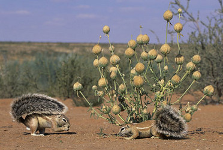

# [[Xerinae]] 

## #has_/text_of_/abstract 

> The **Xerinae** comprise a subfamily of squirrels, many of which are highly terrestrial. It includes the tribes Marmotini (marmots, chipmunks, prairie dogs, and other Holarctic ground squirrels), Xerini (African and some Eurasian ground squirrels), and Protoxerini (African tree squirrels). 
>
> The Xerinae first originated in Eurasia but later dispersed to other parts of the world. One of which was Africa, where they traveled via land bridges in the Miocene period, leading to the emergence of Protoxerini and Xerini ground squirrel tribes. Many Xerinae also dispersed to North America during the early Oligocene era, and with the help of global cooling and the expansion of grasslands, resulted in the emergence of the Marmotini ground squirrel tribe.
>
> [Wikipedia](https://en.wikipedia.org/wiki/Xerinae) 

## Phylogeny 

-   « Ancestral Groups  
    -   [Squirrel](../Squirrel.md)
    -   [Rodentia](Rodentia.md)
    -   [Eutheria](Eutheria.md)
    -   [Mammal](Mammal.md)
    -   [Therapsida](../../../../../Therapsida.md)
    -   [Synapsida](../../../../../../Synapsida.md)
    -   [Amniota](../../../../../../../Amniota.md)
    -   [Terrestrial Vertebrates](../../../../../../../../Terrestrial.md)
    -   [Sarcopterygii](../../../../../../../../../Sarc.md)
    -   [Gnathostomata](../../../../../../../../../../Gnath.md)
    -   [Vertebrata](../../../../../../../../../../../Vertebrata.md)
    -   [Craniata](../../../../../../../../../../../../Craniata.md)
    -   [Chordata](../../../../../../../../../../../../../Chordata.md)
    -   [Deuterostomia](../../../../../../../../../../../../../../Deutero.md)
    -   [Bilateria](Bilateria)
    -   [Animals](Animals)
    -   [Eukaryotes](Eukaryotes)
    -   [Tree of Life](../../../../../../../../../../../../../../../../../Tree_of_Life.md)

-   ◊ Sibling Groups of  Sciuridae
    -   [Callosciurini](Callosciurini.md)
    -   Xerinae
    -   [Sciurini](Sciurini.md)
    -   [Pteromyini](Pteromyini.md)

-   » Sub-Groups
    -   [Marmotini](Xerinae/Marmotini.md)
    -   [Protoxerini](Xerinae/Protoxerini.md)
    -   [Xerini](Xerinae/Xerini.md)

## Title Illustrations

---------------------

Scientific Name ::     Xerus inauris
Location ::           Kgalagadi Transfrontier Park, Kalahari, South Africa
Specimen Condition   Live Specimen
Copyright ::            © 2006 [Nigel Dennis](http://www.nigeldennis.com/)

