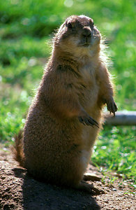
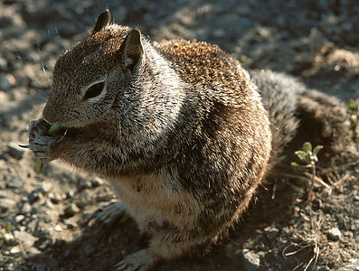

# [[Marmotini]] 

## #has_/text_of_/abstract 

> Ground squirrels are rodents of the squirrel family (Sciuridae) that generally live on the ground or in burrows, rather than in trees like the tree squirrels. The term is most often used for the medium-sized ground squirrels, as the larger ones are more commonly known as marmots (genus Marmota) or prairie dogs, while the smaller and less bushy-tailed ground squirrels tend to be known as chipmunks (genus Tamias).
>
> Together, they make up the "marmot tribe" of squirrels, **Marmotini**, a clade within the large and mainly ground squirrel subfamily Xerinae, and containing six living genera. Well-known members of this largely Holarctic group are the marmots (Marmota), including the American groundhog, the chipmunks, the susliks (Spermophilus), and the prairie dogs (Cynomys). They are highly variable in size and habitus, but most are remarkably able to rise up on their hind legs and stand fully erect comfortably for prolonged periods. They also tend to be far more gregarious than other squirrels, and many live in colonies with complex social structures. Most Marmotini are rather short-tailed and large squirrels. At up to 8 kg (18 lb) or more, certain marmots are the heaviest squirrels.
>
> The chipmunks of the genus Tamias frequently spend time in trees. Also closer to typical squirrels in other aspects, they are occasionally considered a tribe of their own (Tamiini).
>
> [Wikipedia](https://en.wikipedia.org/wiki/Ground%20squirrel) 

## Phylogeny 

-   « Ancestral Groups  
    -   [Xerinae](../Xerinae.md)
    -   [Squirrel](../../Squirrel.md)
    -   [Rodentia](Rodentia.md)
    -   [Eutheria](Eutheria.md)
    -   [Mammal](Mammal.md)
    -   [Therapsida](../../../../../../Therapsida.md)
    -   [Synapsida](../../../../../../../Synapsida.md)
    -   [Amniota](../../../../../../../../Amniota.md)
    -   [Terrestrial Vertebrates](../../../../../../../../../Terrestrial.md)
    -   [Sarc](../../../../../../../../../../Sarc.md)(Sarc.md)
    -   [Gnathostomata](../../../../../../../../../../../Gnath.md)
    -   [Vertebrata](../../../../../../../../../../../../Vertebrata.md)
    -   [Craniata](../../../../../../../../../../../../../Craniata.md)
    -   [Chordata](../../../../../../../../../../../../../../Chordata.md)
    -   [Deuterostomia](../../../../../../../../../../../../../../../Deutero.md)
    -   [Bilateria](Bilateria)
    -   [Animals](Animals)
    -   [Eukaryotes](Eukaryotes)
    -   [Tree of Life](../../../../../../../../../../../../../../../../../../Tree_of_Life.md)

-   ◊ Sibling Groups of  Xerinae
    -   Marmotini
    -   [Protoxerini](Protoxerini.md)
    -   [Xerini](Xerini.md)

-   » Sub-Groups[Marmota](Marmotini/Marmota.md)rmota.md)

	-   *Spermophilus* [(groundsquirrels)][ (non-monophyletic)
	    ]
	-   *Cynomys* [(prairie-dog[Marmota](Marmotini/Marmota.md "go to ToL page")oL page")* [(marmots and
	    woodchuck)]
	-   *Ammospermophilus* [(antelope ground squirrels)]
	-   *Tamias* [(chipmuncks)]
	-   *Sciurotamias* [(rock squirrels)]

## Title Illustrations

-------------------

Scientific Name ::     Cynomys
Creator              Claire Dobert
Acknowledgements     Photo courtesy U.S. Fish and Wildlife Service
Specimen Condition   Live Specimen

-------------------

Scientific Name ::     Spermophilus
Creator              Joe Martin
Acknowledgements     Photo courtesy U.S. Fish and Wildlife Service
Specimen Condition   Live Specimen

## Confidential Links & Embeds: 

### [Marmotini](/_Standards/bio/bio~Domain/Eukaryotes/Animals/Bilateria/Deutero/Chordata/Craniata/Vertebrata/Gnath/Sarc/Tetrapods/Amniota/Synapsida/Therapsida/Mammal/Eutheria/Rodentia/Squirrel/Xerinae/Marmotini.md) 

### [Marmotini.public](/_public/bio/bio~Domain/Eukaryotes/Animals/Bilateria/Deutero/Chordata/Craniata/Vertebrata/Gnath/Sarc/Tetrapods/Amniota/Synapsida/Therapsida/Mammal/Eutheria/Rodentia/Squirrel/Xerinae/Marmotini.public.md) 

### [Marmotini.internal](/_internal/bio/bio~Domain/Eukaryotes/Animals/Bilateria/Deutero/Chordata/Craniata/Vertebrata/Gnath/Sarc/Tetrapods/Amniota/Synapsida/Therapsida/Mammal/Eutheria/Rodentia/Squirrel/Xerinae/Marmotini.internal.md) 

### [Marmotini.protect](/_protect/bio/bio~Domain/Eukaryotes/Animals/Bilateria/Deutero/Chordata/Craniata/Vertebrata/Gnath/Sarc/Tetrapods/Amniota/Synapsida/Therapsida/Mammal/Eutheria/Rodentia/Squirrel/Xerinae/Marmotini.protect.md) 

### [Marmotini.private](/_private/bio/bio~Domain/Eukaryotes/Animals/Bilateria/Deutero/Chordata/Craniata/Vertebrata/Gnath/Sarc/Tetrapods/Amniota/Synapsida/Therapsida/Mammal/Eutheria/Rodentia/Squirrel/Xerinae/Marmotini.private.md) 

### [Marmotini.personal](/_personal/bio/bio~Domain/Eukaryotes/Animals/Bilateria/Deutero/Chordata/Craniata/Vertebrata/Gnath/Sarc/Tetrapods/Amniota/Synapsida/Therapsida/Mammal/Eutheria/Rodentia/Squirrel/Xerinae/Marmotini.personal.md) 

### [Marmotini.secret](/_secret/bio/bio~Domain/Eukaryotes/Animals/Bilateria/Deutero/Chordata/Craniata/Vertebrata/Gnath/Sarc/Tetrapods/Amniota/Synapsida/Therapsida/Mammal/Eutheria/Rodentia/Squirrel/Xerinae/Marmotini.secret.md)

