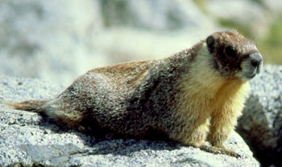

# [[Marmota]] 

## #has_/text_of_/abstract 

> Marmots are large ground squirrels in the genus **Marmota**, with 15 species living in Asia, Europe, and North America. These herbivores are active during the summer, when they can often be found in groups, but are not seen during the winter, when they hibernate underground. They are the heaviest members of the squirrel family.
>
> [Wikipedia](https://en.wikipedia.org/wiki/Marmot) 

## Phylogeny 

-   « Ancestral Groups  
    -   [Marmotini](../Marmotini.md)
    -   [Squirrel](../../../Squirrel.md)
    -   [Rodentia](Rodentia.md)
    -   [Eutheria](Eutheria.md)
    -   [Mammal](Mammal.md)
    -   [Therapsida](../../../../../../../Therapsida.md)
    -   [Synapsida](../../../../../../../../Synapsida.md)
    -   [Amniota](../../../../../../../../../Amniota.md)
    -   [Terrestrial Vertebrates](../../../../../../../../../../Terrestrial.md)
    -   [Sarc](../../../../../../../../../../../Sarc.md)(Sarc.md)
    -   [Gnathostomata](../../../../../../../../../../../../Gnath.md)
    -   [Vertebrata](../../../../../../../../../../../../../Vertebrata.md)
    -   [Craniata](../../../../../../../../../../../../../../Craniata.md)
    -   [Chordata](../../../../../../../../../../../../../../../Chordata.md)
    -   [Deuterostomia](../../../../../../../../../../../../../../../../Deutero.md)
    -   [Bilateria](Bilateria)
    -   [Animals](Animals)
    -   [Eukaryotes](Eukaryotes)
    -   [Tree of Life](../../../../../../../../../../../../../../../../../../../Tree_of_Life.md)

-   ◊ Sibling Groups of  Marmotini
    -   Marmota

-   » Sub-Groups 

### Information on the Internet

[The Marmot Burrow](http://www.marmotburrow.ucla.edu/index.html)\
[The International Marmot Network](http://www.marmotburrow.ucla.edu/index.html)\
[Groundhog Day](http://www.marmotburrow.ucla.edu/index.html)\
[Vancouver Island Marmo](http://www.marmotburrow.ucla.edu/index.html)t
(critically endangered)

## Title Illustrations

Figure 1. Marmota flaviventris, the yellow-bellied marmot. copyright © Scott Steppan.

---------

Copyright ::   © 2000 Scott Steppan

