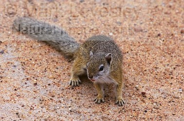

# [[Protoxerini]]

## #has_/text_of_/abstract 

> The **Protoxerini** comprise a tribe of squirrels found in Africa. The 30 species in six genera are:
> - Epixerus (monotypic) - Ebian's palm squirrel
> - Funisciurus (nine species) - African striped squirrels
> - Heliosciurus (six species) - sun squirrels
> - Myosciurus (monotypic) - African pygmy squirrel
> - Paraxerus (11 species) - African bush squirrels
> - Protoxerus (two species) - African giant squirrels
>
> [Wikipedia](https://en.wikipedia.org/wiki/Protoxerini) 

## Phylogeny 

-   « Ancestral Groups  
    -   [Xerinae](../Xerinae.md)
    -   [Squirrel](../../Squirrel.md)
    -   [Rodentia](Rodentia.md)
    -   [Eutheria](Eutheria.md)
    -   [Mammal](Mammal.md)
    -   [Therapsida](../../../../../../Therapsida.md)
    -   [Synapsida](../../../../../../../Synapsida.md)
    -   [Amniota](../../../../../../../../Amniota.md)
    -   [Terrestrial Vertebrates](../../../../../../../../../Terrestrial.md)
    -   [Sarc](../../../../../../../../../../Sarc.md)(Sarc.md)
    -   [Gnathostomata](../../../../../../../../../../../Gnath.md)
    -   [Vertebrata](../../../../../../../../../../../../Vertebrata.md)
    -   [Craniata](../../../../../../../../../../../../../Craniata.md)
    -   [Chordata](../../../../../../../../../../../../../../Chordata.md)
    -   [Deuterostomia](../../../../../../../../../../../../../../../Deutero.md)
    -   [Bilateria](Bilateria)
    -   [Animals](Animals)
    -   [Eukaryotes](Eukaryotes)
    -   [Tree of Life](../../../../../../../../../../../../../../../../../../Tree_of_Life.md)

-   ◊ Sibling Groups of  Xerinae
    -   [Marmotini](Marmotini.md)
    -   Protoxerini
    -   [Xerini](Xerini.md)

-   » Sub-Groups 

## Title Illustrations

------------------------

Scientific Name ::     Paraxerus cepapi
Location ::           Kruger National Park, South Africa
Specimen Condition   Live Specimen
Copyright ::            © [Mark Levesley](http://www.naturalimagebank.com/index.html)

## Confidential Links & Embeds: 

### [Protoxerini](/_Standards/bio/bio~Domain/Eukaryotes/Animals/Bilateria/Deutero/Chordata/Craniata/Vertebrata/Gnath/Sarc/Tetrapods/Amniota/Synapsida/Therapsida/Mammal/Eutheria/Rodentia/Squirrel/Xerinae/Protoxerini.md) 

### [Protoxerini.public](/_public/bio/bio~Domain/Eukaryotes/Animals/Bilateria/Deutero/Chordata/Craniata/Vertebrata/Gnath/Sarc/Tetrapods/Amniota/Synapsida/Therapsida/Mammal/Eutheria/Rodentia/Squirrel/Xerinae/Protoxerini.public.md) 

### [Protoxerini.internal](/_internal/bio/bio~Domain/Eukaryotes/Animals/Bilateria/Deutero/Chordata/Craniata/Vertebrata/Gnath/Sarc/Tetrapods/Amniota/Synapsida/Therapsida/Mammal/Eutheria/Rodentia/Squirrel/Xerinae/Protoxerini.internal.md) 

### [Protoxerini.protect](/_protect/bio/bio~Domain/Eukaryotes/Animals/Bilateria/Deutero/Chordata/Craniata/Vertebrata/Gnath/Sarc/Tetrapods/Amniota/Synapsida/Therapsida/Mammal/Eutheria/Rodentia/Squirrel/Xerinae/Protoxerini.protect.md) 

### [Protoxerini.private](/_private/bio/bio~Domain/Eukaryotes/Animals/Bilateria/Deutero/Chordata/Craniata/Vertebrata/Gnath/Sarc/Tetrapods/Amniota/Synapsida/Therapsida/Mammal/Eutheria/Rodentia/Squirrel/Xerinae/Protoxerini.private.md) 

### [Protoxerini.personal](/_personal/bio/bio~Domain/Eukaryotes/Animals/Bilateria/Deutero/Chordata/Craniata/Vertebrata/Gnath/Sarc/Tetrapods/Amniota/Synapsida/Therapsida/Mammal/Eutheria/Rodentia/Squirrel/Xerinae/Protoxerini.personal.md) 

### [Protoxerini.secret](/_secret/bio/bio~Domain/Eukaryotes/Animals/Bilateria/Deutero/Chordata/Craniata/Vertebrata/Gnath/Sarc/Tetrapods/Amniota/Synapsida/Therapsida/Mammal/Eutheria/Rodentia/Squirrel/Xerinae/Protoxerini.secret.md)

