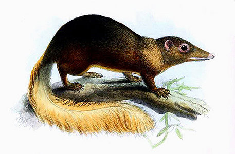

# [[Scandentia]] 

## Tree shrews 

 

## #has_/text_of_/abstract 

> The treeshrews (also called tree shrews or banxrings) are small mammals native to the tropical forests of South and Southeast Asia. They make up the entire order **Scandentia** (from Latin scandere, "to climb"), which split into two families: the Tupaiidae (19 species, "ordinary" treeshrews), and the Ptilocercidae (one species, the pen-tailed treeshrew).
>
> Though called 'treeshrews', and despite having previously been classified in Insectivora, they are not true shrews, and not all species live in trees. They are omnivores; among other things, treeshrews eat fruit. As fellow members of Euarchonta, treeshrews are closely related to primates, and have been used as an alternative to primates in experimental studies of myopia, psychosocial stress, and hepatitis.
>
> [Wikipedia](https://en.wikipedia.org/wiki/Treeshrew)

### Information on the Internet

-   [Order     Scandentia](http://animaldiversity.ummz.umich.edu/chordata/mammalia/scandentia.html).
    Animal Diversity Web. University of Michigan Museum of Zoology.
-   [What Is A Tree Shrew?](http://www.nwf.org/intlwild/treeshre.html)
    National Wildlife Federation.
-   [Eurasian Insectivores and Tree Shrews: Status Survey and     Conservation Action     Plan](http://194.183.128.22/shrew/itsesAP95-cover.html).
    Insectivore, Tree Shrew & Elephant Shrew Specialist Group. IUCN -
    The World Conservation Union. Species Survival Commission.
-   [Link Olson: Research     Interests](http://www.uaf.edu/museum/mammal/Link_Olson/index.htm).

## Phylogeny 

-   « Ancestral Groups  
    -   [Eutheria](Eutheria.md)
    -   [Mammal](Mammal.md)
    -   [Therapsida](../../../Therapsida.md)
    -   [Synapsida](../../../../Synapsida.md)
    -   [Amniota](../../../../../Amniota.md)
    -   [Terrestrial Vertebrates](../../../../../../Terrestrial.md)
    -   [Sarcopterygii](../../../../../../../Sarc.md)
    -   [Gnathostomata](../../../../../../../../Gnath.md)
    -   [Vertebrata](../../../../../../../../../Vertebrata.md)
    -   [Craniata](../../../../../../../../../../Craniata.md)
    -   [Chordata](../../../../../../../../../../../Chordata.md)
    -   [Deuterostomia](../../../../../../../../../../../../Deutero.md)
    -   [Bilateria](Bilateria)
    -   [Animals](Animals)
    -   [Eukaryotes](Eukaryotes)
    -   [Tree of Life](../../../../../../../../../../../../../../../Tree_of_Life.md)

-   ◊ Sibling Groups of  Eutheria
    -   [Edentata](Edentata.md)
    -   [Pholidota](Pholidota.md)
    -   [Lagomorpha](Lagomorpha.md)
    -   [Rodentia](Rodentia.md)
    -   [Macroscelididae](Macroscelididae.md)
    -   [Primates](Primates.md)
    -   Scandentia
    -   [Chiroptera](Chiroptera.md)
    -   [Dermoptera](Dermoptera.md)
    -   [Insectivora](Insectivora.md)
    -   [Carnivora](Carnivora.md)
    -   [Artiodactyla](Artiodactyla.md)
    -   [Whale](Whale.md)
    -   [Tubulidentata](Tubulidentata.md)
    -   [Perissodactyla](Perissodactyla.md)
    -   [Hyracoidea](Hyracoidea.md)
    -   [Sirenia](Sirenia.md)
    -   [Proboscidea](Eukaryotes/Animals/Bilateria/Deutero/Chordata/Craniata/Vertebrata/Gnath/Sarc/Terrestrial/Amniota/Synapsida/Therapsida/Mammal/Eutheria/Proboscidea.md)

-   » Sub-Groups
    -   [Tupaia](Tupaia.md)

## Title Illustrations

------------
 
Scientific Name ::  Tupaia tana
Creator           Joseph Smit (1836--1929)

## Confidential Links & Embeds: 

### [Scandentia](/_Standards/bio/bio~Domain/Eukaryotes/Animals/Bilateria/Deutero/Chordata/Craniata/Vertebrata/Gnath/Sarc/Tetrapods/Amniota/Synapsida/Therapsida/Mammal/Eutheria/Scandentia.md) 

### [Scandentia.public](/_public/bio/bio~Domain/Eukaryotes/Animals/Bilateria/Deutero/Chordata/Craniata/Vertebrata/Gnath/Sarc/Tetrapods/Amniota/Synapsida/Therapsida/Mammal/Eutheria/Scandentia.public.md) 

### [Scandentia.internal](/_internal/bio/bio~Domain/Eukaryotes/Animals/Bilateria/Deutero/Chordata/Craniata/Vertebrata/Gnath/Sarc/Tetrapods/Amniota/Synapsida/Therapsida/Mammal/Eutheria/Scandentia.internal.md) 

### [Scandentia.protect](/_protect/bio/bio~Domain/Eukaryotes/Animals/Bilateria/Deutero/Chordata/Craniata/Vertebrata/Gnath/Sarc/Tetrapods/Amniota/Synapsida/Therapsida/Mammal/Eutheria/Scandentia.protect.md) 

### [Scandentia.private](/_private/bio/bio~Domain/Eukaryotes/Animals/Bilateria/Deutero/Chordata/Craniata/Vertebrata/Gnath/Sarc/Tetrapods/Amniota/Synapsida/Therapsida/Mammal/Eutheria/Scandentia.private.md) 

### [Scandentia.personal](/_personal/bio/bio~Domain/Eukaryotes/Animals/Bilateria/Deutero/Chordata/Craniata/Vertebrata/Gnath/Sarc/Tetrapods/Amniota/Synapsida/Therapsida/Mammal/Eutheria/Scandentia.personal.md) 

### [Scandentia.secret](/_secret/bio/bio~Domain/Eukaryotes/Animals/Bilateria/Deutero/Chordata/Craniata/Vertebrata/Gnath/Sarc/Tetrapods/Amniota/Synapsida/Therapsida/Mammal/Eutheria/Scandentia.secret.md)

