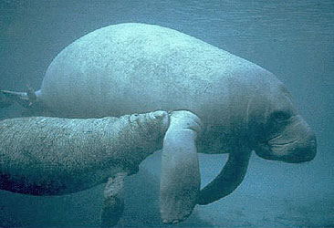

# [[Trichechidae]]

## Manatees 

## #has_/text_of_/abstract 

> **Trichechidae** is a family of sirenians that includes all living manatees and several extinct genera.
>
> [Wikipedia](https://en.wikipedia.org/wiki/Trichechidae) 

## Phylogeny 

-   « Ancestral Groups  
    -   [Sirenia](Sirenia.md)
    -   [Eutheria](Eutheria.md)
    -   [Mammal](Mammal.md)
    -   [Therapsida](../../../../Therapsida.md)
    -   [Synapsida](../../../../../Synapsida.md)
    -   [Amniota](../../../../../../Amniota.md)
    -   [Terrestrial Vertebrates](../../../../../../../Terrestrial.md)
    -   [Sarcopterygii](../../../../../../../../Sarc.md)
    -   [Gnathostomata](../../../../../../../../../Gnath.md)
    -   [Vertebrata](../../../../../../../../../../Vertebrata.md)
    -   [Craniata](../../../../../../../../../../../Craniata.md)
    -   [Chordata](../../../../../../../../../../../../Chordata.md)
    -   [Deuterostomia](../../../../../../../../../../../../../Deutero.md)
    -   [Bilateria](Bilateria)
    -   [Animals](Animals)
    -   [Eukaryotes](Eukaryotes)
    -   [Tree of Life](../../../../../../../../../../../../../../../../Tree_of_Life.md)

-   ◊ Sibling Groups of  Sirenia
    -   [Dugongidae](Dugongidae.md)
    -   Trichechidae

-   » Sub-Groups 
	-   *Ribodon* †
	-   *Trichechus inunguis* [(Amazonian manatee)]
	-   *Trichechus manatus* [(West Indian Manatee)]
	-   *Trichechus senegalensis* [(West Aftican manatee)]

### Information on the Internet

-   [Sirenia Project: Manatee Ecology and Population     Biology](http://www.fcsc.usgs.gov/Manatees/manatees.html). U.S.
    Geological Survey Biological Resources Division. Florida Caribbean
    Science Center.
-   [Manatee Research Center     Online](http://lake.ju.edu/research/marco/). Jacksonville
    University, Florida, USA.

## Title Illustrations

-------------------

Scientific Name ::     Trichechus manatus
Location ::           Florida
Comments             West Indian manatee
Creator              Galen Rathbun
Acknowledgements     Courtesy of the U.S. Fish and Wildlife Service
Specimen Condition   Live Specimen
Life Cycle Stage ::     cow and calf
