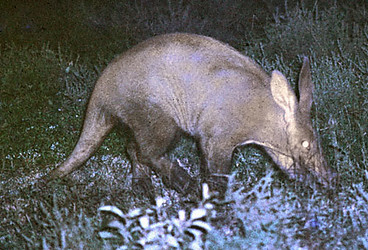

# [[Tubulidentata]] 

## Aardvarks or ant bears 

    

## #has_/text_of_/abstract 

> Orycteropodidae is a family of afrotherian mammals.  
> Although there are many fossil species, the only species surviving today is the aardvark, Orycteropus afer.  
> Orycteropodidae is recognized as the only family within the order **Tubulidentata**, from the Latin words tubulis (tubule) and dentis (tooth), referring to the tubule-style teeth., so the two are effectively synonyms.
>
> [Wikipedia](https://en.wikipedia.org/wiki/Orycteropodidae) 

## Phylogeny 

-   « Ancestral Groups  
    -   [Eutheria](Eutheria.md)
    -   [Mammal](Mammal.md)
    -   [Therapsida](../../../Therapsida.md)
    -   [Synapsida](../../../../Synapsida.md)
    -   [Amniota](../../../../../Amniota.md)
    -   [Terrestrial Vertebrates](../../../../../../Terrestrial.md)
    -   [Sarcopterygii](../../../../../../../Sarc.md)
    -   [Gnathostomata](../../../../../../../../Gnath.md)
    -   [Vertebrata](../../../../../../../../../Vertebrata.md)
    -   [Craniata](../../../../../../../../../../Craniata.md)
    -   [Chordata](../../../../../../../../../../../Chordata.md)
    -   [Deuterostomia](../../../../../../../../../../../../Deutero.md)
    -   [Bilateria](Bilateria)
    -   [Animals](Animals)
    -   [Eukaryotes](Eukaryotes)
    -   [Tree of Life](../../../../../../../../../../../../../../../Tree_of_Life.md)

-   ◊ Sibling Groups of  Eutheria
    -   [Edentata](Edentata.md)
    -   [Pholidota](Pholidota.md)
    -   [Lagomorpha](Lagomorpha.md)
    -   [Rodentia](Rodentia.md)
    -   [Macroscelididae](Macroscelididae.md)
    -   [Primates](Primates.md)
    -   [Scandentia](Scandentia.md)
    -   [Chiroptera](Chiroptera.md)
    -   [Dermoptera](Dermoptera.md)
    -   [Insectivora](Insectivora.md)
    -   [Carnivora](Carnivora.md)
    -   [Artiodactyla](Artiodactyla.md)
    -   [Whale](Whale.md)
    -   Tubulidentata
    -   [Perissodactyla](Perissodactyla.md)
    -   [Hyracoidea](Hyracoidea.md)
    -   [Sirenia](Sirenia.md)
    -   [Proboscidea](Eukaryotes/Animals/Bilateria/Deutero/Chordata/Craniata/Vertebrata/Gnath/Sarc/Terrestrial/Amniota/Synapsida/Therapsida/Mammal/Eutheria/Proboscidea.md)

-   » Sub-Groups 
	-   *Archaeorycteropus* †
	-   *Myorycteropus* †
	-   *Orycteropus afer*
	-   *Leptorycteropus* †

### Information on the Internet

-   [Order     Tubulidentata](http://animaldiversity.ummz.umich.edu/chordata/mammalia/tubulidentata.html).
    Animal Diversity Web. University of Michigan Museum of Zoology.
-   [Tubulidentata](http://www.ultimateungulate.com/Tubulidentata.html).
    The Ultimate Ungulate Page.
-   [Afrotheria Specialist     Group](http://www.calacademy.org/research/bmammals/afrotheria/ASG.html).
    IUCN - The World Conservation Union. Species Survival Commission.
-   [Aardvark](http://www.awf.org/wildlives/60). African Wildlife
    Foundation.

## Title Illustrations

-------------------------------------------------------------------------

Scientific Name ::     Orycteropus afer
Location ::           Serengeti National Park, Tanzania
Comments             Aardvarks are shy, solitary and completely nocturnal. They sleep in burrows by day and emerge to dig for termites after dark. This one was found by spotlighting on open grasslands.
Specimen Condition   Live Specimen
Identified By        David Bygott
Behavior             Foraging
Life Cycle Stage ::     Adult
View                 Lateral
Copyright ::            © 2005 [David Bygott](mailto:davidbygott@yahoo.com) 

-------------------------------------------------------------------------

Scientific Name ::     Orycteropus afer
Location ::           captive specimen at Frankfurt Zoo (Germany)
Comments             aardvark
Creator              Lloyd Glenn Ingles
Specimen Condition   Live Specimen
Source Collection    [CalPhotos](http://calphotos.berkeley.edu/)
Copyright ::            © 2001 [California Academy of Sciences](http://www.calacademy.org/) 

## Confidential Links & Embeds: 

### #is_/same_as :: [Tubulidentata](/_Standards/bio/bio~Domain/Eukaryotes/Animals/Bilateria/Deutero/Chordata/Craniata/Vertebrata/Gnath/Sarc/Tetrapods/Amniota/Synapsida/Therapsida/Mammal/Eutheria/Tubulidentata.md) 

### #is_/same_as :: [Tubulidentata.public](/_public/bio/bio~Domain/Eukaryotes/Animals/Bilateria/Deutero/Chordata/Craniata/Vertebrata/Gnath/Sarc/Tetrapods/Amniota/Synapsida/Therapsida/Mammal/Eutheria/Tubulidentata.public.md) 

### #is_/same_as :: [Tubulidentata.internal](/_internal/bio/bio~Domain/Eukaryotes/Animals/Bilateria/Deutero/Chordata/Craniata/Vertebrata/Gnath/Sarc/Tetrapods/Amniota/Synapsida/Therapsida/Mammal/Eutheria/Tubulidentata.internal.md) 

### #is_/same_as :: [Tubulidentata.protect](/_protect/bio/bio~Domain/Eukaryotes/Animals/Bilateria/Deutero/Chordata/Craniata/Vertebrata/Gnath/Sarc/Tetrapods/Amniota/Synapsida/Therapsida/Mammal/Eutheria/Tubulidentata.protect.md) 

### #is_/same_as :: [Tubulidentata.private](/_private/bio/bio~Domain/Eukaryotes/Animals/Bilateria/Deutero/Chordata/Craniata/Vertebrata/Gnath/Sarc/Tetrapods/Amniota/Synapsida/Therapsida/Mammal/Eutheria/Tubulidentata.private.md) 

### #is_/same_as :: [Tubulidentata.personal](/_personal/bio/bio~Domain/Eukaryotes/Animals/Bilateria/Deutero/Chordata/Craniata/Vertebrata/Gnath/Sarc/Tetrapods/Amniota/Synapsida/Therapsida/Mammal/Eutheria/Tubulidentata.personal.md) 

### #is_/same_as :: [Tubulidentata.secret](/_secret/bio/bio~Domain/Eukaryotes/Animals/Bilateria/Deutero/Chordata/Craniata/Vertebrata/Gnath/Sarc/Tetrapods/Amniota/Synapsida/Therapsida/Mammal/Eutheria/Tubulidentata.secret.md)

