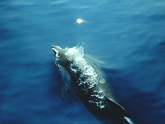
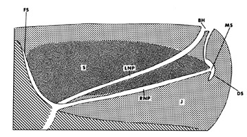
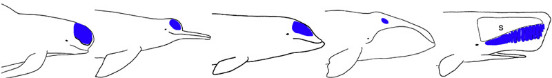
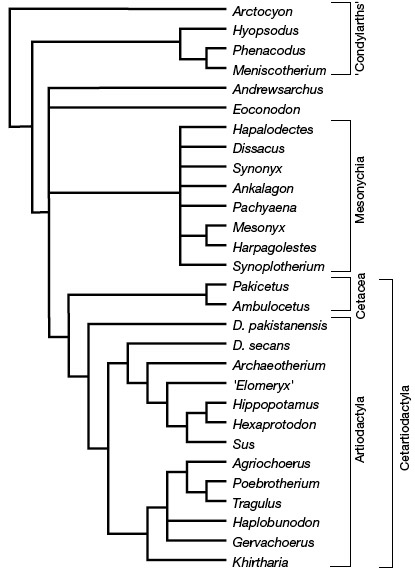

# [[Whale]] 

#is_/same_as :: [[../../../../../../../../../../../../../../WikiData/WD~Whale,160|WD~Whale,160]] 
#is_/same_as :: [[../../../../../../../../../../../../../../WikiData/WD~Whale,1865281|WD~Whale,1865281]] 

## #has_/text_of_/abstract 

> **Cetacea** (; from Latin  cetus 'whale', from Ancient Greek  κῆτος (kêtos) 'huge fish, sea monster') 
> is an infraorder of aquatic mammals belonging to the order Artiodactyla 
> that includes whales, dolphins and porpoises. 
> 
> Key characteristics are their fully aquatic lifestyle, streamlined body shape, 
> often large size and exclusively carnivorous diet. 
> 
> They propel themselves through the water 
> with powerful up-and-down movement of their tail 
> which ends in a paddle-like fluke, 
> using their flipper-shaped forelimbs to maneuver.
>
> While the majority of cetaceans live in marine environments, a small number reside solely in brackish water or fresh water. Having a cosmopolitan distribution, they can be found in some rivers and all of Earth's oceans, and many species inhabit vast ranges where they migrate with the changing of the seasons.
>
> Cetaceans are famous for their high intelligence, complex social behaviour, and the enormous size of some of the group's members. For example, the blue whale reaches a maximum confirmed length of 29.9 meters (98 feet) and a weight of 173 tonnes (190 short tons), making it the largest animal ever known to have existed.
>
> There are approximately 89 living species split into two parvorders: Odontoceti or toothed whales (containing porpoises, dolphins, other predatory whales like the  beluga and the sperm whale, and the poorly understood beaked whales) and the filter feeding Mysticeti or baleen whales (which includes species like the blue whale, the humpback whale and the bowhead whale). Despite their highly modified bodies and carnivorous lifestyle, genetic and fossil evidence places cetaceans as nested within even-toed ungulates, most closely related to hippopotamus within the clade Whippomorpha.
>
> Cetaceans have been extensively hunted for their meat, blubber and oil by commercial operations. Although the International Whaling Commission has agreed on putting a halt to commercial whaling, whale hunting is still going on, either under IWC quotas to assist the subsistence of Arctic native people or in the name of scientific research, although a large spectrum of non-lethal methods are now available to study marine mammals in the wild. Cetaceans also face severe environmental hazards from underwater noise pollution, entanglement in abandoned ropes and nets, collisions with ships, plastic and heavy metals build-up, to accelerating climate change, but how much they are affected varies widely from species to species, from minimally in the case of the southern bottlenose whale to the baiji (Chinese river dolphin) which is considered to be functionally extinct due to human activity.
>
> [Wikipedia](https://en.wikipedia.org/wiki/Cetacea)
    -   [Primates](Primates.md)
    -   [Scandentia](Scandentia.md)
    -   [Chiroptera](Chiroptera.md)
    -   [Dermoptera](Dermoptera.md)
    -   [Insectivora](Insectivora.md)
    -   [Carnivora](Carnivora.md)
    -   [Artiodactyla](Artiodactyla.md)
    -   Cetacea
    -   [Tubulidentata](Tubulidentata.md)
    -   [Perissodactyla](Perissodactyla.md)
    -   [Hyracoidea](Hyracoidea.md)
    -   [Sirenia](Sirenia.md)
    -   [Proboscidea](Eukaryotes/Animals/Bilateria/Deutero/Chordata/Craniata/Vertebrata/Gnath/Sarc/Terrestrial/Amniota/Synapsida/Therapsida/Mammal/Eutheria/Proboscidea.md)

-   » Sub-Groups
    -   [Odontoceti](Whale/Odontoceti.md)
    -   [Mysticeti](Whale/Mysticeti.md)

# Cetacea

## Whales, dolphins, and porpoises 

[Michel C. Milinkovitch and Olivier Lambert]()

Archaeoceti clearly is paraphyletic, Mysticeti clearly is monophyletic,
Odontoceti is likely monophyletic (see text below).

Containing group: [Eutheria](Eutheria.md)

### Information on the Internet

-   [Order     Cetacea](http://animaldiversity.ummz.umich.edu/chordata/mammalia/cetacea.html).
    Animal Diversity Web. University of Michigan Museum of Zoology.
-   [American Cetacean Society](http://www.acsonline.org/).
-   [National Marine Mammal Laboratory     (NMML)](http://nmml.afsc.noaa.gov/).
-   [Canada\'s Marine     Mammals](http://www.aquatic.uoguelph.ca/mammals/whales/marine_frame.htm).
    University of Guelph.
-   [Indonesia Oceanic Cetacean     Program](http://www.apex-environmental.com/).
-   [Center for Oceanic Research and     Education](http://coreresearch.org/).
-   [WhaleNet at Wheelock     College](http://whale.wheelock.edu/Welcome.html).
-   [Institute of Cetacean     Research](http://www.icrwhale.org/eng-index.htm).
-   [Oceania Project: Caring for Whales, Dolphins & the     Oceans](http://www.oceania.org.au/index.html).
-   [Whale-Watching-Web](http://www.physics.helsinki.fi/whale/).
-   [Azorian Whale Watching Base](http://www.espacotalassa.com/).
-   [Whale Dreams: Spotting Whales in     Australia](http://www.abc.net.au/oceans/whale/spot.htm). Environment
    Australia - Biodiversity Group.
-   [The Whale Center of New England](http://www.whalecenter.org/).
-   [Marine Mammal     Program](http://www.nmfs.noaa.gov/prot_res/overview/mm.html). U. S.
    National Marine Fisheries Service Office of Protected Resources.

#### Early Cetacea Fossils:

-   [Whale     Origins](http://www.neoucom.edu/Depts/Anat/whaleorigins.htm). J. G. M.
    \"Hans\" Thewissen, Northeastern Ohio Universities.
-   [Mark D. Uhen\'s Research in Vertebrate     Paleontology](http://www.cdp1802.org/%7Emuhen/).
-   [Ambulocetus as a Fossil     Transitional](http://www.geocities.com/CapeCanaveral/Hangar/2437/ambulo.htm).
    Lenny Flank, Creation \"Science\" Debunked.
-   [Cetaceans (Whales and     Dolphins)](http://www.ucmp.berkeley.edu/mammal/cetacea/cetacean.html).
    UCMP Berkeley.

## Introduction

Cetaceans (whales, dolphins and porpoises) form one of the most
dramatically-derived group of mammals. Indeed, during their transition
from the terrestrial to the aquatic environment, they experienced
spectacular transformation of many biological systems and acquired a
fusiform body shape giving modern families a superficial resemblance to
fish. Extant cetaceans comprise approximately 87 species in 14 families
and two sub-orders: Mysticeti (baleen-bearing whales) and Odontoceti
(teeth-bearing whales) (Rice, 1998). Adult size ranges from less than
1.5 meters for some representatives of the *Cephalorhynchus* genus, to
more than 30 meters for the largest blue whales. Cetaceans are
ecologically very diverse as their habitats vary from coastal to
pelagic, from tropical to polar, and from marine to fresh water, while
their preys vary from planctonic crustaceans to fish, squids, and marine
mammals.

### Characteristics

The major morphological transformations related to the transition to the
aquatic environment include:

-   Loss of external hind limbs, although vestigial pelvic girdle bones
    are still present in all extant species;
-   Paddle-like forelimbs with hyperphalangy and a non-rotational elbow
    joint;
-   Torpedo-shaped body, with addition of vertebrae, reduction of the
    neck, and development of a horizontal caudal tail;
-   Development of a thick blubber layer that prevents heat-loss;
-   Telescoping of the skull, and posterior movement of the narial
    openings. The position of the external nares on the top of the skull
    allows cetacean to breathe while keeping the rest of the head
    underwater. The telescoping of the skull mostly involves the
    posterior extension of the bones of the elongated rostrum: maxillae,
    premaxillae, vomer and mesethmoid;
-   Isolation of the earbones related to the development of underwater
    hearing and echolocation abilities.

### Breathing

In mysticetes the nasal passages are separate tubes all the way to the
external nares, whereas in odontocetes, the two nasal passages branch
into a complex series of nasal sacs that eventually coalesce into a
single blowhole. The sperm whale is however intermediate as it exhibits
a sigmoidally-shaped blowhole formed by two nasal tubes that remain
distinct from the bony nares to the top of the head: the anterior and
posterior curves of the sigmoid blowhole represent the apertures of the
right and left nares, respectively (rare examples of adult sperm whales
with two distinct blowholes have even been reported). In the pygmy sperm
whales (Kogiidae), the situation is only slightly different since the
nasal passages remain discrete tubes until just proximal to the single
blowhole.

In the giant sperm whale, the nasal passages remain discrete tubes until
just proximal to the single s-shaped blowhole.\
© 1989 John E. Heyning.

 
### Hearing and Echolocation

Echolocation is the ability to assess the environment (mostly, detecting
obstacles, conspecifics, predators, and prey) by emitting sounds and
listening to the echoes. Echolocation abilities have been conclusively
demonstrated in delphinoids and so-called "river dolphins" (see below)
and seem to be present in beaked and sperm whales as well. Although they
can easily detect an object about the size of a ping-pong ball more than
50 meters away, dolphins also use echolocation to inspect objects at
very short ranges (*e.g.*, to assess shape, size, and structure).
Dolphins produce short "clicks" whose frequencies (10 to 150 kHz) and
intervals (as short as 1.2 milliseconds) are adjusted depending on the
size and distance of the target (high frequencies dissipate more rapidly
than low frequencies but allow the detection of smaller targets and a
finer analysis of shape and structure). These sounds are produced by
circulation of air in a complex system of facial sacs, reflected by the
cranium, and focused into a beam by the melon, a fatty structure located
in the forehead and serving as an acoustic lens. Mysticetes possess a
small (Heyning 1989), possibly vestigial (Milinkovitch, 1995) melon.

The melon is a a fatty structure located in the forehead of all
cetaceans. In most toothed whales, it serves as an acoustic lens for
echolocation sound production. The melon is shown in blue for the genera
*Globicephala*, *Inia*, *Ziphius*, *Balaena*, and *Physeter* (from left
to right). **S**, spermaceti organ.\
© 1995 [Michel C. Milinkovitch](http://www.ulb.ac.be/sciences/ueg/)

The high-frequency echoes are received through the hollow mandible then
transferred across fatty channels to the middle ear. Low-frequency
sounds on the other hand are perceived through the auditory channels.
The middle and inner ears of odontocetes are surrounded by an emulsion
of mucus, oil, and air. The whole structure is enclosed into a dense,
bony bulla. This high level of acoustic isolation greatly improves
directional detection. The isolation mechanism is less complete in
mysticetes, but the large distance between the two ears (simply because
of the size of these animals) probably helps directional detection.
Mysticetes exhibit a peculiar tympanic membrane (the finger glove) and
seem to receive sounds through the auditory channels. It is unclear
whether mysticetes are able to rely on the echoes of their low-frequency
sounds.

Dorsal and anterior to the skull, sperm whales also have a large oily
organ (called the "spermaceti organ" because early whalers thought the
whitish oily substance was the whale semen) that possibly works as a
biological ballast (Raven & Gregory 1933; Clarke 1970) or constitutes a
secondary sexual character involved in acoustic display (Cranford 1999).
Because of the high specialization of the giant sperm whale facial
anatomy, it is unclear what structure in this species is homologous to
the melon of other cetaceans. However, based on the comparison between
the facial anatomy of dwarf and pygmy sperm whales, Heyning (1989)
suggested the junk (a segmented tissue located below the spermaceti case
and so-called because it is less rich in oil than the spermaceti itself)
rather than the spermaceti organ as the most likely candidate. This
hypothesis is supported by comparative CT-scan analyses (Cranford et al.
1996).

### Origin of Cetacea

The oldest known cetaceans are Eocene in age, appearing around 55
million years ago. These primitive toothed cetaceans, lacking
odontocetes and mysticetes cranial specializations, form the
paraphyletic sub-order Archaeoceti. Representatives of this group have
been found in Egypt, Nigeria, India, Pakistan, and USA and show a wide
range of morphologies that prompted their classification into several
families such as the Pakicetidae (early Eocene), Protocetidae (middle
Eocene) and Basilosauridae (middle to Late Eocene). The most primitive
taxa exhibited locomotory hind limbs (see Thewissen et al. 1994;
Gingerich et al. 2001; Thewissen et al. 2001). The archaeoceti fossils
illustrate the progressive reduction of hind limbs, adaptations of the
ear for underwater hearing, and the expansion of the pterygoid sinus
fossae in the basicranium leading to a better isolation of the ear
bones.

The origin of aquatic cetaceans has to be found among terrestrial
mammals living in the early Tertiary. Analyses of neontological data
have long suggested that cetaceans are closely related to ungulates
(*e.g.*, Flower, 1883; Prothero *et al.* 1988). These results were
corroborated by paleontological data (Gingerich *et al*. 1990; Thewissen
and Hussain, 1993; Thewissen, 1994). The close relationship between
cetaceans and ungulates (and especially artiodactyls) was strongly
supported by basically all molecular data published to date: from
immunological (e.g., Boyden and Gemeroy, 1950; Shoshani, 1986) and
DNA-DNA hybridization (Milinkovitch, 1992) studies, to analyses of
mitochondrial and nuclear amino-acid and DNA sequences (e.g., Czelusniak
et al. 1990; Milinkovitch et al. 1993; Gatesy, 1997; Milinkovitch et al.
1998, Gatesy et al. 1999).

The two main alternative hypotheses regarding the exact phylogenetic
position of cetaceans within mammals are suggested respectively by
morphological and molecular data. Morphological studies suggested that
artiodactyls is the sister group to Cete \-- *i.e.*, a clade comprising
cetaceans and a fossil group of carnivorous hoofed mammals: the
mesonychians (see *e.g.* O\'Leary and Geisler, 1999). On the other hand,
molecular studies indicate that cetaceans are highly derived
artiodactyls and that hippopotamids are their extant sister group.
Although the nesting of cetaceans within artiodactyls (making the latter
paraphyletic) was suggested by multiple studies (Goodman *et al.* 1985;
Czelusniak *et al.* 1990; Irwin *et al.* 1991; Graur and Higgins, 1994;
Gatesy *et al.* 1996; Smith *et al.* 1996; Gatesy, 1997; Montgelard *et
al.* 1997) the statistical support or methods of analyses have been
strongly criticized (*e.g.*, Philippe and Douzery, 1994; Hasegawa and
Adachi, 1996). This lead to a second series of molecular analyses with
greatly increased taxon and gene sampling (Milinkovitch *et al.* 1998,
Gatesy *et al.* 1999).

These latter analyses confirmed the monophyly of Cetartiodactyla
(cetaceans,artiodactyls) and clarified its phylogeny. Furthermore,
phylogenetic interpretation of retropositional events that lead to the
insertion of short interspersed elements (SINEs) at particular loci in
the nuclear genome of various artiodactyl and cetacean ancestors
(Shimamura *et al.* 1997; Nikaido *et al.* 1999) lead to the same
phylogenetic tree, suggesting that the paraphyly of artiodactyls is not
the result of analytical problems related to the analysis of aligned
nucleotide sequences (Milinkovitch and Thewissen, 1997; Shedlock *et
al.* 2000). It is indeed the nature of SINE data that makes them so
efficient in phylogeny inference: the likelihood of SINEs being
independently inserted at the same locus in different lineages, or
precisely excised in different lineages, seems virtually nil.

It remains to be understood why these results are in striking
contradiction to the common interpretation of the available
morphological data, namely, supporting artiodactyl monophyly (*e.g.*,
O\'Leary and Geisler, 1999).\

Note however, that the discrepancies between the morphological and
molecular hypotheses have recently diminished. Indeed, recent
discoveries of primitive whales from the families Pakicetidae and
Protocetidae, from the early Eocene of Pakistan, allowed the description
of skulls associated with hindlimbs (Thewissen *et al.* 2001; Gingerich
*et al.* 2001). These fossils exhibit skull characters typical of
primitive cetaceans and terrestrial hindlimbs with derived characters of
artiodactyls. The morphology of the ankle (mainly the astragalus and
calcaneum) of these terrestrial cetaceans suggest that Cetacea are the
sister group of monophyletic Artiodactyla, and that \[artiodactyls ,
cetaceans\] form the sister group of mesonychians. In these new trees,
cetaceans are therefore getting closer to artiodactyls but these
analyses of morphological characters continue to support the monophyly
of the latter group and, hence, to disagree with the molecular analyses.

Relationships between Artiodactyla, Cetacea, and Mesonychia based on
morphological data. From Thewissen et al. (2001).

Finally, Geisler and Uhen (2003) have performed maximum parsimony
analyses of a matrix including substantially more taxa and morphological
characters than previous analyses and found support for the
sister-relationship between hippos and cetaceans, making molecular and
morphological evidence for the phylogeny of these taxa much more
congruent than previously thought.\

### Discussion of Phylogenetic Relationships

Some molecular studies based on mitochondrial DNA sequences
(Milinkovitch *et al.* 1993; Milinkovitch *et al.* 1994) suggested that
Physeteroidea (sperm whales) are more closely related to mysticetes than
they are to other odontocetes. However, other molecular data (*e.g.*,
Nikaido *et al.* 2001; Gatesy *et al.* 1999) support the monophyly of
toothed whales (Odontoceti). Recent analyses (Cassens *et al.* 2000)
indicate that there is conflicting signal between the nuclear DNA and
mitochondrial DNA data. Whether this conflict is due to differential
lineage sorting or to misleading signal from one or several data set(s)
remains to be investigated. This issue is further discussed in the
Odontoceti (toothed whale) page.

Phylogenetic relationships among the families of extant cetaceans are
still problematic and hypotheses on various nodes of the tree come from
a variety of data: the morphology of extant taxa (including the soft
anatomy) (*e.g.,* Heyning, 1989), paleontological (e.g., Muizon 1991;
Fordyce 1994; Geisler and Sanders 2003), and molecular evidence (*e.g.*,
Milinkovitch *et al.* 1993, 1994; Arnason and Gulberg, 1996; Cassens *et
al.* 2000) or a combination of these (Milinkovitch 1995; Messenger and
Mc Guire, 1998; Gatesy *et al.* 1999). This evidence will be discussed
on relevant pages of cetacean subgroups.
## Phylogeny 

-   « Ancestral Groups  
    -   [Eutheria](Eutheria.md)
    -   [Mammal](Mammal.md)
    -   [Therapsida](../../../Therapsida.md)
    -   [Synapsida](../../../../Synapsida.md)
    -   [Amniota](../../../../../Amniota.md)
    -   [Terrestrial Vertebrates](../../../../../../Terrestrial.md)
    -   [Sarcopterygii](../../../../../../../Sarc.md)
    -   [Gnathostomata](../../../../../../../../Gnath.md)
    -   [Vertebrata](../../../../../../../../../Vertebrata.md)
    -   [Craniata](../../../../../../../../../../Craniata.md)
    -   [Chordata](../../../../../../../../../../../Chordata.md)
    -   [Deuterostomia](../../../../../../../../../../../../Deutero.md)
    -   [Bilateria](Bilateria)
    -   [Animals](Animals)
    -   [Eukaryotes](Eukaryotes)
    -   [Tree of Life](../../../../../../../../../../../../../../../Tree_of_Life.md)

-   ◊ Sibling Groups of  Eutheria
    -   [Edentata](Edentata.md)
    -   [Pholidota](Pholidota.md)
    -   [Lagomorpha](Lagomorpha.md)
    -   [Rodentia](Rodentia.md)
    -   [Macroscelididae](Macroscelididae.md)

## Title Illustrations

-----------------------------------------------------------------------------

Scientific Name ::  Stenella coeruleoalba
Location ::        Mediterranean Sea, between France and Corsica.
Copyright ::         © 1991 [Michel C. Milinkovitch](http://www.ulb.ac.be/sciences/ueg) 

## Confidential Links & Embeds: 

### #is_/same_as :: [Whale](/_Standards/bio/bio~Domain/Eukaryotes/Animals/Bilateria/Deutero/Chordata/Craniata/Vertebrata/Gnath/Sarc/Tetrapods/Amniota/Synapsida/Therapsida/Mammal/Eutheria/Whale.md) 

### #is_/same_as :: [Whale.public](/_public/bio/bio~Domain/Eukaryotes/Animals/Bilateria/Deutero/Chordata/Craniata/Vertebrata/Gnath/Sarc/Tetrapods/Amniota/Synapsida/Therapsida/Mammal/Eutheria/Whale.public.md) 

### #is_/same_as :: [Whale.internal](/_internal/bio/bio~Domain/Eukaryotes/Animals/Bilateria/Deutero/Chordata/Craniata/Vertebrata/Gnath/Sarc/Tetrapods/Amniota/Synapsida/Therapsida/Mammal/Eutheria/Whale.internal.md) 

### #is_/same_as :: [Whale.protect](/_protect/bio/bio~Domain/Eukaryotes/Animals/Bilateria/Deutero/Chordata/Craniata/Vertebrata/Gnath/Sarc/Tetrapods/Amniota/Synapsida/Therapsida/Mammal/Eutheria/Whale.protect.md) 

### #is_/same_as :: [Whale.private](/_private/bio/bio~Domain/Eukaryotes/Animals/Bilateria/Deutero/Chordata/Craniata/Vertebrata/Gnath/Sarc/Tetrapods/Amniota/Synapsida/Therapsida/Mammal/Eutheria/Whale.private.md) 

### #is_/same_as :: [Whale.personal](/_personal/bio/bio~Domain/Eukaryotes/Animals/Bilateria/Deutero/Chordata/Craniata/Vertebrata/Gnath/Sarc/Tetrapods/Amniota/Synapsida/Therapsida/Mammal/Eutheria/Whale.personal.md) 

### #is_/same_as :: [Whale.secret](/_secret/bio/bio~Domain/Eukaryotes/Animals/Bilateria/Deutero/Chordata/Craniata/Vertebrata/Gnath/Sarc/Tetrapods/Amniota/Synapsida/Therapsida/Mammal/Eutheria/Whale.secret.md)

