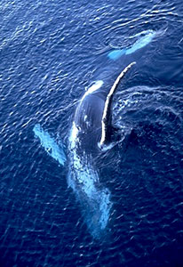

# [[Balaenopteridae]]

## Rorquals 

## #has_/text_of_/abstract 

> Rorquals () are the largest group of baleen whales, comprising the family **Balaenopteridae**, which contains nine extant species in two genera. They include the largest known animal that has ever lived, the blue whale, which can reach 180 tonnes (200 short tons), and the fin whale, which reaches 120 tonnes (130 short tons); even the smallest of the group, the northern minke whale, reaches 9 tonnes (10 short tons).
>
> Rorquals take their name from French rorqual, which derives from the Norwegian word røyrkval: the first element røyr originated from the Old Norse name for this type of whale, reyðr, probably related to the Norse word for "red", and the second from the Norse word hvalr meaning "whale" in general. The family name Balaenopteridae is from the type genus, Balaenoptera.
>
> [Wikipedia](https://en.wikipedia.org/wiki/Rorqual)

## Phylogeny 

-   « Ancestral Groups  
    -   [Mysticeti](../Mysticeti.md)
    -   [Whale](../../Whale.md)
    -   [Eutheria](Eutheria.md)
    -   [Mammal](Mammal.md)
    -   [Therapsida](../../../../../Therapsida.md)
    -   [Synapsida](../../../../../../Synapsida.md)
    -   [Amniota](../../../../../../../Amniota.md)
    -   [Terrestrial Vertebrates](../../../../../../../../Terrestrial.md)
    -   [Sarcopterygii](../../../../../../../../../Sarc.md)
    -   [Gnathostomata](../../../../../../../../../../Gnath.md)
    -   [Vertebrata](../../../../../../../../../../../Vertebrata.md)
    -   [Craniata](../../../../../../../../../../../../Craniata.md)
    -   [Chordata](../../../../../../../../../../../../../Chordata.md)
    -   [Deuterostomia](../../../../../../../../../../../../../../Deutero.md)
    -   [Bilateria](Bilateria)
    -   [Animals](Animals)
    -   [Eukaryotes](Eukaryotes)
    -   [Tree of Life](../../../../../../../../../../../../../../../../../Tree_of_Life.md)

-   ◊ Sibling Groups of  Mysticeti
    -   Balaenopteridae
    -   [Balaenidae](Balaenidae.md)

-   » Sub-Groups 
	-   *Notiocetus* †
	-   *Palaeocetus* †
	-   *Balaenoptera musculus* [(blue whale)]
	-   *Balaenoptera physalus* [(fin whale)]
	-   *Balaenoptera borealis* [(sei whale)]
	-   *Balaenoptera edeni* [(Bryde\'s whale)]
	-   *Balaenoptera acutorostrata* [(minke whale)]
	-   *Plesiocetus* †
	-   *Idiocetus* †
	-   *Megaptera novaeangliae* [(humpback whale)]
	-   *Megapteropsis* †
	-   *Burtinopsis* †

### Information on the Internet

-   [The Virtual Whale     Project](http://www.cs.sfu.ca/research/projects/Whales/). 3D
    Animation and sound environment for the visualization of the feeding
    behaviours of Pacific Humpback Whales.
-   [Humpback Whales: Biology and Natural     History](http://earthtrust.org/wlcurric/whales.html). Hawaii\'s
    Marine Wildlife. Earthtrust, Kailua, Hawaii.

## Title Illustrations

------------------------------------------------------------------------------
Scientific Name ::     Megaptera novaeangliae
Location ::           Gerlache Strait (Antarctica)
Comments             Humpback whale (Balaenopteridae)
Creator              Photograph by Gerald and Buff Corsi
Specimen Condition   Live Specimen
Source Collection    [CalPhotos](http://calphotos.berkeley.edu/)
Copyright ::            © 2001 [California Academy of Sciences](http://www.calacademy.org/) 
------------------------------------------------------------------------------

## Confidential Links & Embeds: 

### [Balaenopteridae](/_Standards/bio/bio~Domain/Eukaryotes/Animals/Bilateria/Deutero/Chordata/Craniata/Vertebrata/Gnath/Sarc/Tetrapods/Amniota/Synapsida/Therapsida/Mammal/Eutheria/Whale/Mysticeti/Balaenopteridae.md) 

### [Balaenopteridae.public](/_public/bio/bio~Domain/Eukaryotes/Animals/Bilateria/Deutero/Chordata/Craniata/Vertebrata/Gnath/Sarc/Tetrapods/Amniota/Synapsida/Therapsida/Mammal/Eutheria/Whale/Mysticeti/Balaenopteridae.public.md) 

### [Balaenopteridae.internal](/_internal/bio/bio~Domain/Eukaryotes/Animals/Bilateria/Deutero/Chordata/Craniata/Vertebrata/Gnath/Sarc/Tetrapods/Amniota/Synapsida/Therapsida/Mammal/Eutheria/Whale/Mysticeti/Balaenopteridae.internal.md) 

### [Balaenopteridae.protect](/_protect/bio/bio~Domain/Eukaryotes/Animals/Bilateria/Deutero/Chordata/Craniata/Vertebrata/Gnath/Sarc/Tetrapods/Amniota/Synapsida/Therapsida/Mammal/Eutheria/Whale/Mysticeti/Balaenopteridae.protect.md) 

### [Balaenopteridae.private](/_private/bio/bio~Domain/Eukaryotes/Animals/Bilateria/Deutero/Chordata/Craniata/Vertebrata/Gnath/Sarc/Tetrapods/Amniota/Synapsida/Therapsida/Mammal/Eutheria/Whale/Mysticeti/Balaenopteridae.private.md) 

### [Balaenopteridae.personal](/_personal/bio/bio~Domain/Eukaryotes/Animals/Bilateria/Deutero/Chordata/Craniata/Vertebrata/Gnath/Sarc/Tetrapods/Amniota/Synapsida/Therapsida/Mammal/Eutheria/Whale/Mysticeti/Balaenopteridae.personal.md) 

### [Balaenopteridae.secret](/_secret/bio/bio~Domain/Eukaryotes/Animals/Bilateria/Deutero/Chordata/Craniata/Vertebrata/Gnath/Sarc/Tetrapods/Amniota/Synapsida/Therapsida/Mammal/Eutheria/Whale/Mysticeti/Balaenopteridae.secret.md)

