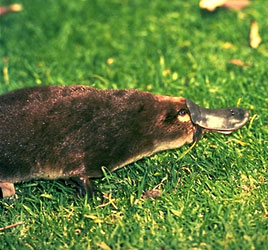

# [[Platypus]] 

  

#is_/same_as :: [[WD~Platypus,15343]]

## #has_/text_of_/abstract 

> The **Platypus** (Ornithorhynchus anatinus), sometimes referred to as the duck-billed platypus, is a semiaquatic, egg-laying mammal endemic to eastern Australia, including Tasmania. The platypus is the sole living representative or monotypic taxon of its family Ornithorhynchidae and genus Ornithorhynchus, though a number of related species appear in the fossil record.
>
> Together with the four species of echidna, it is one of the five extant species of monotremes, mammals that lay eggs instead of giving birth to live young. Like other monotremes, the platypus has a sense of electrolocation, which it uses to detect prey in cloudy water. It is one of the few species of venomous mammals, as the male platypus has a spur on the hind foot that delivers an extremely painful venom.
>
> The unusual appearance of this egg-laying, duck-billed, beaver-tailed, otter-footed mammal at first baffled European naturalists. In 1799, the first scientists to examine a preserved platypus body judged it a fake made of several animals sewn together.
>
> The unique features of the platypus make it important in the study of evolutionary biology, and a recognisable and iconic symbol of Australia. It is culturally significant to several Aboriginal peoples, who also used to hunt it for food. It has appeared as a national mascot, features on the reverse of the Australian twenty-cent coin, and is an emblem of the state of New South Wales.
>
> The platypus was hunted for its fur, but it has been a legally protected species in all states where it occurs since 1912. Its population is not under severe threat, although captive-breeding programs have had slight success, and it is vulnerable to pollution. It is classified as a near-threatened species by the IUCN, but a November 2020 report has recommended that it be upgraded to threatened species under the federal EPBC Act, due to habitat destruction and declining numbers in all states.
>
> [Wikipedia](https://en.wikipedia.org/wiki/Platypus) 

## Confidential Links & Embeds: 

### [Platypus](/_Standards/bio/bio~Domain/Eukaryotes/Animals/Bilateria/Deutero/Chordata/Craniata/Vertebrata/Gnath/Sarc/Tetrapods/Amniota/Synapsida/Therapsida/Mammal/Monotremata/Platypus.md) 

### [Platypus.public](/_public/bio/bio~Domain/Eukaryotes/Animals/Bilateria/Deutero/Chordata/Craniata/Vertebrata/Gnath/Sarc/Tetrapods/Amniota/Synapsida/Therapsida/Mammal/Monotremata/Platypus.public.md) 

### [Platypus.internal](/_internal/bio/bio~Domain/Eukaryotes/Animals/Bilateria/Deutero/Chordata/Craniata/Vertebrata/Gnath/Sarc/Tetrapods/Amniota/Synapsida/Therapsida/Mammal/Monotremata/Platypus.internal.md) 

### [Platypus.protect](/_protect/bio/bio~Domain/Eukaryotes/Animals/Bilateria/Deutero/Chordata/Craniata/Vertebrata/Gnath/Sarc/Tetrapods/Amniota/Synapsida/Therapsida/Mammal/Monotremata/Platypus.protect.md) 

### [Platypus.private](/_private/bio/bio~Domain/Eukaryotes/Animals/Bilateria/Deutero/Chordata/Craniata/Vertebrata/Gnath/Sarc/Tetrapods/Amniota/Synapsida/Therapsida/Mammal/Monotremata/Platypus.private.md) 

### [Platypus.personal](/_personal/bio/bio~Domain/Eukaryotes/Animals/Bilateria/Deutero/Chordata/Craniata/Vertebrata/Gnath/Sarc/Tetrapods/Amniota/Synapsida/Therapsida/Mammal/Monotremata/Platypus.personal.md) 

### [Platypus.secret](/_secret/bio/bio~Domain/Eukaryotes/Animals/Bilateria/Deutero/Chordata/Craniata/Vertebrata/Gnath/Sarc/Tetrapods/Amniota/Synapsida/Therapsida/Mammal/Monotremata/Platypus.secret.md)

