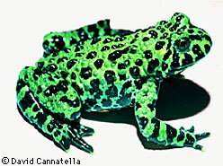
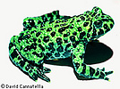

---
title: Bombinatoridae
---

## Phylogeny 

-   « Ancestral Groups  
    -   [Salientia](../Salientia.md)
    -   [Living Amphibians](Living_Amphibians)
    -   [Terrestrial Vertebrates](../../../Terrestrial.md)
    -   [Sarcopterygii](../../../../Sarc.md)
    -   [Gnathostomata](../../../../../Gnath.md)
    -   [Vertebrata](../../../../../../Vertebrata.md)
    -   [Craniata](../../../../../../../Craniata.md)
    -   [Chordata](../../../../../../../../Chordata.md)
    -   [Deuterostomia](../../../../../../../../../Deutero.md)
    -   [Bilateria](Bilateria)
    -   [Animals](Animals)
    -   [Eukaryotes](Eukaryotes)
    -   [Tree of Life](../../../../../../../../../../../../Tree_of_Life.md)

-   ◊ Sibling Groups of  Salientia
    -   [Triadobatrachus         massinoti](Triadobatrachus_massinoti.md)
    -   [Vieraella herbsti](Vieraella_herbsti.md)
    -   [Notobatrachus degiustoi](Notobatrachus_degiustoi.md)
    -   [Ascaphus truei](Ascaphus_truei.md)
    -   [Leiopelma](Leiopelma.md)
    -   [Eodiscoglossus         santonjae](Eodiscoglossus_santonjae.md)
    -   Bombinatoridae
    -   [Discoglossidae](Discoglossidae.md)
    -   [Eopelobatinae](Eopelobatinae.md)
    -   [Megophryidae](Megophryidae.md)
    -   [Pelobatidae](Pelobatidae.md)
    -   [Pelodytidae](Pelodytidae.md)
    -   [Rhinophrynidae](Rhinophrynidae.md)
    -   [\'Pipids\'](%27Pipids%27)
    -   [Palaeobatrachidae](Palaeobatrachidae.md)
    -   [Pipidae](Pipidae.md)
    -   [Neobatrachia](Neobatrachia.md)

-   » Sub-Groups 

# Bombinatoridae

## Bombinas and barbourulas 

[David Cannatella](http://www.tolweb.org/)

-   *Bombina*
-   *Barbourula*

from Ford and Cannatella (1993)

Containing group: [Salientia](../Salientia.md)

## Introduction

This family includes only two genera, Barbourula and Bombina. Barbourula
occurs in the Philippine Islands (Barbourula busuangensis) and Borneo
(Barbourula kalimantanensis). The approximately six species of Bombina
are found in Europe, the western soviet republics, western Asia, China,
Vietnam, and Korea.

Bombina are warty, aquatic toads, and tend to be gregarious. The vocal
behavior of some Bombina is unusual in that the call is produced during
inhalation rather than exhalation as in other frogs. They lay pigmented
eggs in ponds. The tadpoles have beaks, two upper and three lower rows
of denticles, and a median spiracle (typical Orton Type 3).

Species of Bombina have bright red or yellow mottling on the venter. The
German word **Unke** means toad. Bombina exhibit an \"unken reflex\"
when bothered. The animal will arch its back and limbs to expose the
bright belly, and may turn over on its back. This acts as a warning to
predators. Not surprisingly, the skin toxins of Bombina are distasteful.

Barbourula are not as brightly colored but have webbed fingers in
addition to webbed toes. Tadpoles of Barbourula are unknown. Both genera
have flattened bodies.

Fossil Bombina are known from the Pliocene to the Pleistocene; there are
no fossils of Barbourula.

### Discussion of Phylogenetic Relationships

In most classifications, Bombina and Barbourula have generally been
placed in the Discoglossidae. Cannatella (1985) presented a phylogenetic
analysis that indicated the Discoglossidae was paraphyletic.
Synapomorphies of Discoglossanura (Ford and Cannatella, 1993) reject the
monophyly of \"Discoglossidae\" as traditionally used. Ford and
Cannatella (1993) formalized this by resurrecting the family
Bombinatoridae for Barbourula and Bombina. They considered
Bombinatoridae to be the node-based name for the most recent common
ancestor of Bombina and Barbourula, and all its descendants.
Synapomorphies of Bombinatoridae are an expanded flange of the
quadratojugal and the presence of endochondral ossifications in the
hyoid plate; these are not parahyoid bones, which are also present
(Cannatella, 1985; Clarke, 1987).

Almost all workers have placed Alytes, Discoglossus, Bombina, and
Barbourula in Discoglossidae, although the dissimilarity of Alytes and
Discoglossus, on one hand, and Bombina on the other has often been noted
(e.g., Lanza et al., 1976). In contrast, the recent study of Hay et al.
(1995) found Bombina orientalis and Discoglossus pictus to be closest
relatives; this supports the traditional arrangement of the
Discoglossidae.

Griffiths (1963) stated that the diagnostic feature of
\"Discoglossidae\" (including Bombinatoridae and Discoglossidae) is a
triradiate sternum. However, this type of sternum is also present in
Leiopelma, and is a synapomorphy of Leiopelmatanura.

### References

[Click here](http://www.tolweb.org/accessory/Salientia_References?acc_id=574)
for general list of references

## Title Illustrations



  -------------------------------------------------------------------------
  Scientific Name ::  Bombina orientalis
  Copyright ::         © 1995 [David Cannatella](http://www.catfishlab.org/) 
  -------------------------------------------------------------------------
)

  -------------------------------------------------------------------------
  Scientific Name ::  Bombina orientalis
  View              ventral
  Copyright ::         © 1995 [David Cannatella](http://www.catfishlab.org/) 
  -------------------------------------------------------------------------

## Confidential Links & Embeds: 

### #is_/same_as ::[Bombinatoridae](Bombinatoridae.md)) 

### #is_/same_as :: [Bombinatoridae.public](/_public/bio/bio~Domain/Eukaryotes/Animals/Bilateria/Deutero/Chordata/Craniata/Vertebrata/Gnath/Sarc/Tetrapods/Amphibians/Salientia/Bombinatoridae.public.md) 

### #is_/same_as :: [Bombinatoridae.internal](/_internal/bio/bio~Domain/Eukaryotes/Animals/Bilateria/Deutero/Chordata/Craniata/Vertebrata/Gnath/Sarc/Tetrapods/Amphibians/Salientia/Bombinatoridae.internal.md) 

### #is_/same_as :: [Bombinatoridae.protect](/_protect/bio/bio~Domain/Eukaryotes/Animals/Bilateria/Deutero/Chordata/Craniata/Vertebrata/Gnath/Sarc/Tetrapods/Amphibians/Salientia/Bombinatoridae.protect.md) 

### #is_/same_as :: [Bombinatoridae.private](/_private/bio/bio~Domain/Eukaryotes/Animals/Bilateria/Deutero/Chordata/Craniata/Vertebrata/Gnath/Sarc/Tetrapods/Amphibians/Salientia/Bombinatoridae.private.md) 

### #is_/same_as :: [Bombinatoridae.personal](/_personal/bio/bio~Domain/Eukaryotes/Animals/Bilateria/Deutero/Chordata/Craniata/Vertebrata/Gnath/Sarc/Tetrapods/Amphibians/Salientia/Bombinatoridae.personal.md) 

### #is_/same_as :: [Bombinatoridae.secret](/_secret/bio/bio~Domain/Eukaryotes/Animals/Bilateria/Deutero/Chordata/Craniata/Vertebrata/Gnath/Sarc/Tetrapods/Amphibians/Salientia/Bombinatoridae.secret.md)

