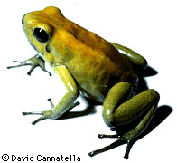
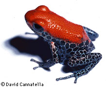
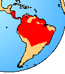

---
title: Dendrobatidae
---

# [[Dendrobatidae]]

Poison-arrow frogs, Dart-poison frogs, Poison-dart frogs 

[David Cannatella](http://www.tolweb.org/)

    

## #has_/text_of_/abstract 

> Poison dart frog (also known as dart-poison frog, poison frog or formerly known as poison arrow frog) is the common name of a group of frogs in the family **Dendrobatidae** which are native to tropical Central and South America. These species are diurnal and often have brightly colored bodies. This bright coloration is correlated with the toxicity of the species, making them aposematic. Some species of the family Dendrobatidae exhibit extremely bright coloration along with high toxicity — a feature derived from their diet of ants, mites and termites— while species which eat a much larger variety of prey have cryptic coloration with minimal to no amount of observed toxicity. Many species of this family are threatened due to human infrastructure encroaching on their habitats.
>
> These amphibians are often called "dart frogs" due to the aboriginal South Americans' use of their toxic secretions to poison the tips of blowdarts. However, out of over 170 species, only four have been documented as being used for this purpose (curare plants are more commonly used for aboriginal South American darts) all of which come from the genus Phyllobates, which is characterized by the relatively large size and high levels of toxicity of its members.
>
> [Wikipedia](https://en.wikipedia.org/wiki/Poison%20dart%20frog) 

### Information on the Internet

-   [Digital Dendrobates. Jewels of the     Rainforest](http://www1.tip.nl/%7Et272198/index.htm).

## Introduction

Dendrobatids are also known as poison-arrow, arrow-poison, and
dart-poison frogs. As a group they are the most brightly colored of
frogs. Dendrobatids are generally small species, about 20 to 40 mm in
snout-vent length. They are also mostly diurnal, and observed hopping on
the forest floor by day. A few species are arboreal, or at least partly
so. They range from Nicaragua to the Amazonian Bolivia, the Guianas, and
SE Brazil. There are no fossils.

Many dendrobatids are brightly colored (and presumably poisonous to some
degree). However, there are many dull-colored species in the genus
Colostethus, mostly brownish, that do not appear to be poisonous.
Indians of the Emberá Chocó in Colombia rub their blowgun darts onto the
backs of Phyllobates terribilis to load the darts with poison (Myers et
al., 1978).

The reproductive behaviors are diverse. In all species of dendrobatids
for which data are known, the tadpoles are carried on the back of the
adult. In some species it is the male; in others it is the female that
carries the tadpoles. Generally the tadpoles are transported to a body
of water, usually a stream, but also small ponds, the water-filled axils
of bromeliads or some other small container, in the case of some
Dendrobates. The female will transport one tadpole at a time in this
way, and there is only one tadpole per crevice. These tiny hiding places
offer little in the way of food resources to the developing larva, and
the female has evolved the remarkable behavior of depositing
unfertilized eggs in the axil to feed the developing tadpole. The normal
beaks and denticles that are found in most tadpoles are reduced or lost
in these bromeliad-developers.

### Geographic Distribution

The distribution of living members of the family Dendrobatidae is
indicated in red.\

### Discussion of Phylogenetic Relationships

Ford and Cannatella (1993) defined Dendrobatidae to be the node-based
name for the most recent ancestor of Allobates, Aromobates, Colostethus,
Dendrobates, Epipedobates, Minyobates, Phobobates, and Phyllobates, and
all of its descendants. Synapomorphies include the presence of a
retroarticular process of mandible, and the arrangement of the
superficial slip of the m. depressor mandibulae (Ford, 1989b; Myers and
Ford, 1986). Other features that have been argued to support monophyly
include the tendon of the semitendinosus piercing the mm. gracilis major
and minor (Noble, 1922), egg attendance culminating in the transport of
aquatic larvae on the dorsum of the parent (Weygoldt, 1987), divided
dermal scutes on dorsal surfaces of fingers, and cephalic amplexus
(Duellman and Trueb, 1986).

The retroarticular process and conformation of the depressor mandibulae
muscle are unique to dendrobatids. The use of other features as
synapomorphies assumes that the similar conditions observed in other
neobatrachians are convergent. The thigh muscle pattern has been
reported in some myobatrachids, some Physalaemus, and Crossodactylus
(Lynch, 1971, 1973). However, L. Ford has observed the \"bufonoid\"
condition in Crossodactylus. Dorsal transport of the larva is reported
in Rana microdisca, Cyclorhamphus stejnegeri, and Sooglossus
seychellensis (Duellman and Trueb, 1986) but Weygoldt (1987) emphasized
that dendrobatid parental care was unique in its behavioral complexity.
Divided finger scutes have been reported in other frogs, such as
hylodine leptodactylids and some myobatrachids (Lynch, 1971).

Data for the amplexus character are meager, but its presence in putative
basal (Colostethus) and more deeply embedded taxa (Epipedobates and
Phyllobates) suggests that cephalic amplexus is ancestral for
Dendrobatidae; its condition in Aromobates nocturnus, the putative
sister-group of all other dendrobatids, is unknown (Myers et al., 1991).
Two closely related species of Dendrobates lack amplexus (Duellman and
Trueb, 1986), but this is probably derived within Dendrobatidae. The
less parsimonious alternative is that the cephalic amplexus of
dendrobatids is independently evolved from amplexus in other frogs.
These and other diagnostic characters of Dendrobatidae were discussed by
Ford (1989b).

Relationships of Dendrobatidae to other neobatrachians have been
controversial. Griffiths (1959b) allied Dendrobatidae to petropedetine
ranids. Noble (1926, 1931) and Lynch (1971, 1973) argued that
dendrobatids were derived from hylodine leptodactylids. Following
Griffiths, Duellman and Trueb (1986) placed Dendrobatidae with ranoids,
although not explicitly with petropedetines. Laurent (1979, 1986)
included Dendrobatidae among hyloids, rather than in ranoids.
Dendrobatids have a cartilaginous sternum, horizontal pupil, fused
second distal carpal, fused second distal tarsal, and an unnotched
tongue, all of which are plesiomorphic at the level of Ranoidea. These
data do not refute the placement of Dendrobatidae in Ranoidea, but
rather suggests that, like Microhylidae, dendrobatids are not nested
within Laurent\'s Ranidae or Hyperoliidae.

Ford (1993) reviewed the controversy concerning the placement of
dendrobatids and analyzed the relevant characters in support of each
hypothesis. The position of Dendrobatidae was addressed by Ford (1989b)
in a phylogenetic analysis of neobatrachians, with an emphasis on ranids
and leptodactylids. She concluded that dendrobatids were nested within
Ranoidea, close to arthroleptid and petropedetine ranoids.

## Phylogeny 

-   « Ancestral Groups  
    -   [Neobatrachia](../Neobatrachia.md)
    -   [Salientia](../../Salientia.md)
    -   [Living Amphibians](Living_Amphibians)
    -   [Terrestrial Vertebrates](../../../../Terrestrial.md)
    -   [Sarcopterygii](../../../../../Sarc.md)
    -   [Gnathostomata](../../../../../../Gnath.md)
    -   [Vertebrata](../../../../../../../Vertebrata.md)
    -   [Craniata](../../../../../../../../Craniata.md)
    -   [Chordata](../../../../../../../../../Chordata.md)
    -   [Deuterostomia](../../../../../../../../../../Deutero.md)
    -   [Bilateria](Bilateria)
    -   [Animals](Animals)
    -   [Eukaryotes](Eukaryotes)
    -   [Tree of Life](../../../../../../../../../../../../../Tree_of_Life.md)

-   ◊ Sibling Groups of  Neobatrachia
    -   [Allophryne ruthveni](Allophryne_ruthveni.md)
    -   [Brachycephalidae](Brachycephalidae.md)
    -   [Bufonidae](Bufonidae.md)
    -   [Heleophryne](Heleophryne.md)
    -   [\'Leptodactylidae\'](%27Leptodactylidae%27)
    -   [Limnodynastinae](Limnodynastinae.md)
    -   [Myobatrachinae](Myobatrachinae.md)
    -   [Sooglossidae](Sooglossidae.md)
    -   [Rhinoderma](Rhinoderma.md)
    -   Dendrobatidae
    -   [Pseudidae](Pseudidae.md)
    -   [Hylidae](Hylidae.md)
    -   [Centrolenidae](Centrolenidae.md)
    -   [Microhylidae](Microhylidae.md)
    -   [Hemisus](Hemisus.md)
    -   [Arthroleptidae](Arthroleptidae.md)
    -   [\'Ranidae\'](%27Ranidae%27)
    -   [Hyperoliidae](Hyperoliidae.md)
    -   [Rhacophoridae](Rhacophoridae.md)

-   » Sub-Groups 
	-   *Aromobates*
	-   *Colostethus*
	-   *Dendrobates*
	-   *Epipedobates*
	-   *Mannophryne*
	-   *Minyobates*
	-   *Phyllobates*

## Title Illustrations

------------------------------------------------------------------------
1. Phyllobates bicolor; photo copyright © 1995 David Cannatella\)

------------------------------------------------------------------------
2. Dendrobates reticulatus; photo copyright © 1995 David Cannatella

## Confidential Links & Embeds: 

### #is_/same_as ::[Dendrobatidae](Dendrobatidae.md)) 

### #is_/same_as :: [Dendrobatidae.public](/_public/bio/bio~Domain/Eukaryotes/Animals/Bilateria/Deutero/Chordata/Craniata/Vertebrata/Gnath/Sarc/Tetrapods/Amphibians/Salientia/Neobatrachia/Dendrobatidae.public.md) 

### #is_/same_as :: [Dendrobatidae.internal](/_internal/bio/bio~Domain/Eukaryotes/Animals/Bilateria/Deutero/Chordata/Craniata/Vertebrata/Gnath/Sarc/Tetrapods/Amphibians/Salientia/Neobatrachia/Dendrobatidae.internal.md) 

### #is_/same_as :: [Dendrobatidae.protect](/_protect/bio/bio~Domain/Eukaryotes/Animals/Bilateria/Deutero/Chordata/Craniata/Vertebrata/Gnath/Sarc/Tetrapods/Amphibians/Salientia/Neobatrachia/Dendrobatidae.protect.md) 

### #is_/same_as :: [Dendrobatidae.private](/_private/bio/bio~Domain/Eukaryotes/Animals/Bilateria/Deutero/Chordata/Craniata/Vertebrata/Gnath/Sarc/Tetrapods/Amphibians/Salientia/Neobatrachia/Dendrobatidae.private.md) 

### #is_/same_as :: [Dendrobatidae.personal](/_personal/bio/bio~Domain/Eukaryotes/Animals/Bilateria/Deutero/Chordata/Craniata/Vertebrata/Gnath/Sarc/Tetrapods/Amphibians/Salientia/Neobatrachia/Dendrobatidae.personal.md) 

### #is_/same_as :: [Dendrobatidae.secret](/_secret/bio/bio~Domain/Eukaryotes/Animals/Bilateria/Deutero/Chordata/Craniata/Vertebrata/Gnath/Sarc/Tetrapods/Amphibians/Salientia/Neobatrachia/Dendrobatidae.secret.md)

