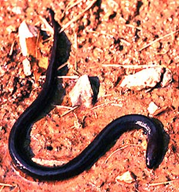

# [[Amphiumidae]]

Amphiumas 

 

## #has_/text_of_/abstract 

> Amphiuma is a genus of aquatic salamanders from the United States, the only extant genus within the family **Amphiumidae** . They are colloquially known as amphiumas. They are also known to fishermen as "conger eels" or "Congo snakes", which are zoologically incorrect designations or misnomers, since amphiumas are actually salamanders (and thus amphibians), and not fish, nor reptiles and are not from Congo. Amphiuma exhibits one of the largest complements of DNA in the living world, around 25 times more than a human.
>
> [Wikipedia](https://en.wikipedia.org/wiki/Amphiuma) 
## Introduction

[Allan Larson](http://www.tolweb.org/)

Salamanders of the family Amphiumidae are elongate (length may exceed 1
meter) and permanently aquatic, although adults lack gills and use lungs
to breathe air. Both forelimbs and hindlimbs are extremely reduced in
size and appear nonfunctional, although the animals move them. Three
extant species of the genus *Amphiuma* differ in the number of toes
present on the limbs, from one *(A. pholeter),* to two *(A. means)* or
three *(A. tridactylum).* Larvae hatch with external gills and transform
partially, losing the gills but retaining one pair of gill slits.

Amphiumas inhabit swamps, bayous, marshes, drainage ditches and streams
in the southeastern United States. *Amphiuma means* is distributed in
the Atlantic and Gulf coastal states from Virginia, south to Florida and
west to Louisiana. *Amphiuma tridactylum* occurs in Louisiana and
surrounding areas of Texas, Arkansas and Mississippi, and enters parts
of Alabama, Missouri and Oklahoma. *Amphiuma pholeter* is restricted to
a small area at the base of the Florida panhandle and an adjacent part
of Georgia.

Amphiumas are nocturnally active, generalist predators that feed on
crayfish, frogs, fish and small snakes. They serve as prey for larger
snakes including cottonmouths and mudsnakes. Large amphiumas have a
powerful bite that is unusual for salamanders and they should not be
handled carelessly.

Breeding has been observed for the two-toed and three-toed amphiumas.
These amphiumas breed in the winter or spring, fertilize eggs
internally, and lay a string of eggs in muddy, shallow water. Eggs are
guarded until they hatch in the summer or fall.

### Characteristics

#### Diagnosis

Large, aquatic salamanders that retain some larval characteristics as
adults (one of three pairs of larval gill slits, eyes small and without
eyelids) but which lose external gills at adulthood. The body is
cylindrical and highly elongated. Limbs are present in two pairs but are
extremely tiny relative to the large size of the body. Despite their
aquatic lifestyle, amphiumas breathe air through lungs by periodically
poking the nostrils above the surface of the water.

#### Detailed Characteristics of the Amphiumidae

The morphological characters given below are the ones standardly used to
diagnose the salamander family Amphiumidae and to assess its
phylogenetic relationships to other salamanders. The individual
characteristics are in most cases shared with other salamanders and
should not be interpreted as synapomorphies of the Amphiumidae. Absence
of characteristics found in other salamanders is noted where it is
important for distinguishing amphiumas from other salamanders and/or
determining their relationships to other salamanders. These
characteristics were assembled from a large number of original sources
by Duellman and Trueb (1986), Larson (1991) and Larson and Dimmick
(1993).

Metamorphosis is incomplete in the Amphiumidae, leading to a number of
paedomorphic characteristics in adults.

###### Morphology of the Head

Premaxillae are fused to form a single bone. Bilaterally paired nasal
bones each ossify from a single, laterally positioned anlage; long
posterior processes of the premaxillae extend between the paired nasal
bones and completely separate them. Maxillary bones are present and well
developed. Septomaxillary bones are absent. Lacrimal bone is absent.
Quadratojugal bone is absent. Pterygoid bones are present but small. The
angular bone is fused to the mandible. An internal carotid foramen is
present in the parasphenoid bone. Ear bones include a detached columella
but no operculum. Replacement of vomerine teeth proceeds laterally in
parallel to the maxillary teeth. Teeth have a distinct crown and
pedicel. Origin of the levator mandibulae anterior superficialis muscle
includes the exoccipital. Eyelids are absent.

###### Inner Ear

A basilaris complex is present in the inner ear. The recessus
amphibiorum is oriented horizontally in the inner ear. The otic sac is
multilobate, vascularized and filled with calcium. The amphibian
periotic canal lacks fibrous connective tissue. The periotic cistern is
large. The periotic cistern does not protrude into the fenestra.

###### Hyobranchial Structures

The first hypobranchial and first ceratobranchial (alternatively
homologized as the first ceratobranchial and first epibranchial,
respectively) are fused together. The second ceratobranchial
(alternatively homologized as the second epibranchial) comprises four
elements. An ypsiloid cartilage is absent. Lungs are present. Larvae
have three pairs of gill slits, and a single pair of gill slits persists
in adults.

###### Characteristics of the Trunk and Vertebral Column

Forelimbs and hind limbs highly reduced, as are the pectoral and pelvic
girdles. The scapula and coracoid bones of the pectoral girdle are fused
to form the scapulocoracoid. Vertebral centra are amphicoelous. Ribs are
bicapitate. A progression from partial to complete spinal-nerve foramina
is observed in neural arches of caudal vertebrae 3-8; such foramina are
absent from other vertebrae. The pubotibialis and puboischiotibialis
exist as separate muscles. Anterior glomeruli of the kidney are reduced
or absent.

###### Reproductive Characters

Fertilization is internal. Ciliated epithelium is present in the cloacal
tube and/or anterior cloacal chamber of females. Epidermal lining is
absent from the anterior cloacal chamber of females. Evaginations are
absent from the dorsolateral walls of the male cloacal tube. Anterior
ventral glands are absent from the cloacae of females. Spermathecae are
present in the female cloacal chamber. Glands secreting into the dorsal
walls of the female cloaca are absent. Anterior ventral glands are
present in male cloacae. Posterior ventral glands are absent from male
cloacae. Kingsbury\'s glands are absent from male cloacae. Dorsal pelvic
glands are present in males. Lateral pelvic glands are absent in males.
Glands secreting into the male cloacal orifice are present. Parental
care of eggs is by females.

The diploid number of chromosomes is 28.

### Classification

In addition to *Amphiuma,* the family Amphiumidae contains a single
extinct species in the genus *Proamphiuma.* This Cretaceous genus is
distinguished from *Amphiuma* by a less pronounced elaboration of the
vertebral features associated with specialized, intervertebral muscles
that are unique to amphiumids. Estes (1981) describes *Proamphiuma* as a
\"good structural ancestor\" for *Amphiuma.*

Estes (1981) placed the Amphiumidae in a distinct suborder,
Amphiumoidea, although later authors have included them in a large
suborder, Salamandroidea, that includes all internally-fertilizing
salamanders (Duellman and Trueb, 1986).

### Discussion of Phylogenetic Relationships

The Amphiumidae is clearly a monophyletic group that is not closely
related to any other salamanders. Several lines of evidence have
suggested that the Amphiumidae may be the sister taxon to the lungless
salamander family Plethodontidae (Salthe and Kaplan, 1966; Larson, 1991;
Larson and Dimmick, 1993), although this grouping has not been
demonstrated with statistical significance. Even if these families are
sister taxa, however, their evolutionary divergence was nonetheless an
ancient one.

An allozymic study of the products of 24 presumptive genetic loci
(Karlin and Means, 1994) indicates a fairly close relationship between
*Amphiuma means* and *A. tridactylum* (Nei\'s genetic distance = 0.12)
and a much more distant relationship between either of these species and
*A. pholeter* (Nei\'s genetic distance = 0.73-0.90). These data provide
convincing evidence that *A. means* and *A. tridactylum* are sister taxa
and that these species are collectively the sister taxon to *A.
pholeter*.

## Phylogeny 

-   « Ancestral Groups  
    -   [Caudata](../Caudata.md)
    -   [Living Amphibians](Living_Amphibians)
    -   [Terrestrial Vertebrates](../../../Terrestrial.md)
    -   [Sarcopterygii](../../../../Sarc.md)
    -   [Gnathostomata](../../../../../Gnath.md)
    -   [Vertebrata](../../../../../../Vertebrata.md)
    -   [Craniata](../../../../../../../Craniata.md)
    -   [Chordata](../../../../../../../../Chordata.md)
    -   [Deuterostomia](../../../../../../../../../Deutero.md)
    -   [Bilateria](Bilateria)
    -   [Animals](Animals)
    -   [Eukaryotes](Eukaryotes)
    -   [Tree of Life](../../../../../../../../../../../../Tree_of_Life.md)

-   ◊ Sibling Groups of  Caudata
    -   [Plethodontidae](Plethodontidae.md)
    -   Amphiumidae
    -   [Dicamptodontidae](Dicamptodontidae.md)
    -   [Ambystomatidae](Ambystomatidae.md)
    -   [Salamandridae](Salamandridae.md)
    -   [Rhyacotritonidae](Rhyacotritonidae.md)
    -   [Proteidae](Proteidae.md)
    -   [Cryptobranchidae](Cryptobranchidae.md)
    -   [Hynobiidae](Hynobiidae.md)
    -   [Sirenidae](Sirenidae.md)

-   » Sub-Groups 

## Title Illustrations

------------

Scientific Name ::     Amphiumidae
Location ::           Florida
Comments             The one-toed amphiuma
Specimen Condition   Live Specimen
Copyright ::            © 1996 J. Robert Macey

## Confidential Links & Embeds: 

### [Amphiumidae](/_Standards/bio/bio~Domain/Eukaryotes/Animals/Bilateria/Deutero/Chordata/Craniata/Vertebrata/Gnath/Sarc/Tetrapods/Amphibians/Caudata/Amphiumidae.md) 

### [Amphiumidae.public](/_public/bio/bio~Domain/Eukaryotes/Animals/Bilateria/Deutero/Chordata/Craniata/Vertebrata/Gnath/Sarc/Tetrapods/Amphibians/Caudata/Amphiumidae.public.md) 

### [Amphiumidae.internal](/_internal/bio/bio~Domain/Eukaryotes/Animals/Bilateria/Deutero/Chordata/Craniata/Vertebrata/Gnath/Sarc/Tetrapods/Amphibians/Caudata/Amphiumidae.internal.md) 

### [Amphiumidae.protect](/_protect/bio/bio~Domain/Eukaryotes/Animals/Bilateria/Deutero/Chordata/Craniata/Vertebrata/Gnath/Sarc/Tetrapods/Amphibians/Caudata/Amphiumidae.protect.md) 

### [Amphiumidae.private](/_private/bio/bio~Domain/Eukaryotes/Animals/Bilateria/Deutero/Chordata/Craniata/Vertebrata/Gnath/Sarc/Tetrapods/Amphibians/Caudata/Amphiumidae.private.md) 

### [Amphiumidae.personal](/_personal/bio/bio~Domain/Eukaryotes/Animals/Bilateria/Deutero/Chordata/Craniata/Vertebrata/Gnath/Sarc/Tetrapods/Amphibians/Caudata/Amphiumidae.personal.md) 

### [Amphiumidae.secret](/_secret/bio/bio~Domain/Eukaryotes/Animals/Bilateria/Deutero/Chordata/Craniata/Vertebrata/Gnath/Sarc/Tetrapods/Amphibians/Caudata/Amphiumidae.secret.md)

