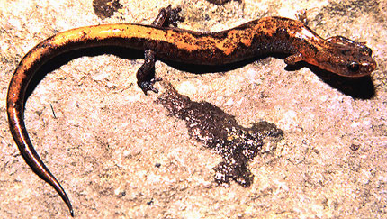
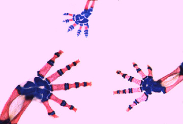

# [[Plethodontidae]]

Lungless Salamanders 

## #has_/text_of_/abstract 

> **Plethodontidae**, or lungless salamanders, are a family of salamanders. With over 500 species, lungless salamanders are by far the largest family of salamanders in terms of their diversity. Most species are native to the Western Hemisphere, from British Columbia to Brazil. Only two extant genera occur in the Eastern Hemisphere: Speleomantes (native to Sardinia and mainland Europe south of the Alps) and Karsenia (native to South Korea).
>
> [Wikipedia](https://en.wikipedia.org/wiki/Plethodontidae) 

## Introduction

[Allan Larson, David Wake, and Tom Devitt](http://www.tolweb.org/) 

Salamanders of the family Plethodontidae, commonly called \"lungless
salamanders,\" are widely distributed in eastern and western North
America and Central America, with populations also in South America,
southern Europe, Sardinia, and Korea. The family Plethodontidae is by
far the largest salamander family with \~376 recognized species (see
AmphibiaWeb\'s [Amphibian Species Lists](http://amphibiaweb.org/lists/index.shtml)). These salamanders
have figured prominently in experimental studies of the structuring of
ecological communities (Hairston, 1987) and of the role of behavioral
isolation in speciation (Arnold et al., 1993; Arnold et al., 1996; Houck
,1998; Houck et al., 1998; Houck and Verrell, 1993; Reagan, 1992;
Verrell, 2000).

The hypothesis that lunglessness in plethodontids evolved as a
rheotropic adaptation for existence in cool, fast-flowing mountain
streams has been invoked repeatedly (Wilder and Dunn, 1920; Dunn, 1926;
Wake, 1966) but has recently been challenged more recently, generating
much controversy (see Ruben and Boucot, 1989; Reagan and Verrell, 1991;
Beachy and Bruce, 1992; Ruben et al., 1993; Mueller et al., 2004).

Plethodontid salamanders occupy a great diversity of adaptive zones
ranging from strictly aquatic ones to strictly terrestrial and even
arboreal ones (Wake, 1966; Larson, 1984). The ancestral life history for
plethodontids is believed to be a semiaquatic one, featuring gilled,
aquatic larvae that inhabit streams and metamorphosed adults that show
varying degrees of terrestriality (see Titus and Larson \[1996\] for
arguments relevant to this hypothesis). Morphological evolutionary
patterns and their relationships to adaptive diversification of
plethodontid salamanders are discussed by Wake and Larson (1987).

The biphasic life history is observed for most members of the supergenus
*Desmognathus*, (subfamily Plethodontinae) and the subfamilies
Hemidactyliinae and Spelerpinae (taxonomy after Chippindale et al.,
2004). Three species of the supergenus *Desmognathus* (*Desmognathus
aeneus*, *D. wrighti* and *Phaeognathus hubrichti*) are strictly
terrestrial, however, and have no aquatic larval stage. Many lineages of
the subfamily Spelerpinae have experienced the opposite evolutionary
change, eliminating the terrestrial adult phase and retaining the
morphological and ecological characteristics of aquatic larvae
throughout life (a condition termed \"perennibranchiate\"). Many
perennibranchiate salamanders in this group are troglobitic and
demonstrate the reduced pigmentation and vision characteristic of many
cave-dwelling animals. Both the supergenus *Desmognathus* and subfamily
Spelerpinae occur in eastern North America, with the latter group
extending westward to the Edwards Plateau region of central Texas, where
many troglobitic forms are found.

The subfamilies Bolitoglossinae and members of the Plethodontinae (other
than most *Desmognathus*) lack aquatic larvae and hatch as miniature
adults from eggs laid on land or terrestrial vegetation. Members of the
Plethodontinae include woodland salamanders of the genera *Aneides* and
*Plethodon*, which occur both in eastern and western North America, the
western North American genus *Ensatina*, and the genus *Hydromantes* of
California (subgenus *Hydromantes*), southern Europe, and Sardinia
(subgenera *Atylodes* and *Speleomantes*; Wake et al., 2005).
*Plethodon*, *Aneides*, and *Ensatina* take refuge under logs and rocks
on the forest floor during the day, becoming active on the surface at
night when conditions are favorable. Members of the genus *Aneides* show
varying degrees of climbing ability and associated arboreality (see
Larson et al., 1981). *Aneides aeneus* and *Plethodon petraeus* (Wynn et
al., 1988) demonstrate adaptations for climbing in rock crevices, as do
members of the genus *Hydromantes*.

Members of the subfamily Bolitoglossinae occur in western North America,
Central America and South America. This group has undergone an extensive
evolutionary radiation in the New World tropics, including highly
arboreal and fossorial groups (Wake and Lynch, 1976). Convergent and
parallel evolutionary origins of webbing of the feet are observed in the
genus *Bolitoglossa*, associated with arboreality on moist tropical
vegetation, and extensive foot-webbing occurs in other genera as well
(Wake and Lynch, 1976; Alberch, 1981). Convergent and parallel
evolutionary trends are observed also for elongate, fossorial forms
among the tropical genera *Lineatriton* and *Oedipina* and the temperate
genus *Batrachoseps* (Parra-Olea and Wake, 2001).

The discovery of the first Asian plethodontid salamander in 2005 was a
complete surprise. This fully terrestrial species is associated with
rocks and rock crevices in wooded areas in the middle portion of the
Korean Peninsula in South Korea. Min et al. (2005) placed this species
in a new genus, *Karsenia*, in the subfamily Plethodontinae based on
morphological and molecular data. The discovery of this taxon, together
with the presence of *Hydromantes* in Europe, suggests that
plethodontids formerly had a Holarctic distribution.

In 1972, the Highlands Biological Station in Highlands North Carolina
launched a series of conferences designed to stimulate the spread of
current research on plethodontid salamanders. A selection of papers
covering a wide range of topics in plethodontid biology were published
in a formal volume derived from the fourth plethodontid conference
(Bruce et al., eds., 2000).\

### Characteristics

Skeletal structures of the feet of three species of *Bolitoglossa* (red
= bone; blue = cartilage; photograph © Allan Larson).

#### Diagnosis

All plethodontid salamanders are lungless and breathe through moist
skin. Plethodontids are unique among salamanders in having narrow
grooves between each nostril and the upper lip. Males often have
protuberances on the upper lip associated with the nasolabial grooves
and a mental gland located beneath the mouth. Costal grooves are
pronounced. Most plethodontids are completely terrestrial and lay eggs
on land (subfamilies Bolitoglossinae and Plethdontinae and three species
of the supergenus *Desmognathus*). Some have a biphasic life cycle with
an aquatic larva and terrestrial adult (most members of the supergenus
*Desmognathus* and subfamily Hemidactyliinae), and others are completely
aquatic and permanently larval in form (some members of the subfamily
Spelerpinae). Aquatic forms usually inhabit streams.

#### Detailed Characteristics of the Plethodontidae

The morphological characters given below are the ones standardly used to
diagnose the salamander family Plethodontidae and to assess its
phylogenetic relationships to other salamanders. The individual
characteristics in most cases are shared with other salamanders and
should not be interpreted as synapomorphies of the Plethodontidae.
Absence of characteristics found in other salamanders is noted where it
is important for distinguishing plethodontids from other salamanders
and/or determining their relationships to other salamanders. These
characteristics were assembled from a large number of original sources
by Duellman and Trueb (1986), Larson (1991) and Larson and Dimmick
(1993).

##### Morphology of the Head and Skull

Premaxillary bones may be paired or fused to form a single bone.
Bilaterally paired nasal bones each ossify from a single, laterally
positioned anlage; long posterior processes of the premaxillae extend
between the paired nasal bones and completely separate them. Maxillary
bones are present and well developed. Bilaterally paired septomaxillary
bones are present. Lacrimal bone is absent. Quadratojugal bone is
absent. Pterygoid bones are present in larvae but not in metamorphosed
adults. Internal carotid foramina are absent from parasphenoid bones.
The angular bone is fused to the mandible. Ear bones feature fusion of
the operculum with the stylus of the columella in some species and
absence of the stylus in others. Replacement of vomerine teeth proceeds
laterally and from the posterior. Teeth have a distinct crown and
pedicel. Origin of the levator mandibulae anterior superficialis muscle
includes the exoccipital. Nasolabial grooves are a synapomorphy of
plethodontid salamanders. Males of most genera have cirri on the upper
lip associated with the nasolabial grooves, and also have mental glands.

##### Inner Ear

Basilaris complex is absent from the inner ear. Recessus amphibiorum is
oriented vertically in the inner ear. The otic sac is bulbar and
partially vascularized. Fibrous connective tissue is present around the
amphibian periotic canal. The periotic cistern is small. The periotic
cistern protrudes into the fenestra.

##### Hyobranchial Structures

The first hypobranchial and first ceratobranchial (alternatively
homologized as the first ceratobranchial and first epibranchial,
respectively) exist as separate structures. The second ceratobranchial
(alternatively homologized as the second epibranchial) comprises a
single element. Lungs and the ypsiloid cartilage are absent. Larvae,
when present, have three (subfamily Plethodontinae) or four (supergenus
*Desmognathus*) pairs of gill slits.

##### Characteristics of the Trunk and Vertebral Column

The scapula and coracoid bones of the pectoral girdle are fused to form
the scapulocoracoid. Vertebral centra are opisthocoelous. Ribs are
bicapitate. Spinal-nerve foramina are present in neural arches of all
vertebrae. The pubotibialis and puboischiotibialis exist as separate
muscles. Anterior glomeruli of the kidney are reduced or absent.

##### Reproductive Characters

Fertilization is internal. Ciliated epithelium is absent in the cloacal
tube and/or anterior cloacal chamber of females. Epidermal lining is
present in the anterior cloacal chamber of females. Evaginations are
absent from the dorsolateral walls of the male cloacal tube. Anterior
ventral glands are absent from the cloacae of females. Spermathecae are
present in the female cloacal chamber. Glands secreting into the dorsal
walls of the female cloaca are absent. Anterior ventral glands are
present in male cloacae. Posterior ventral glands are present in male
cloacae. Kingsbury\'s glands are present in male cloacae. Dorsal pelvic
glands are present in males. Lateral pelvic glands are present in males.
Glands secreting into the male cloacal orifice are present. Parental
care of eggs is usually by females and sometimes also by males.

The diploid number of chromosomes is 26 or 28.

### Classification

The family Plethodontidae is classified in the caudate suborder
Salamandroidea (Duellman and Trueb, 1986) which contains all of the
internally fertilizing salamanders. Estes (1981) formerly recognized a
separate suborder (Plethodontoidea) for the family Plethodontidae.

Traditionally, Plethdontidae was subdivided into two subfamilies,
Desmognathinae and Plethodontinae, the latter of which was further
subdivided into the tribes Bolitoglossini, Hemidactyliini and
Plethodontini (Wake, 1966; Lombard and Wake, 1986). However, more recent
phylogenetic analyses using whole mitochondrial genomic DNA sequences
(Macey, 2005; Mueller et al., 2004) and combined mitochondrial DNA,
nuclear DNA and morphology (Chippindale et al., 2004) have called into
question the monophyly of these groupings.

Chippindale et al. (2004) recommended several taxonomic changes
consistent with their phylogeny that required minimal changes to
traditional taxonomic arrangements, including: 1) elevating the tribes
Hemidactyliini and Bolitoglossini to the subfamilies Heimidactylinae and
Bolitoglossinae; 2) making the subfamily Plethodontinae equivalent to
the former tribe Plethodontini plus *Desmognathus* and *Phaeognathus*,
with those genera forming the supergenus *Desmognathus* within
Plethodontinae; 3) recognizing the subfamily Spelerpinae to represent
remaining members of the Hemidactyliini, reserving the name
Hemidactylinae for *Hemidactylium*.

Similarly, Macey (2005) recommended: 1) discontinuing recognition of the
subfamily Desmognathinae, instead including that group within
Plethodontinae along with *Hydromantes*; 2) making the subfamily
Plethodontinae equivalent to the former tribe Plethodontini; 3)
elevating the tribe Bolitoglossini to subfamilial status; 4) placing
*Hemidactylium* in its own subfamily (Hemidactylinae); and 5)
recognizing remaining taxa previously assigned to Hemidactyliini in
their own subfamily. \

### Discussion of Phylogenetic Relationships

Phylogenetic studies of Larson (1991) and Larson and Dimmick (1993)
indicate that the Plethodontidae is a fairly distant relative of the
other internally fertilizing salamanders and that this family has no
close relatives among extant salamanders. These studies are based on
phylogenetic analyses of ribosomal RNA sequences and diverse
morphological characters.

Lombard and Wake (1986) provided a hypothesis for higher-level
plethodontid relationships based on 30 morphological characters, with
particular attention to evolution of the tongue and related structures.
A novel feature of their analysis was the decision to use their earlier
integration of characters related to tongue morphology and function to
use eight functional modes (Lombard and Wake, 1977) as terminal taxa.
Each mode included one or more genera. Modes I (*Desmognathus,
Phaeognathus*) and II (*Plethodon, Aneides)* included taxa with
generalized morphology and were characterized functionally as having
attached protusible tongues. Modes III (*Ensatina*), V
(*Hemidactylium*), and VIII (*Batrachoseps*) have derived morphologies
but retain an anterior muscular attachment of the tongue to the lower
jaw and were characterized functionally as having attached projectile
tongues.  The remaining genera were grouped into modes IV (current
spelerpines), VI (tropical plethodontids, supergenus *Bolitoglossa*),
and VII (*Hydromantes*). Modes III -- VIII were all considered to be
independently derived from generalized ancestors, similar to modes I and
II, and extensive homoplasy is required under any phylogenetic
hypothesis.

Parsimony analysis of their results indicate[ ]a basal split
between Desmognathinae and Plethodontinae, and, within Plethodontinae,
Bolitoglossini as sister to (Hemidactyliini + Plethodontini).  However,
this was only marginally more parsimonious than their preferred tree,
which was a basal split between Desmognathinae and Plethodontinae, and,
within Plethodontinae, Hemidactyliini as sister to (Bolitoglossini +
Plethodontini).[\
]

Mueller et al. (2004) analyzed complete mitochondrial genomic sequences
from 22 plethodontids using partitioned and unpartitioned Bayesian,
maximum likelihood, and maximum parsimony. They recovered congruent
trees that contrasted strongly with traditional taxonomic groupings
based on morphology, rejecting monophyly of three of the four major
groups.\
\
Chippindale et al. (2004) investigated plethodontid relationships using
separate and combined analyses of morphological and molecular data.
Morphological data for osteological characters originally described by
Wake (1966) were confirmed and coded from skeletal preparations and from
the literature for vertebral (Edwards, 1976), auditory (Lombard, 1977),
cloacal (Sever, 1991; 1994), and tongue morphology (Lombard, 1977;
Lombard and Wake, 1986). Molecular data included portions of the
mitochondrial cyt *b* and ND4 genes as well as the nuclear-encoded
*RAG-1* gene. Parsimony and Bayesian analyses of both separate and
combined morphological and molecular data placed desmognathines nested
within plethodontines.

Macey\'s (2005) alternative analysis of the 27 whole mitochondrial
genomic sequences from Mueller et al. (2004) using parsimony recovered
topologies that differed significantly from the model-based analyses of
Mueller et al. (2004) using the same data. Most significantly, Macey
(2005) recovered *Hemidactylium* as the sister taxon to all other
plethodontids, a result Mueller et al. (2004) also found when using
maximum parsimony, but not maximum likelihood or Bayesian methods.\

Min et al. (2005) investigated the phylogenetic position of *Karsenia*
using Bayesian phylogenetic analysis of the nuclear-encoded *RAG-1*
gene, placing *Karsenia* as the sister taxon to a clade comprising
*Aneides* and members of the supergenus *Desmognathus* (sensu
Chippindale et al., 2004). 

## Phylogeny 

-   « Ancestral Groups  
    -   [Caudata](../Caudata.md)
    -   [Living Amphibians](Living_Amphibians)
    -   [Terrestrial Vertebrates](../../../Terrestrial.md)
    -   [Sarcopterygii](../../../../Sarc.md)
    -   [Gnathostomata](../../../../../Gnath.md)
    -   [Vertebrata](../../../../../../Vertebrata.md)
    -   [Craniata](../../../../../../../Craniata.md)
    -   [Chordata](../../../../../../../../Chordata.md)
    -   [Deuterostomia](../../../../../../../../../Deutero.md)
    -   [Bilateria](Bilateria)
    -   [Animals](Animals)
    -   [Eukaryotes](Eukaryotes)
    -   [Tree of Life](../../../../../../../../../../../../Tree_of_Life.md)

-   ◊ Sibling Groups of  Caudata
    -   Plethodontidae
    -   [Amphiumidae](Amphiumidae.md)
    -   [Dicamptodontidae](Dicamptodontidae.md)
    -   [Ambystomatidae](Ambystomatidae.md)
    -   [Salamandridae](Salamandridae.md)
    -   [Rhyacotritonidae](Rhyacotritonidae.md)
    -   [Proteidae](Proteidae.md)
    -   [Cryptobranchidae](Cryptobranchidae.md)
    -   [Hynobiidae](Hynobiidae.md)
    -   [Sirenidae](Sirenidae.md)

-   » Sub-Groups
    -   [Bolitoglossinae](Plethodontidae/Bolitoglossinae.md)
    -   [Spelerpinae](Plethodontidae/Spelerpinae.md)
    -   [Hemidactylium scutatum](Hemidactylium_scutatum)
    -   [Plethodontinae](Plethodontidae/Plethodontinae.md)

## Title Illustrations

-------------

Scientific Name ::  Plethodon dorsalis
Location ::        Eastern United States
Comments          The zigzag salamander
Copyright ::         © 1996 Dr. Robert S. Simmons
