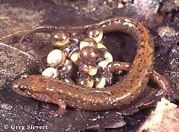
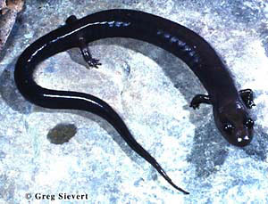

# [[Desmognathus]] 

 
 

## #has_/text_of_/abstract 

> **Desmognathus** is a genus of lungless salamanders in the family Plethodontidae known as dusky salamanders. They range throughout the eastern United States as far west as Texas, and north to southeastern Canada.
>
> [Wikipedia](https://en.wikipedia.org/wiki/Desmognathus) 
## Introduction

[Allan Larson, David Wake, and Tom Devitt](http://www.tolweb.org/) 

Salamanders of the plethodontine supergenus *Desmognathus* are widely
distributed in the forests of eastern North America. Three species
(*Desmognathus aeneus, Desmognathus wrighti* and *Phaeognathus
hubrichti*) are strictly terrestrial and lack an aquatic larval stage.
Eggs are laid on land and hatch fully formed. All remaining species
belong to the genus *Desmognathus* and have biphasic life histories
featuring gilled, aquatic larvae and fully metamorphosed adults.

Ecological communities in the southern Appalachian Mountains commonly
feature three to five species of *Desmognathus* and may have as many as
seven *Desmognathus* species (Bruce, 1991; Tilley and Bernardo, 1993).
These communities figure prominently in experimental ecological studies
(reviewed by Hairston, 1987). The different species of *Desmognathus*
present in these communities demonstrate considerable differentiation in
the degree to which they use aquatic versus terrestrial environments.
*Desmognathus marmoratus* is entirely aquatic in both the larval and
adult stages and inhabits cold, fast-flowing streams. It has a long
larval period (almost 3 years) and a relatively large body size, which
may exceed 14 cm. in total length. A related species, *D.
quadramaculatus,* also has a large body (may exceed 20 cm. total
length), long larval period (3-4 years) and is mostly aquatic as an
adult, favoring swift mountain streams. Intermediate-sized species of
*Desmognathus* (total body length approaching a maximum of 10-17 cm. in
different species) inhabit edges of streams and seepages, and have
larval periods of intermediate length (\~4 months to a year); these
species include *D. carolinensis, D. conanti, D. fuscus, D. imitator, D.
monticola, D. ochrophaeus, D. ocoee, D. orestes, D. santeetlah,* and *D.
welteri.* The directly developing, entirely terrestrial *Desmognathus*
species *(D. aeneus, D. wrighti)* have the smallest bodies in the
supergenus Desmognathus (less than 6 cm maximum total length).

Traditionally, the semiaquatic species *D. quadramaculatus* was
considered to approximate the ancestral condition for *Desmognathus*
with the other states representing evolutionarily derived states;
however, the phylogenetic results of Titus and Larson (1996) challenge
this interpretation by showing that the terrestrial species span the
earliest phylogenetic splits in the subfamily, as illustrated above.
Titus and Larson (1996) suggest that desmognathine evolution features
primarily increases in body size, length of larval period and use of
aquatic habitats as adults.

The genus *Desmognathus* has been the source of some very interesting
studies of the evolution of sexual isolation among populations and its
relationship to population genetic differentiation (Tilley et al., 1990;
Verrell, 1989, 1994; Verrell and Arnold, 1989; Verrell and Tilley,
1992). These studies are particularly important for our understanding of
processes of speciation in salamanders.

### Characteristics

#### Diagnosis

Salamanders of the supergenus *Desmognathus* are woodland salamanders
whose habitats vary from strictly terrestrial to strictly aquatic.
Members of this supergenus are characterized by a number of characters
that are associated functionally with burrowing under rocks and include
(1) a heavily ossified and strongly articulated skull and mandible, (2)
a dorsoventrally flattened, wedgelike head, (3) modified anterior trunk
vertebrae, (4) enlarged dorsal spinal muscles and (5) hindlimbs larger
than forelimbs. Three additional characters appear functionally
associated with feeding and include (1) stalked occipital condyles, (2)
a modified atlas and (3) enlarged quadratopectoralis muscles. A ninth
character, presence of atlanto-mandibular ligaments, appears to be
important for both burrowing and feeding (Schwenk and Wake, 1993).

#### Detailed Characteristics of the Supergenus *Desmognathus*

In addition to the nine characteristics listed above under
\"Diagnosis,\" some additional characteristics are useful in combination
for distinguishing desmognathine salamanders from other plethodontids;
however, most of these characteristics do not constitute synapomorphies
of the supergenus *Desmognathus*. These characteristics are summarized
from Lombard and Wake\'s (1986) phylogenetic analysis of major
plethodontid lineages with special emphasis on evolution of feeding
mechanisms.

##### Tongue and Hyobranchial Apparatus

Tongues are attached to the jaw by a short muscle plus connective and
mucosal tissue. Tongues are protrusible but not projectile. The
hyobranchial skeleton includes a urohyal, cylindrical basibranchial, and
radii that are rodlike structures independent of the basibranchial. The
basibranchial, first ceratobranchial and epibranchial elements are of
approximately equal length. The first ceratobranchial is larger than the
second ceratobranchial and constitutes the main force-transmitting
element in movement of the tongue. The rectus cervicis profundis muscle
is linearly arranged and the rectus cervicis superficialis has a lateral
slip. Omohydoideus, genioglossus, circumglossus, intraglossus and
basiradialis muscles are present. The hyoglossus muscle is large and has
a complete anterior section and posteriorly oriented fibers in the
posterior section. The suprapeduncularis muscle is weakly developed.

##### Epibranchial Number 

Embryos (or larvae) have four epibranchials. 

##### Tail Autotomy

Cutaneous wound healing does not occur, there are 2 caudosacral
vertebrae, the first caudal vertebra is normal, and tail breakage is not
localized.\

##### Brain Stem Motor Column

There are two distinct classes of cells in the motor column of the neck
and trunk.\

##### Jaws, Cranial Osteology and Structure of the Inner Ear

The vomer has a bony shelf anterior to the preorbital process. Parietal
bones have a deep groove extending across the posterolateral portion of
the bone to accommodate the ligament that extends from the lower jaw to
the atlas. The facial process of the maxilla is large and extends into
the area vacated by the prefrontal bones. The premaxillae are fused and
surround the intermaxillary gland. In the inner ear, the amphibian
periotic canal forms a ventral loop immediately after leaving the
periotic cistern. The bore radius of the otic semiarticular ducts has a
strong negative allometry with respect to body weight.

##### Chromosome Number 

The diploid number of chromosomes is 28.

##### Development 

All but 3 species (*Desmognathus aeneus, D. wrighti* and *Phaeognathus
hubrichti*) have gilled, aquatic larvae.\

### Classification

The supergenus *Desmognathus* contains only two genera, *Desmognathus*
(17 species currently recognized; Tilley and Mahoney, 1996; Titus and
Larson, 1996) and the monotypic genus *Phaeognathus. Desmognathus
marmoratus* formerly was placed into the monotypic genus,
*Leurognathus*. Recognition of *Leurognathus* was discontinued by Titus
and Larson (1996) because such recognition clearly makes *Desmognathus*
paraphyletic.\

### Discussion of Phylogenetic Relationships

The strongest conclusions regarding desmognathine phylogeny that can be
made from the analysis of Titus and Larson (1996) are (1) monophyly of
*Desmognathus* (including *D. marmoratus),* (2) *Desmognathus* and
*Phaeognathus* form sister taxa, (3) *D. wrighti* is the sister taxon to
all other *Desmognathus* combined, (4) *D. marmoratus* and *D.
quadramaculatus* together form a monophyletic group, (5) *D. conanti*
and *D. santeetlah* are sister species, and (6) *D. auriculatus* is
closely related to northern populations of *D. fuscus.* Uncertainties
include the exact phylogenetic position of *D. aeneus,* although the
most parsimonious tree makes it the sister taxon to all metamorphosing
*Desmognathus.* Monophyly of *D. fuscus* is uncertain even after *D.
conanti,* formerly a subspecies of *D. fuscus,* is treated as a separate
species. Exact relationships among lineages of metamorphosing
*Desmognathus,* except for those listed above, are very tentative,
including relationships among members of the *D. ochrophaeus* complex
(Tilley and Mahoney, 1996).

## Phylogeny 

-   « Ancestral Groups  
    -   [Plethodontinae](../Plethodontinae.md)
    -   [Plethodontidae](../../Plethodontidae.md)
    -   [Caudata](../../../Caudata.md)
    -   [Living Amphibians](Living_Amphibians)
    -   [Terrestrial Vertebrates](../../../../../Terrestrial.md)
    -   [Sarcopterygii](../../../../../../Sarc.md)
    -   [Gnathostomata](../../../../../../../Gnath.md)
    -   [Vertebrata](../../../../../../../../Vertebrata.md)
    -   [Craniata](../../../../../../../../../Craniata.md)
    -   [Chordata](../../../../../../../../../../Chordata.md)
    -   [Deuterostomia](../../../../../../../../../../../Deutero.md)
    -   [Bilateria](Bilateria)
    -   [Animals](Animals)
    -   [Eukaryotes](Eukaryotes)
    -   [Tree of Life](../../../../../../../../../../../../../../Tree_of_Life.md)

-   ◊ Sibling Groups of  Plethodontinae
    -   Desmognathus

-   » Sub-Groups 

## Title Illustrations

------------------------

Scientific Name ::     Desmognathus fuscus
Location ::           New York
Comments             with eggs
Specimen Condition   Live Specimen
Copyright ::            © 1996 [Greg Sievert](http://academic.emporia.edu/sievertg/)

-----------------------

Scientific Name ::  Phaeognathus hubrichti
Location ::        Alabama
Copyright ::         © 1996 [Greg Sievert](http://academic.emporia.edu/sievertg/)

## Confidential Links & Embeds: 

### [Desmognathus](/_Standards/bio/bio~Domain/Eukaryotes/Animals/Bilateria/Deutero/Chordata/Craniata/Vertebrata/Gnath/Sarc/Tetrapods/Amphibians/Caudata/Plethodontidae/Plethodontinae/Desmognathus.md) 

### [Desmognathus.public](/_public/bio/bio~Domain/Eukaryotes/Animals/Bilateria/Deutero/Chordata/Craniata/Vertebrata/Gnath/Sarc/Tetrapods/Amphibians/Caudata/Plethodontidae/Plethodontinae/Desmognathus.public.md) 

### [Desmognathus.internal](/_internal/bio/bio~Domain/Eukaryotes/Animals/Bilateria/Deutero/Chordata/Craniata/Vertebrata/Gnath/Sarc/Tetrapods/Amphibians/Caudata/Plethodontidae/Plethodontinae/Desmognathus.internal.md) 

### [Desmognathus.protect](/_protect/bio/bio~Domain/Eukaryotes/Animals/Bilateria/Deutero/Chordata/Craniata/Vertebrata/Gnath/Sarc/Tetrapods/Amphibians/Caudata/Plethodontidae/Plethodontinae/Desmognathus.protect.md) 

### [Desmognathus.private](/_private/bio/bio~Domain/Eukaryotes/Animals/Bilateria/Deutero/Chordata/Craniata/Vertebrata/Gnath/Sarc/Tetrapods/Amphibians/Caudata/Plethodontidae/Plethodontinae/Desmognathus.private.md) 

### [Desmognathus.personal](/_personal/bio/bio~Domain/Eukaryotes/Animals/Bilateria/Deutero/Chordata/Craniata/Vertebrata/Gnath/Sarc/Tetrapods/Amphibians/Caudata/Plethodontidae/Plethodontinae/Desmognathus.personal.md) 

### [Desmognathus.secret](/_secret/bio/bio~Domain/Eukaryotes/Animals/Bilateria/Deutero/Chordata/Craniata/Vertebrata/Gnath/Sarc/Tetrapods/Amphibians/Caudata/Plethodontidae/Plethodontinae/Desmognathus.secret.md)

