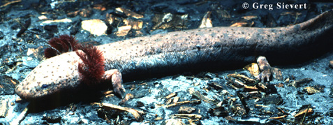

# [[Proteidae]] 

Mudpuppies, waterdogs 

## #has_/text_of_/abstract 

> The family **Proteidae** is a group of aquatic salamanders found today in the Balkan Peninsula and North America.  The range of the genus Necturus (commonly known as waterdogs or mudpuppies) runs from southern central Canada, through the midwestern United States, east to North Carolina and south to Georgia and Mississippi.  The range of the olm, the only extant member of the genus Proteus, is limited to the Western Balkans. The fossil record of the family extends back to the Late Cretaceous, with Paranecturus being known from the Maastrichtian of North America, and Bishara  from the Santonian-Campanian of Central Asia.
>
> [Wikipedia](https://en.wikipedia.org/wiki/Proteidae) 

## Introduction

[Allan Larson](http://www.tolweb.org/)

Salamanders of the family Proteidae are permanently aquatic, and
maintain throughout life the large, filamentous gills and caudal fins
characteristic of larvae. *Proteus* is a European, subterranean
salamander, that lacks pigment and has degenerate eyes. The body is
slender and has reduced numbers of toes on the forelimbs (three) and
hindlimbs (two). It is moderately large, reaching an adult length of
about 30 cm.

*Necturus* is an eastern North American genus that has normal
pigmentation and eyes and 4 digits on each foot. Members of the genus
*Necturus* are commonly called \"mudpuppies\" or \"waterdogs.\" They
inhabit streams, rivers and lakes, where they remain concealed under
rocks and debris during the day and forage for invertebrate prey at
night.

Breeding occurs in spring. Fertilization is internal. Eggs are attached
to the undersides of stones and logs, and may be guarded by males or
females. Larvae hatch in early summer and may require 4-6 years to reach
sexual maturity.

The grouping of the genera *Necturus* and *Proteus* as the family
Proteidae is controversial. This grouping has been favored by Estes
(1981) and Duellman and Trueb (1986) but challenged by Hecht and Edwards
(1977). The shared features that cause these genera to be grouped
taxonomically are possibly a result of parallel, paedomorphic
evolutionary trends and not strongly indicative of common ancestry.

The family Proteidae extends temporally at least to the Upper Paleocene
in North America and to the Middle Miocene in Europe and Kazakhstan
(Estes, 1981).

### Characteristics

#### Diagnosis

All proteids are permanently aquatic larvae with elongated bodies, long
filamentous gills and a caudal fin. Proteids of the European genus
*Proteus* are cave dwellers with depigmented skin and degenerate eyes.
American proteids of the genus *Necturus* have robust bodies that are
usually dark brown, grey or black on the dorsal surface which often has
a mottled appearance; four toes are present on robust forelimbs and
hindlimbs.

#### Detailed Characteristics of the Proteidae

The morphological characters given below are the ones standardly used to
diagnose the salamander family Proteidae and to assess its phylogenetic
relationships to other salamanders. The individual characteristics are
in most cases shared with other salamanders and should not be
interpreted as synapomorphies of the Proteidae. Absence of
characteristics found in other salamanders is noted where it is
important for distinguishing proteids from other salamanders and/or
determining their relationships to other salamanders. These
characteristics were assembled from a large number of original sources
by Duellman and Trueb (1986), Larson (1991) and Larson and Dimmick
(1993).

Metamorphosis is absent in the Proteidae, leading to a number of
paedomorphic features in adults.

###### Morphology of the Skull

The premaxilla consists of separated, paired bones. Bilaterally paired
nasal bones each ossify from a single, laterally positioned anlage; long
posterior processes of the premaxillae extend between the paired nasal
bones and completely separate them. Maxillary bones are absent.
Bilaterally paired septomaxillary bones are absent. Lacrimal bone is
absent. Quadratojugal bone is absent. Pterygoid bones are present. An
internal carotid foramen is present in the parasphenoid bone. The
angular bone is fused to the mandible. Ear bones include a detached
columella but no operculum. Replacement of vomerine teeth proceeds
laterally in parallel to the maxillary teeth. Teeth have a distinct
crown and pedicel. Origin of the levator mandibulae anterior
superficialis muscle includes the exoccipital.

###### Inner Ear

A basilaris complex is absent from the inner ear. The recessus
amphibiorum is oriented vertically in the inner ear. The otic sac is
bulbar and unvascularized. The amphibian periotic canal lacks fibrous
connective tissue. The periotic cistern is large and does not protrude
into the fenestra.

###### Hyobranchial Structures

The first hypobranchial and first ceratobranchial (alternatively
homologized as the first ceratobranchial and first epibranchial,
respectively) exist as separate structures. The second ceratobranchial
(alternatively homologized as the second epibranchial) comprises a
single element. Lungs are present but the ypsiloid cartilage is absent.
Two pairs of gill slits are present.

###### Characteristics of the Trunk and Vertebral Column

The scapula and coracoid bones of the pectoral girdle are fused to form
the scapulocoracoid. Vertebral centra are amphicoelous. Ribs are
bicapitate. Spinal-nerve foramina are absent from all vertebrae.
Anterior glomeruli of the kidney are reduced or absent.

###### Reproductive Characters

Fertilization is internal. Ciliated epithelium is absent from the
cloacal tube and anterior cloacal chamber of females. Epidermal lining
is present in the anterior cloacal chamber of females. Evaginations are
absent from the dorsolateral walls of the male cloacal tube. Anterior
ventral glands are present in the cloacae of females. Spermathecae are
present in the female cloacal chamber. Glands secreting into the dorsal
walls of the female cloaca are absent. Anterior ventral glands are
present in male cloacae. Posterior ventral glands are present in male
cloacae. Kingsbury\'s glands are present in male cloacae. Dorsal pelvic
glands are present in males. Lateral pelvic glands are present in males.
Glands secreting into the male cloacal orifice are present. Parental
care of eggs is by males or females.

The diploid number of chromosomes is 38 (see Morescalchi, 1975).

### Classification

The family Proteidae is part of the caudate suborder Salamandroidea,
which contains all of the internally-fertilizing salamanders. The
grouping of the genera *Necturus* and *Proteus* into a single family has
been controversial and should be considered tentative.

The single recognized species of *Proteus* is sometimes listed as *P.
anguineus* and alternatively as *P. anguinus*.

### Discussion of Phylogenetic Relationships

The Proteidae is a tentative grouping of the genera *Necturus* and
*Proteus,* whose status as sister taxa is still questionable.

Analyses of allozymic data (Guttman et al., 1990) and cytological data
(Sessions and Wiley, 1985) agree that *Necturus lewisi* is the sister
taxon to the remaining species of *Necturus,* and that *N. punctatus* is
the sister lineage to a group including *N. alabamensis, N. beyeri* and
*N. maculosus.* The allozymic data indicate that the lineages leading to
*N. alabamensis, N. beyeri* and *N. maculosus* approximate a three-way
split, and slightly favor a sister grouping of *N. alabamensis* and *N.
beyeri* relative to *N. maculosus.* The cytological study of Sessions
and Wiley (1985) groups *N. beyeri* with *N. maculosus* rather than with
*N. alabamensis.* Relationships among the latter three species are
perhaps best viewed as approximating a three-way split, with the
alternative hypotheses derived from the allozymic and cytological data
being tentative and in need of further testing.

The immunological data of Maxson et al. (1988) were ambiguous in their
resolution of the phylogenetic relationships among the species of
*Necturus*.

## Phylogeny 

-   « Ancestral Groups  
    -   [Caudata](../Caudata.md)
    -   [Living Amphibians](Living_Amphibians)
    -   [Terrestrial Vertebrates](../../../Terrestrial.md)
    -   [Sarcopterygii](../../../../Sarc.md)
    -   [Gnathostomata](../../../../../Gnath.md)
    -   [Vertebrata](../../../../../../Vertebrata.md)
    -   [Craniata](../../../../../../../Craniata.md)
    -   [Chordata](../../../../../../../../Chordata.md)
    -   [Deuterostomia](../../../../../../../../../Deutero.md)
    -   [Bilateria](Bilateria)
    -   [Animals](Animals)
    -   [Eukaryotes](Eukaryotes)
    -   [Tree of Life](../../../../../../../../../../../../Tree_of_Life.md)

-   ◊ Sibling Groups of  Caudata
    -   [Plethodontidae](Plethodontidae.md)
    -   [Amphiumidae](Amphiumidae.md)
    -   [Dicamptodontidae](Dicamptodontidae.md)
    -   [Ambystomatidae](Ambystomatidae.md)
    -   [Salamandridae](Salamandridae.md)
    -   [Rhyacotritonidae](Rhyacotritonidae.md)
    -   Proteidae
    -   [Cryptobranchidae](Cryptobranchidae.md)
    -   [Hynobiidae](Hynobiidae.md)
    -   [Sirenidae](Sirenidae.md)

-   » Sub-Groups 

## Title Illustrations

-----------------------

Scientific Name ::  Necturus alabamensis
Comments          The Alabama waterdog
Copyright ::         © 1996 [Greg Sievert](http://academic.emporia.edu/sievertg/)
