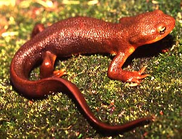

---
title: Salamandridae
---

# [[Salamandridae]]

## Newts and \"True Salamanders\" 

 

## #has_/text_of_/abstract 

> **Salamandridae** is a family of salamanders consisting of true salamanders and newts. Salamandrids are distinguished from other salamanders by the lack of rib or costal grooves along the sides of their bodies and by their rough skin. Their skin is very granular because of the number of poison glands. They also lack nasolabial grooves. Most species of Salamandridae have moveable eyelids but lack lacrimal glands.
>
> Nearly all salamandrids produce a potent toxin in their skin, with some species being deadly to many other animal species. With a few exceptions, salamandrids have patterns of bright and contrasting colours, most of these are to warn potential predators of their toxicity. They have four well-developed limbs, with four toes on the fore limbs, and (in most cases) five toes on the hind limbs. They vary from 7 to 30 cm (3 to 12 in) in length.
>
> Many species within this family reproduce by method of internal fertilization. Additionally, there are many species-specific courtship rituals that males perform to attract mates. These courtship rituals often employ pheromones to induce mating behavior in females. Pheromones have been discovered to be the driving force behind female mating responses in Alpine newts. These pheromones can induce behavior even when male visual epigamic characters and courtship dances are absent. All species within the genus Lyciasalamandra are viviparous, meaning they give birth to live young, without a tadpole stage. There are some species within the genus Salamandra are known to be viviparous too. Some newts are neotenic, being able to reproduce before they are fully metamorphosed. The females of many species can store sperm for up to 6 months at a time.
>
> [Wikipedia](https://en.wikipedia.org/wiki/Salamandridae) 

## Introduction

[Allan Larson, David Wake, and Tom Devitt](http://www.tolweb.org/) 

Salamanders of the family Salamandridae are informally subdivided into
two major subgroups, the \"true salamanders\" (includes genera
*Chioglossa, Lyciasalamandra, Mertensiella* and *Salamandra)* and the
newts (includes all remaining extant genera). Both groups have aquatic
larvae except for some viviparous true salamanders (*Lyciasalamandra,
Salamandra atra*, *S. lanzai*, some Spanish populations of *Salamandra
salamandra*, and some Moroccan populations of *Salamandra algira*) that
give birth to fully metamorphosed offspring. Metamorphosed adults of the
true salamanders are highly terrestrial whereas those of newts are at
least partly aquatic, and some are entirely aquatic. Some newts of the
North American genus *Notophthalmus* have a particularly complex life
cycle with two metamorphoses and three distinct developmental stages: an
aquatic larva, a terrestrial juvenile (the \"red eft\") and a
secondarily aquatic adult.

The family Salamandridae has a holarctic distribution and is well
represented in Europe, Asia, and North America. The true salamanders are
almost entirely European in distribution, except for some peripheral
populations of *Salamandra infraimmaculata* and *S. semenovi* located in
the Middle East (Iran, Iraq, Israel, Lebanon, Syria, and Turkey),
*Salamandra algira * from northwest Africa (northern Algeria and
Morocco), and the genus *Lyciasalamandra* in southern Turkey and some
Aegean islands. Habitats favored by the true salamanders include burrows
and refuges located under logs or stones in moist woodlands and
subalpine meadows. The true salamanders are generally secretive and are
active on the surface only on mild, damp nights.

The newts are more widespread in distribution, covering most of Europe
and including species located in southeastern China and northern Laos
and Vietnam, the Middle East, northwestern Africa and North America. All
newts have aquatic larvae and some, such as members of the Chinese genus
*Pachytriton,* are strictly aquatic also as adults. Other newts are
largely terrestrial as adults, but all must return to ponds or streams
to reproduce.

All salamandrids have toxic skin secretions, and newts are highly
poisonous in all stages of their life history. Many salamandrids have
bright colors that serve as warnings of their toxicity and may be used
in defensive displays.

For a detailed review of the biology, reproduction and diversity of
salamandrids, see Griffiths (1996) for European species and Zhao et al.
(1988) for Asian species. Halstead (1992) comments on toxicity of newts.
Titus and Larson (1995), Steinfartz et al. (2006), and Weisrock et al.
(2006) analyzed phylogenetic relationships within the family
Salamandridae. Montori and Herrero (2004) reviewed the systematics and
taxonomy of salamandrids inhabiting the Iberian Peninsula and the
Balearic Islands. Relationships of salamandrids to salamanders of other
families are summarized by Larson and Dimmick (1993). For a
comprehensive listing of extant species, see Frost (2006) and
AmphibiaWeb. For fossils, see Estes (1981) and Duellman and Trueb
(1986). See also Nussbaum et al. (1995) for taxonomic changes in the
genus *Tylototriton.*

### Characteristics

#### Diagnosis

Newts of the family Salamandridae are unlike all other salamanders in
having rough-textured skin that is not slimy. Costal grooves usually are
not distinct. Most salamandrids have a biphasic life history with
aquatic larvae and metamorphosed adults that may be terrestrial or
aquatic. The tail is finlike in aquatic forms but not in terrestrial
forms. Larvae have four pairs of gill slits and large external gills.
Legs are relatively long, prominent and robust.

#### Detailed Characteristics of the Salamandridae

The morphological characters given below are the ones standardly used to
diagnose the salamander family Salamandridae and to assess its
phylogenetic relationships to other salamanders. The individual
characteristics are in most cases shared with other salamanders and are
not synapomorphies of the Salamandridae. Absence of characteristics
found in other salamanders is noted where it is important for
distinguishing salamandrids from other salamanders and/or determining
their relationships to other salamanders. These characteristics were
assembled from a large number of original sources by Duellman and Trueb
(1986), Larson (1991) and Larson and Dimmick (1993). See \"Discussion of
Character Evolution\" below for comments on some interesting
evolutionary trends occurring within the Salamandridae.

###### Morphology of the skull

The premaxilla may consist of a single bone or separated, paired bones.
The angular bone is fused to the mandible. A frontosquamosal arch is
present in some genera. Bilaterally paired nasal bones each ossify from
a single, laterally positioned anlage; long posterior processes of the
premaxillae extend between the paired nasal bones and completely
separate them. Septomaxillary bones are absent. Lacrimal bone is absent.
Quadratojugal bone is absent. Pterygoid bones are present. Internal
carotid foramina are absent from parasphenoid bones. Ear bones feature
fusion of the columella with the ear capsule, and a free operculum.
Replacement of vomerine teeth proceeds medially. Teeth have a distinct
crown and pedicel. Origin of the levator mandibulae anterior
superficialis muscle includes the exoccipital.

###### Inner ear

A basilaris complex is present in the inner ear of some species and
absent from others. The recessus amphibiorum is oriented horizontally in
the inner ear. The otic sac is multilobate, vascularized and filled with
calcium. Fibrous connective tissue is present around the amphibian
periotic canal. The periotic cistern is small. The periotic cistern may
or may not protrude into the fenestra.

###### Hyobranchial apparatus 

The first hypobranchial and first ceratobranchial (alternatively
homologized as the first ceratobranchial and first epibranchial,
respectively) exist as separate structures in most species, but are
fused into a single structure in several genera. The second
ceratobranchial (alternatively homologized as the second epibranchial)
comprises a single element. Lungs are present but greatly reduced in
some species. An ypsiloid cartilage is present. Larvae have four pairs
of gill slits and large external gills.

###### Postcranial Morphology

The scapula and coracoid bones of the pectoral girdle are fused to form
the scapulocoracoid. Vertebral centra are opisthocoelous. Ribs are
bicapitate. Spinal-nerve foramina are present in neural arches of all
vertebrae except for spinal nerves exiting between the atlas and first
trunk vertebra. The pubotibialis and puboischiotibialis exist as
separate muscles. Anterior glomeruli of the kidney are reduced or
absent.

###### Reproductive characters

Fertilization is internal. Ciliated epithelium may be present or absent
in the cloacal tube and anterior cloacal chamber of females. Epidermal
lining is absent from the anterior cloacal chamber of females.
Evaginations are absent from the dorsolateral walls of the male cloacal
tube. Anterior ventral glands are present in the cloacae of females.
Spermathecae are present in the female cloacal chamber. Glands secreting
into the dorsal walls of the female cloaca are absent. Anterior ventral
glands are present in male cloacae. Posterior ventral glands are present
in male cloacae. Kingsbury\'s glands are present in male cloacae. Dorsal
pelvic glands are present in males. Lateral pelvic glands are absent in
males. Glands secreting into the male cloacal orifice are present.
Parental care of eggs has not been reported.

The diploid number of chromosomes is 22 *(Notophthalmus* and *Taricha)*
or 24 (see Morescalchi, 1975).

### Classification

Although taxonomists generally have accepted the hypothesis of monophyly
for extant salamandrid genera, evidence for salamandrid monophyly rests
mainly on recent molecular data (Larson, 1991; Titus and Larson, 1995;
Weisrock et al., 2006).

The \"true salamanders\" and \"newts\" are not recognized as formal
taxa, although the results of Titus and Larson (1995), Steinfartz et al.
(2006), and Weisrock et al. (2006) are compatible with the
interpretation that these groupings represent monophyletic sister taxa
and potentially could be recognized as subfamilies. Monophyly of \"true
salamanders\" is supported by the molecular studies of Veith et al.
(1998), Weisrock et al. (2001), and Steinfartz et al. (2006). The exact
phylogenetic position of the newt, *Salamandrina terdigitata,* is
uncertain (see below) and requires better resolution before we can be
confident that the newts form a monophyletic group.

Recent molecular studies (Weisrock et al., 2006) have validated earlier
studies that suggested that *Mertensiella*, *Euproctus* and *Triturus*
were polyphyletic assemblages and taxonomic changes have resulted.
Species of *Triturus* have been placed in *Lissotriton*, *Mesotriton*
(Montori and Herrero, 2004)*, Ommatotriton* (Litvinchuk et al., 2005)
and *Triturus*, species of *Mertensiella* in *Lyciasalamandra* and
*Mertensiella* (Veith and Steinfartz, 2004), and species of *Euproctus*
in *Calotriton* and *Euproctus* (Montori and Herrero, 2004). Features
such as a cutaneous dorsal spine above the base of the tail that
functions in courtship behavior were thought to be unique to
*Mertensiella* but have evolved homoplastically. *Lyciasalamandra* is
very closely related to *Salamandra* and could easily be recognized as a
component of that genus, as earlier work on osteology suggested (Özeti,
1967).

### Discussion of Phylogenetic Relationships

Titus and Larson (1995) reviewed 48 morphological and reproductive
characteristics for members of the Salamandridae (see also Özeti and
Wake, 1969; Wake and Özeti, 1969; Sever, 1992). No single feature
uniquely characterizes all salamandrids as a monophyletic group, but a
combined analysis of these characters and variation in mitochondrial DNA
sequence data strongly supports monophyly of the Salamandridae. This
analysis of the combined morphological and molecular characters gives
strong support to the monophyly of the true salamanders (genera
*Chioglossa, Lyciasalamandra, Mertensiella* and *Salamandra*) and to
monophyly of a group containing all newts except *Salamandrina
terdigitata.*

The genus *Salamandrina* appears to be the sole extant representative of
an ancient lineage that separated from other salamandrid lineages near
the time that the lineages leading to the remaining newts and to the
true salamanders were formed. The phylogenetic position of
*Salamandrina* is uncertain. Partitioned Bayesian analyses group
*Salamandrina* with the true salamanders, while parsimony analyses place
it sister to the newts (Weisrock et al., 2006). *Salamandrina* is
clearly only a distant relative of the other salamandrid genera, and we
can be fairly confident that it does not belong within either the clade
containing the remaining newts or the clade containing the true
salamanders.

Within the true salamanders, a clade comprising *Chioglossa* and
*Mertensiella* is sister to a clade containing *Salamandra* and
*Lyciasalamandra* (Veith et al., 1998; Weisrock et al., 2001, 2006;
Steinfartz et al., 2006). *Salamandra* and *Lyciasalamandra* each form
clades, and the major lineages of both form polytomies (Steinfartz et
al., 2000, 2006; Barroso and Bogaerts, 2003; García-París et al., 2003;
Weisrock et al., 2006).

Within the newt clade, the Asian genera *Echinotriton* and
*Tylototriton* are monophyletic and together form a clade with the
European and North African *Pleurodeles*, sister to the remaining newts
(except *Salamandrina*; Hayashi and Matsui, 1989; Titus and Larson,
1995; Veith et al., 2004; Steinfartz et al., 2006). The North American
genera *Notophthalmus* and *Taricha* form a clade sister to all other
newts except *Echinotriton, Pleurodeles, Salamandrina*, and *Tylotriton*
(Steinfartz et al., 2006; Weisrock et al., 2006).\

*Calotriton*, *Cynops*, *Euproctus*, *Lissotriton, Mesotriton,
Neurergus, Ommatotriton, Pachytriton, Paramesotriton,* and *Triturus*
together form a clade (Weisrock et al., 2006). Within this clade, a
clade comprising the Asian genera *Cynops, Pachytriton* and
*Paramesotriton* is supported (Hayashi and Matsui, 1988, 1989; Titus and
Larson, 1995; Chan et al., 2001; Steinfartz et al., 2006; Weisrock et
al., 2006). However, *Pachytriton* is the only genus in this clade that
is monophyletic (Chan et al., 2001; Weisrock et al., 2006).

The genera *Neurergus* and *Euproctus* are each monophyletic, and
*Euproctus* is the sister taxon to a clade comprising *Calotriton*,
*Pachytriton, Paramesotriton*, and *Triturus* (Weisrock et al., 2006).
*Calotriton* is sister to *Triturus* (sensu Montori and Herrero, 2004).

Steinfartz et al. (2006) recovered *Triturus* as a non-monophyletic
(holophyletic) species assemblage comprising four monophyletic groups:
(i) large-bodied *Triturus* (six species); (ii) small-bodied *Triturus*
(five species; *Lissotriton* sensu Montori and Herrero, 2004); (iii) *T.
alpestris* (*Mesotriton alpestris* sensu Montori and Herrero, 2004); and
(iv) *T. vittatus* (*Ommatotriton* sensu Litvinchuk et al., 2005)*.*

### Discussion of Character Evolution

Knowledge of phylogenetic relationships permits interpretation of the
evolution of several morphological characters that have been important
in the evolutionary diversification of salamandrids. Rough, keratinized
skin characterizes all newts except the highly aquatic species,
*Pachytriton labiatus*. Rough skin appears to have evolved in a common
ancestor of the newts after their separation from the true salamanders,
followed by loss of keratinized skin in the *Pachytriton* lineage.

Courtship in salamandrids can be classified into four general groups
based on the degree of contact between the male and female (Houck and
Arnold, 2003). Male salamandrids may actively capture the female on its
ventral surface (*Mertensiella*, *Salamandra*, *Pleurodeles*, and
*Tylototriton*), dorsal surface (*Notophthalmus* and *Taricha*), or tail
(*Euproctus* and *Calotriton*), or make no physical contact with the
female at all (*Cynops*, *Neurergus*, *Paramesotriton*, *Pachytriton*,
and *Triturus*). Absence of physical contact between the sexes is
considered the ancestral condition for salamandrids, and additional data
on the courtship of *Salamandrina* (which currently is unknown) are
required to clarify the evolutionary sequence of changes in courtship
behavior. Caudal capture in *Calotriton* and *Euproctus* has been
interpreted as an adaptation to stream habitats (Salthe, 1967) and has
occurred independently in these genera (Steinfartz et al., 2006).
Male-mediated visual courtship displays, the only known case of visual
courtship cues among all salamanders, have evolved independently
multiple times in *Triturus* (sensu Steinfartz et al., 2006).

Phylogenetic analyses (Titus and Larson, 1995) suggest that egg-laying
is ancestral for salamandrids and that the live-bearing observed in
*Lyciasalamandra* and *Salamandra* is evolutionarily derived. Presence
of well-developed lungs is ancestral for salamandrids with five
evolutionarily independent reductions or losses of lungs in the genera
*Calotriton*, *Chioglossa*, *Euproctus*, *Pachytriton*, and
*Salamandra*.

Two cranial characters provide synapomorphies for subgroups of
salamandrids (Titus and Larson, 1995). Presence of a frontosquamosal
arch is a derived characteristic found in all newts (except *Triturus*)
but no other salamanders. Fusion of the premaxillary bones in
salamandrids is a synapomorphy of all newts excluding the genera
*Pleurodeles*, *Salamandrina* and *Tylototriton*, although this
character has arisen independently in other salamanders (see Wake and
Larson, 1987). Other cranial characteristics show more complex patterns
of evolution in the Salamandridae.

## Phylogeny 

-   « Ancestral Groups  
    -   [Caudata](../Caudata.md)
    -   [Living Amphibians](Living_Amphibians)
    -   [Terrestrial Vertebrates](../../../Terrestrial.md)
    -   [Sarcopterygii](../../../../Sarc.md)
    -   [Gnathostomata](../../../../../Gnath.md)
    -   [Vertebrata](../../../../../../Vertebrata.md)
    -   [Craniata](../../../../../../../Craniata.md)
    -   [Chordata](../../../../../../../../Chordata.md)
    -   [Deuterostomia](../../../../../../../../../Deutero.md)
    -   [Bilateria](Bilateria)
    -   [Animals](Animals)
    -   [Eukaryotes](Eukaryotes)
    -   [Tree of Life](../../../../../../../../../../../../Tree_of_Life.md)

-   ◊ Sibling Groups of  Caudata
    -   [Plethodontidae](Plethodontidae.md)
    -   [Amphiumidae](Amphiumidae.md)
    -   [Dicamptodontidae](Dicamptodontidae.md)
    -   [Ambystomatidae](Ambystomatidae.md)
    -   Salamandridae
    -   [Rhyacotritonidae](Rhyacotritonidae.md)
    -   [Proteidae](Proteidae.md)
    -   [Cryptobranchidae](Cryptobranchidae.md)
    -   [Hynobiidae](Hynobiidae.md)
    -   [Sirenidae](Sirenidae.md)

-   » Sub-Groups
    -   [Salamandrina](Salamandridae/Salamandrina.md)
    -   [Salamandra](Salamandridae/Salamandra.md)

## Title Illustrations

------------

Scientific Name ::  Taricha granulosa
Location ::        California
Copyright ::         © 1996 Dr. Tom A. Titus

## Confidential Links & Embeds: 

### #is_/same_as :: [Salamandridae](/_Standards/bio/bio~Domain/Eukaryotes/Animals/Bilateria/Deutero/Chordata/Craniata/Vertebrata/Gnath/Sarc/Tetrapods/Amphibians/Caudata/Salamandridae.md) 

### #is_/same_as :: [Salamandridae.public](/_public/bio/bio~Domain/Eukaryotes/Animals/Bilateria/Deutero/Chordata/Craniata/Vertebrata/Gnath/Sarc/Tetrapods/Amphibians/Caudata/Salamandridae.public.md) 

### #is_/same_as :: [Salamandridae.internal](/_internal/bio/bio~Domain/Eukaryotes/Animals/Bilateria/Deutero/Chordata/Craniata/Vertebrata/Gnath/Sarc/Tetrapods/Amphibians/Caudata/Salamandridae.internal.md) 

### #is_/same_as :: [Salamandridae.protect](/_protect/bio/bio~Domain/Eukaryotes/Animals/Bilateria/Deutero/Chordata/Craniata/Vertebrata/Gnath/Sarc/Tetrapods/Amphibians/Caudata/Salamandridae.protect.md) 

### #is_/same_as :: [Salamandridae.private](/_private/bio/bio~Domain/Eukaryotes/Animals/Bilateria/Deutero/Chordata/Craniata/Vertebrata/Gnath/Sarc/Tetrapods/Amphibians/Caudata/Salamandridae.private.md) 

### #is_/same_as :: [Salamandridae.personal](/_personal/bio/bio~Domain/Eukaryotes/Animals/Bilateria/Deutero/Chordata/Craniata/Vertebrata/Gnath/Sarc/Tetrapods/Amphibians/Caudata/Salamandridae.personal.md) 

### #is_/same_as :: [Salamandridae.secret](/_secret/bio/bio~Domain/Eukaryotes/Animals/Bilateria/Deutero/Chordata/Craniata/Vertebrata/Gnath/Sarc/Tetrapods/Amphibians/Caudata/Salamandridae.secret.md)

