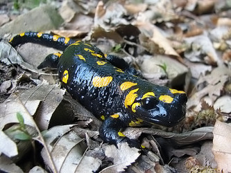
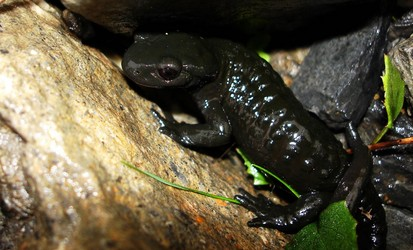

# [[Salamandra]] 

## #has_/text_of_/abstract 

> **Salamandra** is a genus of six species of salamanders localized in central and southern Europe, Northern Africa, and western Asia.
>
> [Wikipedia](https://en.wikipedia.org/wiki/Salamandra) 

## Phylogeny 

-   « Ancestral Groups  
    -   [Salamandridae](../Salamandridae.md)
    -   [Caudata](../../Caudata.md)
    -   [Living Amphibians](Living_Amphibians)
    -   [Terrestrial Vertebrates](../../../../Terrestrial.md)
    -   [Sarcopterygii](../../../../../Sarc.md)
    -   [Gnathostomata](../../../../../../Gnath.md)
    -   [Vertebrata](../../../../../../../Vertebrata.md)
    -   [Craniata](../../../../../../../../Craniata.md)
    -   [Chordata](../../../../../../../../../Chordata.md)
    -   [Deuterostomia](../../../../../../../../../../Deutero.md)
    -   [Bilateria](Bilateria)
    -   [Animals](Animals)
    -   [Eukaryotes](Eukaryotes)
    -   [Tree of Life](../../../../../../../../../../../../../Tree_of_Life.md)

-   ◊ Sibling Groups of  Salamandridae
    -   [Salamandrina](Salamandrina.md)
    -   Salamandra

-   » Sub-Groups 

## Title Illustrations

-----------------------------------------------------------------------

Scientific Name ::     Salamandra salamandra
Location ::           Romania
Specimen Condition   Live Specimen
Identified By        Horia Bogdan
Image Use ::    [Attribution-NonCommercial 2.0 Creative Commons License](http://creativecommons.org/licenses/by-nc/2.0/).
Copyright ::            © [Horia Bogdan](http://herp-or.uv.ro/index) 

-----------------------------------------------------------------------

Scientific Name ::     Salamandra atra
Location ::           Pont de Nant nature reserve in the western swiss alps
Specimen Condition   Live Specimen
Source               [Salamandra atra](http://www.flickr.com/photos/philgimp/205901169/)
Source Collection    [Flickr](http://flickr.com/)
Image Use ::    [Attribution-NonCommercial-ShareAlike 2.0 Creative Commons License](http://creativecommons.org/licenses/by-nc-sa/2.0/).
Copyright ::            © 2006 [Philippe Henry](http://flickr.com/people/66579298@N00)

## Confidential Links & Embeds: 

### [Salamandra](/_Standards/bio/bio~Domain/Eukaryotes/Animals/Bilateria/Deutero/Chordata/Craniata/Vertebrata/Gnath/Sarc/Tetrapods/Amphibians/Caudata/Salamandridae/Salamandra.md) 

### [Salamandra.public](/_public/bio/bio~Domain/Eukaryotes/Animals/Bilateria/Deutero/Chordata/Craniata/Vertebrata/Gnath/Sarc/Tetrapods/Amphibians/Caudata/Salamandridae/Salamandra.public.md) 

### [Salamandra.internal](/_internal/bio/bio~Domain/Eukaryotes/Animals/Bilateria/Deutero/Chordata/Craniata/Vertebrata/Gnath/Sarc/Tetrapods/Amphibians/Caudata/Salamandridae/Salamandra.internal.md) 

### [Salamandra.protect](/_protect/bio/bio~Domain/Eukaryotes/Animals/Bilateria/Deutero/Chordata/Craniata/Vertebrata/Gnath/Sarc/Tetrapods/Amphibians/Caudata/Salamandridae/Salamandra.protect.md) 

### [Salamandra.private](/_private/bio/bio~Domain/Eukaryotes/Animals/Bilateria/Deutero/Chordata/Craniata/Vertebrata/Gnath/Sarc/Tetrapods/Amphibians/Caudata/Salamandridae/Salamandra.private.md) 

### [Salamandra.personal](/_personal/bio/bio~Domain/Eukaryotes/Animals/Bilateria/Deutero/Chordata/Craniata/Vertebrata/Gnath/Sarc/Tetrapods/Amphibians/Caudata/Salamandridae/Salamandra.personal.md) 

### [Salamandra.secret](/_secret/bio/bio~Domain/Eukaryotes/Animals/Bilateria/Deutero/Chordata/Craniata/Vertebrata/Gnath/Sarc/Tetrapods/Amphibians/Caudata/Salamandridae/Salamandra.secret.md)

