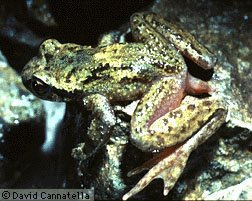

# [[Ascaphus truei]]

## The Tailed Frog 

## #has_/text_of_/abstract 

> The tailed frogs are two species of frogs in the genus Ascaphus, the only taxon in the family Ascaphidae . The "tail" in the name is actually an extension of the male cloaca. The tail is one of two distinctive anatomical features adapting the species to life in fast-flowing streams.  These are the only North American frog species that reproduce by internal fertilization. They are among the most primitive known families of frogs.
>
> Its scientific name means 'without a spade', from the privative prefix a- and the Ancient Greek skaphís (σκαφίς, 'spade, shovel'), referring to the metatarsal spade, which these frogs do not have.
>
> [Wikipedia](https://en.wikipedia.org/wiki/Tailed%20frog) 

## Introduction

[David Cannatella and Darrel Frost]() 

The tailed Frog gets its name from the copulatory organ of the male,
which resembles a short tail. This is one of the very few frogs with
internal fertilization; the copulatory organ is used to transfer sperm
to the female. It inhabits cold streams in humid forests and the areas
around them. Ascaphus ranges from British Columbia south to Mendocino
County, California, the Rocky Mountains of Idaho and Montana, and
adjacent Washington and Oregon. It is not known to have an advertisement
call. Ascaphus is semi-aquatic and is most active in the vicinity of
streams at night.

Its tadpole has a large suckerlike mouth that occupies about one-half of
the ventral surface of the body. It also has a large number of denticles
(2-3 upper and 7-12 lower rows). Ascaphus uses its sucker and denticles
to adhere to and move among rocks in the cold swift streams. Tadpoles of
most species of frogs have only two upper and three lower rows of
denticles.

Ascaphus truei is in the family Ascaphidae, which along with the
Leiopelmatidae, retains nine vertebrae in front of the sacrum, and
\"tailwagging\" muscles, both primitive features. Because the only taxon
in Ascaphidae is Ascaphus truei, the family name Ascaphidae is somewhat
redundant, and the name Ascaphus truei is used in the tree diagram. Many
systematists would use Ascaphidae in order to have a consistent listing
of all the taxa in the tree at the family rank.

### Geographic Distribution

The distribution of living Ascaphus is indicated in red.

### Discussion of Phylogenetic Relationships

Ascaphus and Leiopelma generally have been placed in the same family,
sometimes called Ascaphidae. This arrangement has always been recognized
as one based on symplesiomorphy (Green and Cannatella, 1993). The
synapomorphies of Leiopelmatanura (below) indicate the relationship of
Leiopelma to other frogs.

Ascaphus truei is the sister-group to the clade of all other living
frogs, which was named Leiopelmatanura by Ford and Cannatella (1993).
Cannatella (1985) described synapomorphies of Leiopelmatanura: elongate
arms on the sternum; loss of the ascending process of the
palatoquadrate; sphenethmoid ossifying in the anterior position; the
root of the facial nerve exits the braincase through the facial foramen,
anterior to the auditory capsule, rather than via the anterior acoustic
foramen into the auditory capsule (Slabbert and Maree, 1945; Stephenson,
1951); and a palatoquadrate articulation with the braincase via a
pseudobasal process, rather than a basal process (Pusey, 1943).

Green et al. (1989) concluded on the basis of an allozyme study of 36
loci that Leiopelma was the sister-group to Ascaphus and all other frogs
(represented by Bombina and Discoglossus), based on an UPGMA phenogram
and a midpoint-rooted Fitch-Margoliash tree. However, their tree can be
re-rooted such that Ascaphus is the sister-group to all other frogs,
without increase in the % standard deviation, a measure of
goodness-of-fit. Such a re-rooting would violate only slightly the
assumption of rate homogeneity, which was the basis of the midpoint
rooting.

Most recently Hay et al. (1995) analyzed relationships among families of
frogs using 12S and 16S rRNA and found Ascaphus and Leiopelma to be
sister-groups.

### Amphibian Species of the World Accounts

#### *Ascaphus* Stejneger, 1899

-   **CITATION:** Proc. U.S. Natl. Mus., 21:899.
-   **TYPE SPECIES:** *Ascaphus truei* Stejneger, 1899, by monotypy.
-   **DISTRIBUTION:** As for the single species.

#### *Ascaphus truei* Stejneger, 1899

-   **CITATION:** Proc. U.S. Natl. Mus., 21:900.
-   **TYPE(S):** Holotype: USNM 25979.
-   **TYPE LOCALITY:** \"Humptulips, \[Gray\'s Harbor County,\]
    Washington\", USA.
-   **SYNONYM(S):**
    1.  *Ascaphus truei californicus* Mittleman and Myers, 1949,
    2.  *Ascaphus truei montanus* Mittleman and Myers, 1949, Proc. Biol.
        Soc. Washington, 62:64; Type locality: \"tributary of Lincoln
        Creek, Glacier National Park, Flathead County, Montana\", USA.
-   **DISTRIBUTION:** Extreme southwestern Canada and coastal
    northwestern USA to northern California; western Montana and
    northern Idaho to northeastern Oregon and southwestern Washington,
    USA.
-   **COMMENT:** Reviewed by Metter, 1968, Cat. Am. Amph. Rept., 69.1-2.

## Phylogeny 

-   « Ancestral Groups  
    -   [Salientia](../Salientia.md)
    -   [Living Amphibians](Living_Amphibians)
    -   [Terrestrial Vertebrates](../../../Terrestrial.md)
    -   [Sarcopterygii](../../../../Sarc.md)
    -   [Gnathostomata](../../../../../Gnath.md)
    -   [Vertebrata](../../../../../../Vertebrata.md)
    -   [Craniata](../../../../../../../Craniata.md)
    -   [Chordata](../../../../../../../../Chordata.md)
    -   [Deuterostomia](../../../../../../../../../Deutero.md)
    -   [Bilateria](Bilateria)
    -   [Animals](Animals)
    -   [Eukaryotes](Eukaryotes)
    -   [Tree of Life](../../../../../../../../../../../../Tree_of_Life.md)

-   ◊ Sibling Groups of  Salientia
    -   [Triadobatrachus         massinoti](Triadobatrachus_massinoti.md)
    -   [Vieraella herbsti](Vieraella_herbsti.md)
    -   [Notobatrachus degiustoi](Notobatrachus_degiustoi.md)
    -   Ascaphus truei
    -   [Leiopelma](Leiopelma.md)
    -   [Eodiscoglossus         santonjae](Eodiscoglossus_santonjae.md)
    -   [Bombinatoridae](Bombinatoridae.md)
    -   [Discoglossidae](Discoglossidae.md)
    -   [Eopelobatinae](Eopelobatinae.md)
    -   [Megophryidae](Megophryidae.md)
    -   [Pelobatidae](Pelobatidae.md)
    -   [Pelodytidae](Pelodytidae.md)
    -   [Rhinophrynidae](Rhinophrynidae.md)
    -   [\'Pipids\'](%27Pipids%27)
    -   [Palaeobatrachidae](Palaeobatrachidae.md)
    -   [Pipidae](Pipidae.md)
    -   [Neobatrachia](Neobatrachia.md)

-   » Sub-Groups 

## Title Illustrations

  --------------------------------------------------------------------------

  Scientific Name ::     Ascaphus truei
  Location ::           Oregon
  Specimen Condition   Live Specimen
  Sex ::                Male
  Copyright ::            © 1995 [David Cannatella](http://www.catfishlab.org/) 

## Confidential Links & Embeds: 

### [Ascaphus_truei](/_Standards/bio/bio~Domain/Eukaryotes/Animals/Bilateria/Deutero/Chordata/Craniata/Vertebrata/Gnath/Sarc/Tetrapods/Amphibians/Salientia/Ascaphus_truei.md) 

### [Ascaphus_truei.public](/_public/bio/bio~Domain/Eukaryotes/Animals/Bilateria/Deutero/Chordata/Craniata/Vertebrata/Gnath/Sarc/Tetrapods/Amphibians/Salientia/Ascaphus_truei.public.md) 

### [Ascaphus_truei.internal](/_internal/bio/bio~Domain/Eukaryotes/Animals/Bilateria/Deutero/Chordata/Craniata/Vertebrata/Gnath/Sarc/Tetrapods/Amphibians/Salientia/Ascaphus_truei.internal.md) 

### [Ascaphus_truei.protect](/_protect/bio/bio~Domain/Eukaryotes/Animals/Bilateria/Deutero/Chordata/Craniata/Vertebrata/Gnath/Sarc/Tetrapods/Amphibians/Salientia/Ascaphus_truei.protect.md) 

### [Ascaphus_truei.private](/_private/bio/bio~Domain/Eukaryotes/Animals/Bilateria/Deutero/Chordata/Craniata/Vertebrata/Gnath/Sarc/Tetrapods/Amphibians/Salientia/Ascaphus_truei.private.md) 

### [Ascaphus_truei.personal](/_personal/bio/bio~Domain/Eukaryotes/Animals/Bilateria/Deutero/Chordata/Craniata/Vertebrata/Gnath/Sarc/Tetrapods/Amphibians/Salientia/Ascaphus_truei.personal.md) 

### [Ascaphus_truei.secret](/_secret/bio/bio~Domain/Eukaryotes/Animals/Bilateria/Deutero/Chordata/Craniata/Vertebrata/Gnath/Sarc/Tetrapods/Amphibians/Salientia/Ascaphus_truei.secret.md)

