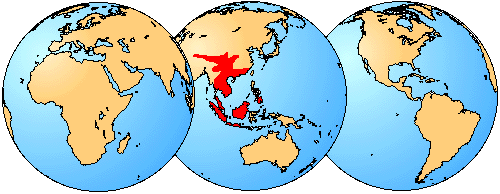

---
title: Megophryidae
---

# [[Megophryidae]]  

## #has_/text_of_/abstract 

> **Megophryidae**, commonly known as goose frogs, is a large family of frogs native to the warm southeast of Asia, from the Himalayan foothills eastwards, south to Indonesia and the Greater Sunda Islands in Maritime Southeast Asia, and extending to the Philippines. Fossil remains are also known from North America. As of 2014 it encompasses 246 species of frogs divided between five genera. For lack of a better vernacular name, they are commonly called megophryids.
>
> [Wikipedia](https://en.wikipedia.org/wiki/Megophryidae) 

## Introduction

[David Cannatella](http://www.tolweb.org/)

Megophryids are the largest and most diverse family-level group of
non-neobatrachian frogs. They are found in India, Pakistan, and eastward
into southeast Asia, Borneo and the Philippines to the Sunda Islands.
They range in size from about 20 to 125 mm. Some are large, cryptic,
forest-floor dwellers with adaptations for large prey. Their skin is
modified so that they resemble dead leaves on the forest floor. Some
species have points of skin on the eyelids, which further enhances the
illusion (Megophrys montana). Others, such as Leptobrachella mjobergi,
are small, with digital discs and are found on rocks along streams. Some
megophryids have pond-type tadpoles; others have stream-dwelling
tadpoles, some with surface-feeding mouths and some with large buccal
areas for clinging to rocks. All megophryids for which data are
available have unusually ossified intervertebral disks, and hyoid plates
that lack most of the ceratohyals. There are no known fossils.

### Geographic Distribution

The distribution of living members of the family Megophryidae is
indicated in red.\

### Discussion of Phylogenetic Relationships

Ford and Cannatella (1993) defined the node-based name Megophryidae to
be the common ancestor of living megophryines (Atympanophrys,
Brachytarsophrys, Leptobrachella, Leptobrachium, Leptolalax, Megophrys,
and Scutiger), and all its descendants. Putative synapomorphies include
the complete or almost complete absence of ceratohyals in adults,
intervertebral cartilages with an ossified center, and paddle-shaped
tongue (Regal and Gans, 1976). Only two of the seven genera were
analyzed by Cannatella (1985), but ongoing studies of other taxa by
Cannatella corroborate these synapomorphies. The monophyly of
megophryids has not been questioned.

## Phylogeny 

-   « Ancestral Groups  
    -   [Salientia](../Salientia.md)
    -   [Living Amphibians](Living_Amphibians)
    -   [Terrestrial Vertebrates](../../../Terrestrial.md)
    -   [Sarcopterygii](../../../../Sarc.md)
    -   [Gnathostomata](../../../../../Gnath.md)
    -   [Vertebrata](../../../../../../Vertebrata.md)
    -   [Craniata](../../../../../../../Craniata.md)
    -   [Chordata](../../../../../../../../Chordata.md)
    -   [Deuterostomia](../../../../../../../../../Deutero.md)
    -   [Bilateria](Bilateria)
    -   [Animals](Animals)
    -   [Eukaryotes](Eukaryotes)
    -   [Tree of Life](../../../../../../../../../../../../Tree_of_Life.md)

-   ◊ Sibling Groups of  Salientia
    -   [Triadobatrachus         massinoti](Triadobatrachus_massinoti.md)
    -   [Vieraella herbsti](Vieraella_herbsti.md)
    -   [Notobatrachus degiustoi](Notobatrachus_degiustoi.md)
    -   [Ascaphus truei](Ascaphus_truei.md)
    -   [Leiopelma](Leiopelma.md)
    -   [Eodiscoglossus         santonjae](Eodiscoglossus_santonjae.md)
    -   [Bombinatoridae](Bombinatoridae.md)
    -   [Discoglossidae](Discoglossidae.md)
    -   [Eopelobatinae](Eopelobatinae.md)
    -   Megophryidae
    -   [Pelobatidae](Pelobatidae.md)
    -   [Pelodytidae](Pelodytidae.md)
    -   [Rhinophrynidae](Rhinophrynidae.md)
    -   [\'Pipids\'](%27Pipids%27)
    -   [Palaeobatrachidae](Palaeobatrachidae.md)
    -   [Pipidae](Pipidae.md)
    -   [Neobatrachia](Neobatrachia.md)

-   » Sub-Groups 
	-   *Atympanophrys*
	-   *Brachytarsophrys*
	-   *Leptobrachella*
	-   *Leptobrachium*
	-   *Leptolalax*
	-   *Megophrys*
	-   *Scutiger*

## Title Illustrations

-------------------------------------------------------------------------

Scientific Name ::  Megophrys montana
Copyright ::         © 1995 [David Cannatella](http://www.catfishlab.org/) 

## Confidential Links & Embeds: 

### #is_/same_as :: [Megophryidae](/_Standards/bio/bio~Domain/Eukaryotes/Animals/Bilateria/Deutero/Chordata/Craniata/Vertebrata/Gnath/Sarc/Tetrapods/Amphibians/Salientia/Megophryidae.md) 

### #is_/same_as :: [Megophryidae.public](/_public/bio/bio~Domain/Eukaryotes/Animals/Bilateria/Deutero/Chordata/Craniata/Vertebrata/Gnath/Sarc/Tetrapods/Amphibians/Salientia/Megophryidae.public.md) 

### #is_/same_as :: [Megophryidae.internal](/_internal/bio/bio~Domain/Eukaryotes/Animals/Bilateria/Deutero/Chordata/Craniata/Vertebrata/Gnath/Sarc/Tetrapods/Amphibians/Salientia/Megophryidae.internal.md) 

### #is_/same_as :: [Megophryidae.protect](/_protect/bio/bio~Domain/Eukaryotes/Animals/Bilateria/Deutero/Chordata/Craniata/Vertebrata/Gnath/Sarc/Tetrapods/Amphibians/Salientia/Megophryidae.protect.md) 

### #is_/same_as :: [Megophryidae.private](/_private/bio/bio~Domain/Eukaryotes/Animals/Bilateria/Deutero/Chordata/Craniata/Vertebrata/Gnath/Sarc/Tetrapods/Amphibians/Salientia/Megophryidae.private.md) 

### #is_/same_as :: [Megophryidae.personal](/_personal/bio/bio~Domain/Eukaryotes/Animals/Bilateria/Deutero/Chordata/Craniata/Vertebrata/Gnath/Sarc/Tetrapods/Amphibians/Salientia/Megophryidae.personal.md) 

### #is_/same_as :: [Megophryidae.secret](/_secret/bio/bio~Domain/Eukaryotes/Animals/Bilateria/Deutero/Chordata/Craniata/Vertebrata/Gnath/Sarc/Tetrapods/Amphibians/Salientia/Megophryidae.secret.md)

