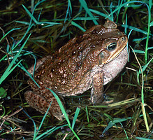
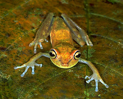
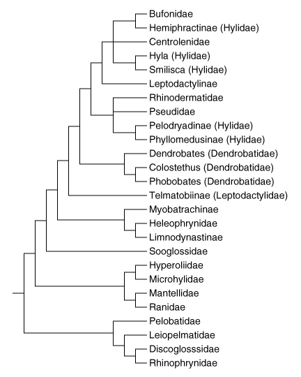

# [[Neobatrachia]]

"Higher" Frogs 

## #has_/text_of_/abstract 

> The **Neobatrachia** (Neo-Latin neo- ("new") + batrachia ("frogs")) are a suborder of the Anura, the order of frogs and toads.
>
> This suborder is the most advanced and apomorphic of the three anuran suborders alive today, hence its name, which literally means "new frogs" (from the hellenic words neo, meaning "new" and batrachia, meaning "frogs"). It is also by far the largest of the three; its more than 5,000 different species make up over 96% of all living anurans.
>
> The differentiation between Archaeobatrachia, Mesobatrachia, and Neobatrachia is based primarily on anatomic differences, especially the skeletal structure, as well as several visible characteristics and behaviors.
>
> [Wikipedia](https://en.wikipedia.org/wiki/Neobatrachia) 

## Introduction

[David Cannatella, Linda Ford, and Lori Bockstanz](http://www.tolweb.org/) 

Neobatrachians are sometimes called the \"advanced\" frogs. This group
includes 95% of the species of frogs, but relationships among the major
lineages are not well-resolved for the most part.

### Discussion of Phylogenetic Relationships

Ford and Cannatella (1993) applied the node-based name Neobatrachia to
the most recent common ancestor of living hyloids (myobatrachids,
leptodactylids, bufonids, hylids, centrolenids, pseudids, sooglossids,
Heleophryne, brachycephalids, Rhinoderma, and Allophryne) and Ranoidea,
and all its descendants. Neobatrachian synapomorphies include the
presence of a neopalatine bone (=palatine auctorum), fusion of the third
distal carpal to other carpals (Ford, 1989), the complete separation of
the sartorius muscle from the semitendinosus, the presence of an
accessory head of the adductor longus muscle, and the absence of the
parahyoid bone (Cannatella, 1985; Duellman and Trueb, 1986; Dunlap,
1960).

Another likely synapomorphy is the presence of a 55-bp insertion in the
28S ribosomal RNA gene (Hillis and Davis, 1987). This is present in
neobatrachians (including the limnodynastine Limnodynastes, the
sooglossid Nesomantis, and the leptodactylid Telmatobius), but was not
present in caecilians, salamanders, or other frogs, including
pelobatoids.

Some recent classifications divided Neobatrachia into three
superfamilies: Bufonoidea (=Hyloidea), Ranoidea, and Microhyloidea
(Duellman, 1975; Laurent, 1986), but relationships among the clades
within these groups are not clear.

There are no published synapomorphies of \"Bufonoidea\" (=Hyloidea,
Dubois \[1986\]) as generally recognized (Duellman, 1975; Laurent,
1986); hyloids are simply neobatrachians that are not ranoids. In a
phylogenetic analysis of osteological characters of Neobatrachia, Ford
(1989b) found hyloids to be paraphyletic with respect to Ranoidea,
including Microhylidae. However, Hay et al. (1995) presented a
neighbor-joining tree of relationships among most of the families of
frogs, in which the hyloids were monophyletic.

         =======C====== Allophryne ruthveni 
         |
         |============= Brachycephalidae 
         |
         |============= Bufonidae 
         |
         |======B====== Heleophryne 
         |
         |||||||||||||| Leptodactylidae 
         |
         |======D====== Limnodynastinae 
         |
         |      ====D== Myobatrachinae 
         |===G==|
         |      ======= Sooglossidae
      ===|
         |======E====== Rhinoderma 
         |
         |      ======= Hylidae 
         |      |
         |===H==|====== Pseudidae 
         |      |
         |      ======= Centrolenidae
         |
         |      ======= Microhylidae 
         |      |
         |      |===F== Hemisus 
         |      |
         |      |====== Dendrobatidae 
         |      |
         ====A==||||||| Arthroleptidae 
                |
                ||||||| Ranidae
                |
                |====== Hyperoliidae
                |
                ======= Rhacophoridae

#### Ranoidea Node A

Ranoids are a large and very diverse group. In a sense they are a
radiation equivalent to the \"hyloids\" (=bufonoids). (Realize however
that there is little evidence for hyloid monophyly, where is there is
data supporting ranoid monophyly, depending on the inclusion of
Dendrobatidae.) Ranoids however are firmisternal, meaning that the left
and right epicoracoid cartilages of the shoulder girdle are fused. In
contrast, the hyloids are mostly arciferal, meaning that the cartilages
overlap, and are not fused. Ranoids are a large and very diverse group.
In a sense they are a radiation equivalent to the \"hyloids\"
(=bufonoids). (Realize however that there is little evidence for hyloid
monophyly, where is there is data supporting ranoid monophyly, depending
on the inclusion of Dendrobatidae.) Ranoids however are firmisternal,
meaning that the left and right epicoracoid cartilages of the shoulder
girdle are fused. In contrast, the hyloids are mostly arciferal, meaning
that the cartilages overlap, and are not fused.

Ranoids can be viewed as the Old World counterpart of the hylids,
bufonids, and leptodactylids. \"Ranidae\" are analogous to
\"Leptodactylidae\" in being a diverse, paraphyletic group of
non-treefrog forms, but with their center of diversity is Africa and
Southeast Asia, with a minor radiation of the genus Rana in the New
World. Rhacophoridae and Hyperoliidae are the Old World ranoid treefrog
types, analogous to hylids in Central and South America. Microhylids are
perhaps the firmisternal equivalent to Bufonidae in that they are a
cosmopolitan group with three apparent radiations, in South America,
Africa, and southeast Asia.

One major issue in the content of the Ranoidea is the inclusion (or not)
of the Dendrobatidae (poison-dart frogs). Here we follow Ford (1989) in
treating dendrobatids as ranoids. Analysis of rRNA sequence data by Hay
et al. (1995) does not support this, however. The four species of
ranoids analyzed by Hay et al. (1995) formed a monophyletic group, but
the dendrobatid was placed among the \"hyloids.\"

Phylogenetic relationships.\--The name Ranoidea was defined by Ford and
Cannatella (1993) as the node-based name for the last common ancestor of
hyperoliids, rhacophorids, ranids, dendrobatids, Hemisus, arthroleptids,
and microhylids, and all of its descendants. Synapomorphies of Ranoidea
include completely fused epicoracoid cartilages, and the medial end of
coracoid being wider than lateral end (Ford, 1989b). A probable
synapomorphy, depending on the position of Dendrobatidae within
Ranoidea, is the insertion of the semitendinosus tendon dorsal to the
gracilis muscle (convergent with some myobatrachines).

Traditionally, Ranoidea was diagnosed by the condition of the pectoral
girdle described as firmisterny (Duellman and Trueb, 1986). This feature
has been controversial because of ambiguity in the definition of the
term. One of the simpler and more widely accepted definitions of
firmisterny is the complete fusion of the epicoracoid cartilages
(Peters, 1964). The girdle has been treated as a single complex unit,
and many individual aspects of it (i. e., clavicle, coracoid,
epicoracoid and procoracoid cartilages) have been not used in systematic
analyses (Ford, 1989a). The validity of the firmisternal girdle as a
single character cannot be assessed until the individual elements are
examined for character independence (Ford, 1988, 1989b).

#### Heleophryne Node B

The redundant family name applied to this taxon is Heleophrynidae.

#### Allophryne ruthveni Node C

The redundant family name applied to this taxon is Allophrynidae.

#### \"Myobatrachidae\" Node D

Under most arrangements, Limnodynastinae and Myobatrachinae are included
in the family Myobatrachidae. The arrangement here follows Ford and
Cannatella (1993).

#### Rhinoderma Node E

The redundant family name applied to this taxon is Rhinodermatidae.

#### Hemisus Node F

The redundant family name applied to this taxon is Hemisotidae.

#### Unnamed Node G

No name has been proposed for this node. Under Linnean nomenclature the
name Myobatrachidae has priority over Sooglossidae.

#### Unnamed Node H

Lynch (1973) and Duellman and Trueb (1986:character J) used the presence
of intercalary elements to unite Hylidae, Centrolenidae and Pseudidae
into a clade. Intercalary elements are also known in Hyperoliidae and
Rhacophoridae, as well as mantelline ranids and phrynomerine
microhylids. The tree presented by Duellman and Trueb (1986:Fig. 17-3)
has an equally parsimonious solution that would require convergent
evolution of a firmisternal girdle (character C1) if lack of homoplasy
in the intercalary element (character J1) is favored. In a subtree
Duellman and Trueb (1986:Fig. 17-4) used the presence of intercalary
elements to unite mantellines, hyperoliids, and rhacophorids, but not
phrynomerines. This tree also has an equally parsimonious alternative
that would unite phrynomerines with the aforementioned clade, but
requires homoplasy in the Type 2 larva (character O2\').

Ford\'s (1989) study of dendrobatid relationships did not include
centrolenids or pseudids. Ford and Cannatella continued the recognition
of the clade consisting of Hylidae, Pseudidae, and Centrolenidae, which
is diagnosed by the presence of intercalary elements, but did not name
it. Hay et al. (1995) found that pseudids, hylids and centrolenids (each
represented by one species) not to be a clade, although the latter two
were sister-taxa, and all three were part of the Neobatrachia.

Recently, Ruvinsky and Maxson (1996; Molecular Phylogenetics and
Evolution 5:533-547) analyzed relationships among Neobatrachia based on
mitochondrial 12S and 16S sequences. Their neighbor-joining tree is
presented below. Several features of their tree are noteworthy.

Bufonoids are a monophyletic group, and dendrobatids are nested within
this clade. Ranoids are monophyletic also. Hylidae is polyphyletic, with
some hylids being most closely related to Bufonidae, some to this clade
plus Centrolenidae, and some to Pseudidae and Rhinodermatidae.
Leptodactylidae as represented by Telmatobiinae and Leptodactylinae can
be considered paraphyletic in one considers that Bufonidae, Hylidae,
Rhinodermatidae, Pseudidae, and Dendrobatidae are all derived from
Leptodactylidae, an arrangement that agrees with Lynch (1971).

## Phylogeny 

-   « Ancestral Groups  
    -   [Salientia](../Salientia.md)
    -   [Living Amphibians](Living_Amphibians)
    -   [Terrestrial Vertebrates](../../../Terrestrial.md)
    -   [Sarcopterygii](../../../../Sarc.md)
    -   [Gnathostomata](../../../../../Gnath.md)
    -   [Vertebrata](../../../../../../Vertebrata.md)
    -   [Craniata](../../../../../../../Craniata.md)
    -   [Chordata](../../../../../../../../Chordata.md)
    -   [Deuterostomia](../../../../../../../../../Deutero.md)
    -   [Bilateria](Bilateria)
    -   [Animals](Animals)
    -   [Eukaryotes](Eukaryotes)
    -   [Tree of Life](../../../../../../../../../../../../Tree_of_Life.md)

-   ◊ Sibling Groups of  Salientia
    -   [Triadobatrachus         massinoti](Triadobatrachus_massinoti.md)
    -   [Vieraella herbsti](Vieraella_herbsti.md)
    -   [Notobatrachus degiustoi](Notobatrachus_degiustoi.md)
    -   [Ascaphus truei](Ascaphus_truei.md)
    -   [Leiopelma](Leiopelma.md)
    -   [Eodiscoglossus         santonjae](Eodiscoglossus_santonjae.md)
    -   [Bombinatoridae](Bombinatoridae.md)
    -   [Discoglossidae](Discoglossidae.md)
    -   [Eopelobatinae](Eopelobatinae.md)
    -   [Megophryidae](Megophryidae.md)
    -   [Pelobatidae](Pelobatidae.md)
    -   [Pelodytidae](Pelodytidae.md)
    -   [Rhinophrynidae](Rhinophrynidae.md)
    -   [\'Pipids\'](%27Pipids%27)
    -   [Palaeobatrachidae](Palaeobatrachidae.md)
    -   [Pipidae](Pipidae.md)
    -   Neobatrachia

-   » Sub-Groups
    -   [Allophryne ruthveni](Neobatrachia/Allophryne_ruthveni.md)
    -   [Brachycephalidae](Neobatrachia/Brachycephalidae.md)
    -   [Bufonidae](Neobatrachia/Bufonidae.md)
    -   [Heleophryne](Neobatrachia/Heleophryne.md)
    -   [\'Leptodactylidae\'](%27Leptodactylidae%27)
    -   [Limnodynastinae](Neobatrachia/Limnodynastinae.md)
    -   [Myobatrachinae](Neobatrachia/Myobatrachinae.md)
    -   [Sooglossidae](Neobatrachia/Sooglossidae.md)
    -   [Rhinoderma](Neobatrachia/Rhinoderma.md)
    -   [Dendrobatidae](Neobatrachia/Dendrobatidae.md)
    -   [Pseudidae](Neobatrachia/Pseudidae.md)
    -   [Hylidae](Neobatrachia/Hylidae.md)
    -   [Centrolenidae](Neobatrachia/Centrolenidae.md)
    -   [Microhylidae](Neobatrachia/Microhylidae.md)
    -   [Hemisus](Neobatrachia/Hemisus.md)
    -   [Arthroleptidae](Neobatrachia/Arthroleptidae.md)
    -   [\'Ranidae\'](%27Ranidae%27)
    -   [Hyperoliidae](Neobatrachia/Hyperoliidae.md)
    -   [Rhacophoridae](Neobatrachia/Rhacophoridae.md)

## Title Illustrations

------------------------------

Scientific Name ::     Bufo marinus
Comments             cane toad
Acknowledgements     Photograph courtesy [InsectImages.org](http://www.insectimages.org/) (#1354003)
Specimen Condition   Live Specimen
Source Collection    [InsectImages.org](http://www.insectimages.org/)
Copyright ::            © Kevin Enge, Florida Fish and Wildlife Conservation Commission

------------------------------

Scientific Name ::     Hyla punctata
Location ::           lowland Amazon rain forest, Peru
Specimen Condition   Live Specimen
Copyright ::            © [Greg and Marybeth Dimijian](http://www.dimijianimages.com/) 

## Confidential Links & Embeds: 

### [Neobatrachia](/_Standards/bio/bio~Domain/Eukaryotes/Animals/Bilateria/Deutero/Chordata/Craniata/Vertebrata/Gnath/Sarc/Tetrapods/Amphibians/Salientia/Neobatrachia.md) 

### [Neobatrachia.public](/_public/bio/bio~Domain/Eukaryotes/Animals/Bilateria/Deutero/Chordata/Craniata/Vertebrata/Gnath/Sarc/Tetrapods/Amphibians/Salientia/Neobatrachia.public.md) 

### [Neobatrachia.internal](/_internal/bio/bio~Domain/Eukaryotes/Animals/Bilateria/Deutero/Chordata/Craniata/Vertebrata/Gnath/Sarc/Tetrapods/Amphibians/Salientia/Neobatrachia.internal.md) 

### [Neobatrachia.protect](/_protect/bio/bio~Domain/Eukaryotes/Animals/Bilateria/Deutero/Chordata/Craniata/Vertebrata/Gnath/Sarc/Tetrapods/Amphibians/Salientia/Neobatrachia.protect.md) 

### [Neobatrachia.private](/_private/bio/bio~Domain/Eukaryotes/Animals/Bilateria/Deutero/Chordata/Craniata/Vertebrata/Gnath/Sarc/Tetrapods/Amphibians/Salientia/Neobatrachia.private.md) 

### [Neobatrachia.personal](/_personal/bio/bio~Domain/Eukaryotes/Animals/Bilateria/Deutero/Chordata/Craniata/Vertebrata/Gnath/Sarc/Tetrapods/Amphibians/Salientia/Neobatrachia.personal.md) 

### [Neobatrachia.secret](/_secret/bio/bio~Domain/Eukaryotes/Animals/Bilateria/Deutero/Chordata/Craniata/Vertebrata/Gnath/Sarc/Tetrapods/Amphibians/Salientia/Neobatrachia.secret.md)

