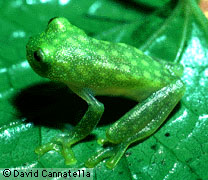
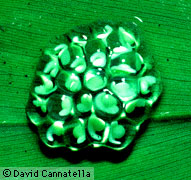
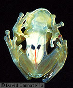
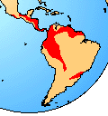

---
title: Centrolenidae
---

# [[Centrolenidae]]

Glass Frogs 

      

## #has_/text_of_/abstract 

> The glass frogs belong to the amphibian family **Centrolenidae** (order Anura), native to the Central American and Colombian rainforests. The general background coloration of most glass frogs is primarily lime green, the abdominal skin of some members of this family is transparent and translucent, giving the glass frog its common name. The internal viscera, including the heart, liver, and gastrointestinal tract, are visible through the skin. When active their blood makes them visible; when sleeping most of the blood is concealed in the liver, hiding them. Glass frogs are arboreal, living mainly in trees, feeding on small insects and only coming out for mating season. Their transparency conceals them very effectively when sleeping on a green leaf, as they habitually do. However, climate change and habitat fragmentation have been threatening the survival rates of the family.
>
> [Wikipedia](https://en.wikipedia.org/wiki/Glass%20frog) 

## Introduction

[David Cannatella](http://www.tolweb.org/)

Glass frogs derive their name from the observation in that several the
skin is almost transparent, and once can see the internal organs, and
even observe the heart beating in some species. The Glass Frogs are a
large group of rather similar species. They are mostly arboreal, living
high in trees overhanging mountain streams in Mexico, Central, and South
America. With the exception of Centrolene gekkoideum most species are
small, about 20-30 mm long. Until the recent work of Ruiz-Carranza and
Lynch (1991), all of the small species were called Centrolenella; that
name is no longer used.

The call of Glass Frogs is a high peep or whistle. In some species, a
single individual seems to initiate a chorus, in which a wave of calls
seems to travel along the stream. Centrolenids lay their clutches of
eggs on vegetation, usually several meters above a stream (one high
montane species, Centrolene buckleyi, uses bromeliads to hide their
eggs). When the eggs hatch, the tadpoles fall into the water; or, if
they miss the water, they use their muscular tails to flip themselves
into the water. The tadpoles generally burrow into the stream substrate.
In some species the males position themselves over the egg mass,
apparently guarding it from predators, including \"frog flies\" which
lay their eggs in the frog\'s egg mass. The developing fly larvae are
known to parasitize and destroy clutches of eggs (Villa and Townsend,
1983).

Because they inhabit high montane streams, glass frogs are not collected
casually; of the 64 species listed in Frost (1985), only 23 were
described before 1960, and many more have been described since 1985. The
exploration of new streams along the Andes of South American almost
certainly yields new species.

### Geographic Distribution

The distribution of living members of the family Centrolenidae is
indicated in red.\

### Discussion of Phylogenetic Relationships

Centrolenidae was defined by Ford and Cannatella (1993) as a node-based
name for the common ancestor of Cochranella, Hyalinobrachium, and
Centrolene (taxa included in Ruiz-C. and Lynch \[1991\]) and all its
descendants. The oft-cited synapomorphy for Centrolenidae is the fusion
of the astragalus and calcaneum (Duellman and Trueb, 1986; Lynch, 1973);
this feature is convergent with that in Pelodytes. Ruiz-Carranza and
Lynch (1991) listed this synapomorphy and additionally, a dilated medial
process on the third metacarpal, T-shaped terminal phalanges, and eggs
deposited out of water. The last two of these are present in other
groups, and require corroboration by a better-resolved phylogeny of
Neobatrachia. Examination of skeletons of more than 40 species by
Cannatella suggests that the presence of a process on the third
metacarpal is a well-corroborated synapomorphy.

## Phylogeny 

-   « Ancestral Groups  
    -   [Neobatrachia](../Neobatrachia.md)
    -   [Salientia](../../Salientia.md)
    -   [Living Amphibians](Living_Amphibians)
    -   [Terrestrial Vertebrates](../../../../Terrestrial.md)
    -   [Sarcopterygii](../../../../../Sarc.md)
    -   [Gnathostomata](../../../../../../Gnath.md)
    -   [Vertebrata](../../../../../../../Vertebrata.md)
    -   [Craniata](../../../../../../../../Craniata.md)
    -   [Chordata](../../../../../../../../../Chordata.md)
    -   [Deuterostomia](../../../../../../../../../../Deutero.md)
    -   [Bilateria](Bilateria)
    -   [Animals](Animals)
    -   [Eukaryotes](Eukaryotes)
    -   [Tree of Life](../../../../../../../../../../../../../Tree_of_Life.md)

-   ◊ Sibling Groups of  Neobatrachia
    -   [Allophryne ruthveni](Allophryne_ruthveni.md)
    -   [Brachycephalidae](Brachycephalidae.md)
    -   [Bufonidae](Bufonidae.md)
    -   [Heleophryne](Heleophryne.md)
    -   [\'Leptodactylidae\'](%27Leptodactylidae%27)
    -   [Limnodynastinae](Limnodynastinae.md)
    -   [Myobatrachinae](Myobatrachinae.md)
    -   [Sooglossidae](Sooglossidae.md)
    -   [Rhinoderma](Rhinoderma.md)
    -   [Dendrobatidae](Dendrobatidae.md)
    -   [Pseudidae](Pseudidae.md)
    -   [Hylidae](Hylidae.md)
    -   Centrolenidae
    -   [Microhylidae](Microhylidae.md)
    -   [Hemisus](Hemisus.md)
    -   [Arthroleptidae](Arthroleptidae.md)
    -   [\'Ranidae\'](%27Ranidae%27)
    -   [Hyperoliidae](Hyperoliidae.md)
    -   [Rhacophoridae](Rhacophoridae.md)

-   » Sub-Groups 
	-   *Centrolene*
	-   *Hyalinobatrachium*
	-   *Cochranella*

## Title Illustrations

------------------------------------------------------------------------
1. Hyalinobatrachium fleischmanni, Costa Rica; photo © 1995 David Cannatella

------------------------------------------------------------------------
1. Hyalinobatrachium fleischmanni eggs; photo © 1995 David Cannatella

------------------------------------------------------------------------
3. Hyalinobatrachium oyampiensis; photo © 1995 David Cannatella

## Confidential Links & Embeds: 

### #is_/same_as :: [Centrolenidae](/_Standards/bio/bio~Domain/Eukaryotes/Animals/Bilateria/Deutero/Chordata/Craniata/Vertebrata/Gnath/Sarc/Tetrapods/Amphibians/Salientia/Neobatrachia/Centrolenidae.md) 

### #is_/same_as :: [Centrolenidae.public](/_public/bio/bio~Domain/Eukaryotes/Animals/Bilateria/Deutero/Chordata/Craniata/Vertebrata/Gnath/Sarc/Tetrapods/Amphibians/Salientia/Neobatrachia/Centrolenidae.public.md) 

### #is_/same_as :: [Centrolenidae.internal](/_internal/bio/bio~Domain/Eukaryotes/Animals/Bilateria/Deutero/Chordata/Craniata/Vertebrata/Gnath/Sarc/Tetrapods/Amphibians/Salientia/Neobatrachia/Centrolenidae.internal.md) 

### #is_/same_as :: [Centrolenidae.protect](/_protect/bio/bio~Domain/Eukaryotes/Animals/Bilateria/Deutero/Chordata/Craniata/Vertebrata/Gnath/Sarc/Tetrapods/Amphibians/Salientia/Neobatrachia/Centrolenidae.protect.md) 

### #is_/same_as :: [Centrolenidae.private](/_private/bio/bio~Domain/Eukaryotes/Animals/Bilateria/Deutero/Chordata/Craniata/Vertebrata/Gnath/Sarc/Tetrapods/Amphibians/Salientia/Neobatrachia/Centrolenidae.private.md) 

### #is_/same_as :: [Centrolenidae.personal](/_personal/bio/bio~Domain/Eukaryotes/Animals/Bilateria/Deutero/Chordata/Craniata/Vertebrata/Gnath/Sarc/Tetrapods/Amphibians/Salientia/Neobatrachia/Centrolenidae.personal.md) 

### #is_/same_as :: [Centrolenidae.secret](/_secret/bio/bio~Domain/Eukaryotes/Animals/Bilateria/Deutero/Chordata/Craniata/Vertebrata/Gnath/Sarc/Tetrapods/Amphibians/Salientia/Neobatrachia/Centrolenidae.secret.md)

