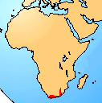

# [[Heleophryne]]

Ghost Frogs 

## #has_/text_of_/abstract 

> **Heleophryne** is a genus of ghost frogs. They are known from mountainous regions of South Africa, Lesotho, and Eswatini.
>
> One member of the genus, the Table Mountain ghost frog (H. rosei) is considered an EDGE species.
>
> [Wikipedia](https://en.wikipedia.org/wiki/Heleophryne) 

## Introduction

[David Cannatella]() 

These are known as the Ghost frogs. There is one genus, Heleophryne,
with four species. They are small to moderate sized frogs (30-65 mm).
These frogs are found in rocky montane streams in South Africa; the tips
of the fingers and toes are expanded. The tadpoles have large suctorial
mouths with many rows of denticles, but lack beaks. The relationship of
this group to other frogs is unclear. No fossils are known.

### Geographic Distribution

The distribution of living members of the family Heleophrynidae is
indicated in red.\

### Discussion of Phylogenetic Relationships

The taxon Heleophrynidae is redundant with Heleophryne. Heleophryne was
defined by Ford and Cannatella (1993) to be the node-based name for the
common ancestor of the living species of Heleophryne, and all its
descendants. Synapomorphies of Heleophryne include the absence of
keratinous beaks in larvae, although numerous rows of denticles are
present. The taxon includes one genus with three species. Laurent (1979,
1986) included this taxon as a subfamily of Myobatrachidae, but there
seem to be no derived characters that would suggest that relationship in
preference to any other.

Duellman and Trueb (1986) listed the following series of taxa (excluding
myobatrachids, sooglossids, and Heleophryne) as a subclade of
Neobatrachia, diagnosed by axillary amplexus (character P):
Leptodactylidae, Brachycephalidae, Bufonidae, etc. (see below). However,
they pointed out that some leptodactylids have inguinal amplexus,
suggesting that basal leptodactylids are paraphyletic, or that the
character is reversed. In reporting inguinal amplexus in all three
species of sooglossids, Nussbaum (1980) reviewed the literature on
amplexus position; Somuncuria, a species of Batrachyla, and some
Pleurodema have inguinal amplexus. The position of these taxa as basal
leptodactylids (Lynch, 1978) suggests that inguinal amplexus may be
primitive for this group. Other cases of inguinal amplexus are known for
Bufonidae: Osornophryne (Ruiz-C. and Hernández-C., 1976) and Bufo
fastidiosus (Graybeal and de Queiroz, 1992), but these are considered to
be reversals. Also, a photo in Halliday and Adler (1986:38-39) shows
Brachycephalus in inguinal amplexus. Thus, the level at which axillary
amplexus is a synapomorphy is unclear.

## Phylogeny 

-   « Ancestral Groups  
    -   [Neobatrachia](../Neobatrachia.md)
    -   [Salientia](../../Salientia.md)
    -   [Living Amphibians](Living_Amphibians)
    -   [Terrestrial Vertebrates](../../../../Terrestrial.md)
    -   [Sarcopterygii](../../../../../Sarc.md)
    -   [Gnathostomata](../../../../../../Gnath.md)
    -   [Vertebrata](../../../../../../../Vertebrata.md)
    -   [Craniata](../../../../../../../../Craniata.md)
    -   [Chordata](../../../../../../../../../Chordata.md)
    -   [Deuterostomia](../../../../../../../../../../Deutero.md)
    -   [Bilateria](Bilateria)
    -   [Animals](Animals)
    -   [Eukaryotes](Eukaryotes)
    -   [Tree of Life](../../../../../../../../../../../../../Tree_of_Life.md)

-   ◊ Sibling Groups of  Neobatrachia
    -   [Allophryne ruthveni](Allophryne_ruthveni.md)
    -   [Brachycephalidae](Brachycephalidae.md)
    -   [Bufonidae](Bufonidae.md)
    -   Heleophryne
    -   [\'Leptodactylidae\'](%27Leptodactylidae%27)
    -   [Limnodynastinae](Limnodynastinae.md)
    -   [Myobatrachinae](Myobatrachinae.md)
    -   [Sooglossidae](Sooglossidae.md)
    -   [Rhinoderma](Rhinoderma.md)
    -   [Dendrobatidae](Dendrobatidae.md)
    -   [Pseudidae](Pseudidae.md)
    -   [Hylidae](Hylidae.md)
    -   [Centrolenidae](Centrolenidae.md)
    -   [Microhylidae](Microhylidae.md)
    -   [Hemisus](Hemisus.md)
    -   [Arthroleptidae](Arthroleptidae.md)
    -   [\'Ranidae\'](%27Ranidae%27)
    -   [Hyperoliidae](Hyperoliidae.md)
    -   [Rhacophoridae](Rhacophoridae.md)

-   » Sub-Groups 

	-   *Heleophryne natalensis*
	-   *Heleophryne purcelli*
	-   *Heleophryne regis*
	-   *Heleophryne rosei*

## Confidential Links & Embeds: 

### [Heleophryne](/_Standards/bio/bio~Domain/Eukaryotes/Animals/Bilateria/Deutero/Chordata/Craniata/Vertebrata/Gnath/Sarc/Tetrapods/Amphibians/Salientia/Neobatrachia/Heleophryne.md) 

### [Heleophryne.public](/_public/bio/bio~Domain/Eukaryotes/Animals/Bilateria/Deutero/Chordata/Craniata/Vertebrata/Gnath/Sarc/Tetrapods/Amphibians/Salientia/Neobatrachia/Heleophryne.public.md) 

### [Heleophryne.internal](/_internal/bio/bio~Domain/Eukaryotes/Animals/Bilateria/Deutero/Chordata/Craniata/Vertebrata/Gnath/Sarc/Tetrapods/Amphibians/Salientia/Neobatrachia/Heleophryne.internal.md) 

### [Heleophryne.protect](/_protect/bio/bio~Domain/Eukaryotes/Animals/Bilateria/Deutero/Chordata/Craniata/Vertebrata/Gnath/Sarc/Tetrapods/Amphibians/Salientia/Neobatrachia/Heleophryne.protect.md) 

### [Heleophryne.private](/_private/bio/bio~Domain/Eukaryotes/Animals/Bilateria/Deutero/Chordata/Craniata/Vertebrata/Gnath/Sarc/Tetrapods/Amphibians/Salientia/Neobatrachia/Heleophryne.private.md) 

### [Heleophryne.personal](/_personal/bio/bio~Domain/Eukaryotes/Animals/Bilateria/Deutero/Chordata/Craniata/Vertebrata/Gnath/Sarc/Tetrapods/Amphibians/Salientia/Neobatrachia/Heleophryne.personal.md) 

### [Heleophryne.secret](/_secret/bio/bio~Domain/Eukaryotes/Animals/Bilateria/Deutero/Chordata/Craniata/Vertebrata/Gnath/Sarc/Tetrapods/Amphibians/Salientia/Neobatrachia/Heleophryne.secret.md)

