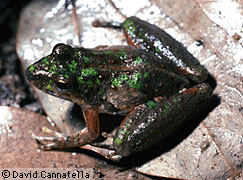
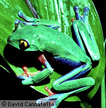
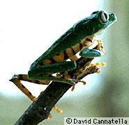
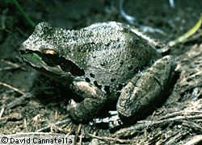
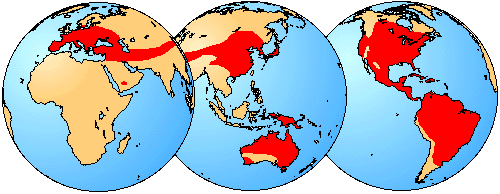

# [[Hylidae]]

Treefrogs 

        

## #has_/text_of_/abstract 

> **Hylidae** is a wide-ranging family of frogs commonly referred to as "tree frogs and their allies". However, the hylids include a diversity of frog species, many of which do not live in trees, but are terrestrial or semiaquatic.
>
> [Wikipedia](https://en.wikipedia.org/wiki/Hylidae) 

### Information on the Internet

-   [The Complete Treefrog     Homepage](http://members.core.com/%7Etreefrog/)

## Introduction

[David Cannatella](http://www.tolweb.org/)

Hylids (treefrogs) are one of the largest families of frogs. There are
about 37-39 genera. These are arranged in four subfamilies, the first
three of which are distinctive: Pelodryadinae, Phyllomedusinae,
Hemiphractinae, and Hylinae.

Among the most bizarre hyline frogs are certain casque-headed genera,
such as *Triprion* and *Trachycephalus*, in which the skull bones are
elaborated into a solid helmet. Certain casque-headed species use their
bony heads to block the entrances to their burrows and reduce
evaporative water loss.

### Geographic Distribution

The distribution of living members of the family Hylidae is indicated in
red.
### Discussion of Phylogenetic Relationships

The name Hylidae was defined by Ford and Cannatella (1993) as node-based
name for the most recent ancestor of Hemiphractinae, Phyllomedusinae,
Pelodryadinae, and Hylinae, and all of its descendants. The single
synapomorphy known is claw-shaped terminal phalanges; these are also
found in some hyperoliids (see below). Another commonly mentioned
diagnostic feature of hylids is the presence of intercalary elements,
but these are also present in centrolenids and pseudids, among the
non-ranoid neobatrachians (see below). Savage (1973), Laurent (1979,
1986) and Dubois (1983, 1984) recognized the Australian hylids
(Pelodryadinae) as a distinct family.

The monophyly of Hylidae is questionable if *Allophryne ruthveni* is
included. See the account under [*Allophryne ruthveni*](Allophryne%20ruthveni.md).

## Phylogeny 

-   « Ancestral Groups  
    -   [Neobatrachia](../Neobatrachia.md)
    -   [Salientia](../../Salientia.md)
    -   [Living Amphibians](Living_Amphibians)
    -   [Terrestrial Vertebrates](../../../../Terrestrial.md)
    -   [Sarcopterygii](../../../../../Sarc.md)
    -   [Gnathostomata](../../../../../../Gnath.md)
    -   [Vertebrata](../../../../../../../Vertebrata.md)
    -   [Craniata](../../../../../../../../Craniata.md)
    -   [Chordata](../../../../../../../../../Chordata.md)
    -   [Deuterostomia](../../../../../../../../../../Deutero.md)
    -   [Bilateria](Bilateria)
    -   [Animals](Animals)
    -   [Eukaryotes](Eukaryotes)
    -   [Tree of Life](../../../../../../../../../../../../../Tree_of_Life.md)

-   ◊ Sibling Groups of  Neobatrachia
    -   [Allophryne ruthveni](Allophryne_ruthveni.md)
    -   [Brachycephalidae](Brachycephalidae.md)
    -   [Bufonidae](Bufonidae.md)
    -   [Heleophryne](Heleophryne.md)
    -   [\'Leptodactylidae\'](%27Leptodactylidae%27)
    -   [Limnodynastinae](Limnodynastinae.md)
    -   [Myobatrachinae](Myobatrachinae.md)
    -   [Sooglossidae](Sooglossidae.md)
    -   [Rhinoderma](Rhinoderma.md)
    -   [Dendrobatidae](Dendrobatidae.md)
    -   [Pseudidae](Pseudidae.md)
    -   Hylidae
    -   [Centrolenidae](Centrolenidae.md)
    -   [Microhylidae](Microhylidae.md)
    -   [Hemisus](Hemisus.md)
    -   [Arthroleptidae](Arthroleptidae.md)
    -   [\'Ranidae\'](%27Ranidae%27)
    -   [Hyperoliidae](Hyperoliidae.md)
    -   [Rhacophoridae](Rhacophoridae.md)

-   » Sub-Groups
    -   [Hemiphractinae](Hylidae/Hemiphractinae.md)
    -   [Hylinae](Hylidae/Hylinae.md)
    -   [Pelodryadinae](Hylidae/Pelodryadinae.md)
    -   [Phyllomedusinae](Hylidae/Phyllomedusinae.md)

## Title Illustrations

-------------------------------------------------------------------------

Scientific Name ::  Acris crepitans
Location ::        Louisiana
Copyright ::         © 1995 [David Cannatella](http://www.catfishlab.org/) 

--------------------------------------------------------------------------

Scientific Name ::     Agalychnis annae
Location ::           Costa Rica
Specimen Condition   Live Specimen
Copyright ::            © 1995 [David Cannatella](http://www.catfishlab.org/) 

--------------------------------------------------------------------------

Scientific Name ::     Phyllomedusa tomopterna
Location ::           Ecuador
Specimen Condition   Live Specimen
Copyright ::            © 1995 [David Cannatella](http://www.catfishlab.org/) 

--------------------------------------------------------------------------

Scientific Name ::  Hyla regilla
Location ::        California
Copyright ::         © 1995 [David Cannatella](http://www.catfishlab.org/) 

## Confidential Links & Embeds: 

### #is_/same_as :: [Hylidae](/_Standards/bio/bio~Domain/Eukaryotes/Animals/Bilateria/Deutero/Chordata/Craniata/Vertebrata/Gnath/Sarc/Tetrapods/Amphibians/Salientia/Neobatrachia/Hylidae.md) 

### #is_/same_as :: [Hylidae.public](/_public/bio/bio~Domain/Eukaryotes/Animals/Bilateria/Deutero/Chordata/Craniata/Vertebrata/Gnath/Sarc/Tetrapods/Amphibians/Salientia/Neobatrachia/Hylidae.public.md) 

### #is_/same_as :: [Hylidae.internal](/_internal/bio/bio~Domain/Eukaryotes/Animals/Bilateria/Deutero/Chordata/Craniata/Vertebrata/Gnath/Sarc/Tetrapods/Amphibians/Salientia/Neobatrachia/Hylidae.internal.md) 

### #is_/same_as :: [Hylidae.protect](/_protect/bio/bio~Domain/Eukaryotes/Animals/Bilateria/Deutero/Chordata/Craniata/Vertebrata/Gnath/Sarc/Tetrapods/Amphibians/Salientia/Neobatrachia/Hylidae.protect.md) 

### #is_/same_as :: [Hylidae.private](/_private/bio/bio~Domain/Eukaryotes/Animals/Bilateria/Deutero/Chordata/Craniata/Vertebrata/Gnath/Sarc/Tetrapods/Amphibians/Salientia/Neobatrachia/Hylidae.private.md) 

### #is_/same_as :: [Hylidae.personal](/_personal/bio/bio~Domain/Eukaryotes/Animals/Bilateria/Deutero/Chordata/Craniata/Vertebrata/Gnath/Sarc/Tetrapods/Amphibians/Salientia/Neobatrachia/Hylidae.personal.md) 

### #is_/same_as :: [Hylidae.secret](/_secret/bio/bio~Domain/Eukaryotes/Animals/Bilateria/Deutero/Chordata/Craniata/Vertebrata/Gnath/Sarc/Tetrapods/Amphibians/Salientia/Neobatrachia/Hylidae.secret.md)

