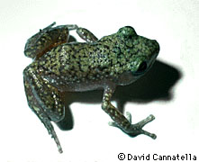
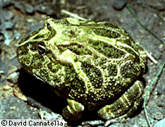
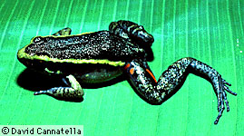
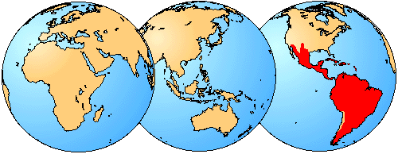

---
title: "\\'Leptodactylidae\\'"
---

# [[Leptodactylidae]] 

Leptodactylid Frogs 

      
 
## #has_/text_of_/abstract 

> The southern frogs form the **Leptodactylidae**, a name that comes from Greek meaning a bird or other animal having slender toes. They are a diverse family of frogs that most likely diverged from other hyloids during the Cretaceous. The family has undergone major taxonomic revisions in recent years, including the reclassification of the former subfamily Eleutherodactylinae into its own family the Eleutherodactylidae; the Leptodactylidae now number 206 species in 13 genera distributed throughout Mexico, the Caribbean, and Central and South America. The family includes terrestrial, burrowing, aquatic, and arboreal members, inhabiting a wide range of habitats.
>
> Several of the genera within the Leptodactylidae lay their eggs in foam nests. These can be in crevices, on the surface of water, or on forest floors. These foam nests are some of the most varied among frogs. When eggs hatch in nests on the forest floor, the tadpoles remain within the nest, without eating, until metamorphosis.
>
> [Wikipedia](https://en.wikipedia.org/wiki/Leptodactylidae) 
## Introduction

[David Cannatella](http://www.tolweb.org/)

Leptodactylids are a large and diverse group of frogs with most of their
diversity in South and Central America and the West Indes. There are
about 50 genera with 700 species; the genus Eleutherodactylus has about
400 species. Leptodactylids barely reach into the United States, and are
not present in Europe, Africa, or Asia. Most leptodactylids are brownish
or grayish, and on the whole lack bright colors seen in some other
groups.

Variation in size is extreme; some are as small as 12 mm (Sminthillus
limbatus) and as large as 250 mm. There is much diversity in habits.
Lithodytes lineatus is a forest-floor dweller. Some species of
Eleutherodactylus are arboreal. Telmatobius are highly aquatic.
Ceratophrys has a huge head and mouth, and eats other vertebrates. The
fossil record is sparse; †Wawelia is known from the Upper Miocene and
†Neoprocoela from the Lower Oligocene, both of Argentina. A few other
genera are present in Pleistocene deposits.

### Notes about Terminal Taxa

Ceratophyinae\--This is a group of two big-headed, carnivorous and
aggressive genera, one terrestrial (Ceratophrys) and the other mostly
aquatic (Lepidobatrachus).

Telmatobiinae\--This group is probably not monophyletic, and includes
diverse groups of taxa that are not readily assigned to other
subfamilies. Eleutherodactylus is in this group. The tribe to which
Eleutherodactylus belongs (Eleutherodactylini) includes the Syrrhophus
and Hylactophryne and is characterized by having terrestrial eggs with
direct development.

Hylodinae\--This is a group of three genera from southeastern Brazil and
adjacent Argentina. Lynch (1971) argued that Dendrobatidae was closely
related to this group.

Leptodactylinae\--These are a lineage of mostly foam-nest builders. One
species of Leptodactylus reaches into southern Texas. The genus
Physalaemus has been the subject of behavioral studies by Mike Ryan and
colleagues.

### Geographic Distribution

The distribution of living members of the family Leptodactylidae is
indicated in red.\

### Discussion of Phylogenetic Relationships

\"Leptodactylidae\" comprises those non-myobatrachid hyloids that lack
particular derived features traditionally considered to be indicators of
family status, such as intercalary cartilages (Hylidae, Pseudidae, and
Centrolenidae) and Bidder\'s organ (Bufonidae). Other small groups that
would be classified as leptodactylids were it not for their derived
features are rhinodermatids, brachycephalids, sooglossids, and
heleophrynids. No synapomorphies for \"Leptodactylidae\" have been
proposed, and Ford (1989b) found the group to be grossly paraphyletic.
However, her sampling of taxa was not sufficient to suggest an
alternative taxonomy.

## Phylogeny 

-   « Ancestral Groups  
    -   [Neobatrachia](../Neobatrachia.md)
    -   [Salientia](../../Salientia.md)
    -   [Living Amphibians](Living_Amphibians)
    -   [Terrestrial Vertebrates](../../../../Terrestrial.md)
    -   [Sarcopterygii](../../../../../Sarc.md)
    -   [Gnathostomata](../../../../../../Gnath.md)
    -   [Vertebrata](../../../../../../../Vertebrata.md)
    -   [Craniata](../../../../../../../../Craniata.md)
    -   [Chordata](../../../../../../../../../Chordata.md)
    -   [Deuterostomia](../../../../../../../../../../Deutero.md)
    -   [Bilateria](Bilateria)
    -   [Animals](Animals)
    -   [Eukaryotes](Eukaryotes)
    -   [Tree of Life](../../../../../../../../../../../../../Tree_of_Life.md)

-   ◊ Sibling Groups of  Neobatrachia
    -   [Allophryne ruthveni](Allophryne_ruthveni.md)
    -   [Brachycephalidae](Brachycephalidae.md)
    -   [Bufonidae](Bufonidae.md)
    -   [Heleophryne](Heleophryne.md)
    -   \'Leptodactylidae\'
    -   [Limnodynastinae](Limnodynastinae.md)
    -   [Myobatrachinae](Myobatrachinae.md)
    -   [Sooglossidae](Sooglossidae.md)
    -   [Rhinoderma](Rhinoderma.md)
    -   [Dendrobatidae](Dendrobatidae.md)
    -   [Pseudidae](Pseudidae.md)
    -   [Hylidae](Hylidae.md)
    -   [Centrolenidae](Centrolenidae.md)
    -   [Microhylidae](Microhylidae.md)
    -   [Hemisus](Hemisus.md)
    -   [Arthroleptidae](Arthroleptidae.md)
    -   [\'Ranidae\'](%27Ranidae%27)
    -   [Hyperoliidae](Hyperoliidae.md)
    -   [Rhacophoridae](Rhacophoridae.md)

-   » Sub-Groups
    -   [Leptodactylinae](Leptodactylidae/Leptodactylinae.md)
	-   *Ceratophryinae*
	-   *Eleutherodactylinae*
	-   *Hylodinae*

## Title Illustrations

------------------------------------------------------------------------
1. Syrrhophus marnockii; Photo © 1995 David Cannatella\

------------------------------------------------------------------------
2. Ceratophrys ornata, Argentina; Photo © 1995 David Cannatella\

------------------------------------------------------------------------
3. Lithodytes lineatus, Ecuador; Photo © 1995 David Cannatella

## Confidential Links & Embeds: 

### #is_/same_as :: [Leptodactylidae](/_Standards/bio/bio~Domain/Eukaryotes/Animals/Bilateria/Deutero/Chordata/Craniata/Vertebrata/Gnath/Sarc/Tetrapods/Amphibians/Salientia/Neobatrachia/Leptodactylidae.md) 

### #is_/same_as :: [Leptodactylidae.public](/_public/bio/bio~Domain/Eukaryotes/Animals/Bilateria/Deutero/Chordata/Craniata/Vertebrata/Gnath/Sarc/Tetrapods/Amphibians/Salientia/Neobatrachia/Leptodactylidae.public.md) 

### #is_/same_as :: [Leptodactylidae.internal](/_internal/bio/bio~Domain/Eukaryotes/Animals/Bilateria/Deutero/Chordata/Craniata/Vertebrata/Gnath/Sarc/Tetrapods/Amphibians/Salientia/Neobatrachia/Leptodactylidae.internal.md) 

### #is_/same_as :: [Leptodactylidae.protect](/_protect/bio/bio~Domain/Eukaryotes/Animals/Bilateria/Deutero/Chordata/Craniata/Vertebrata/Gnath/Sarc/Tetrapods/Amphibians/Salientia/Neobatrachia/Leptodactylidae.protect.md) 

### #is_/same_as :: [Leptodactylidae.private](/_private/bio/bio~Domain/Eukaryotes/Animals/Bilateria/Deutero/Chordata/Craniata/Vertebrata/Gnath/Sarc/Tetrapods/Amphibians/Salientia/Neobatrachia/Leptodactylidae.private.md) 

### #is_/same_as :: [Leptodactylidae.personal](/_personal/bio/bio~Domain/Eukaryotes/Animals/Bilateria/Deutero/Chordata/Craniata/Vertebrata/Gnath/Sarc/Tetrapods/Amphibians/Salientia/Neobatrachia/Leptodactylidae.personal.md) 

### #is_/same_as :: [Leptodactylidae.secret](/_secret/bio/bio~Domain/Eukaryotes/Animals/Bilateria/Deutero/Chordata/Craniata/Vertebrata/Gnath/Sarc/Tetrapods/Amphibians/Salientia/Neobatrachia/Leptodactylidae.secret.md)

