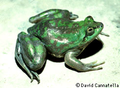

# Pseudidae

## Paradox Frogs 

[David Cannatella](http://www.tolweb.org/)

 

## #has_/text_of_/abstract 

> Pseudis is a genus of South American frogs (swimming frogs) in the family Hylidae. They are often common and frequently heard, but easily overlooked because of their camouflage and lifestyle, living in lakes, ponds, marshes and similar waters with extensive aquatic vegetation, often sitting at the surface among plants or on floating plants, but rapidly diving if disturbed. Whereas the adults are medium-sized frogs, their tadpoles are large; in some species the world's longest.
>
> [Wikipedia](https://en.wikipedia.org/wiki/Pseudis) 
## Introduction

The pseudids include two genera of aquatic frogs from The Magdalena
Valley of Colombia and tropical lowlands of South America east of the
Andes. Pseudis paradoxa is best known because its immense tadpoles
(250-300 mm) metamorphose into relatively moderate-sized frogs. The two
species of Lysapsus are much smaller than the two species of Pseudis.

Pseudids have an additional bony element in the fingers and toes between
the penultimate and terminal phalanx. This element may increase the
functional surface area of the highly webbed foot. Pseudis paradoxa
float among vegetation in shallow ponds and roadside ditches, much like
Rana catesbeiana in North America.

There are no fossils. Were it not for the distinctive intercalary
elements, pseudids would be considered leptodactylids. The intercalary
phalangeal elements are very different than those of arboreal frogs such
as hylids and centrolenids.

### Geographic Distribution

The distribution of living members of the family Pseudidae is indicated
in red.\

### Discussion of Phylogenetic Relationships

Pseudidae was defined by Ford and Cannatella (1993) as the node-based
name for the common ancestor of Lysapsus and Pseudis. Pseudids are
generally characterized as having bony intercalary elements (Lynch,
1973), but Ford and Cannatella (1993) pointed out that these elements
are distinctive in being elongate and perichondrially ossified. They
considered these intercalary elements to be a synapomorphy of Pseudidae.
The elongate nature of the intercalary element is unique among frogs,
and suggests a role in increasing the length of the digit and area of
the webbing in these highly aquatic frogs.

Lynch (1973) and Duellman and Trueb (1986:character J) used the presence
of intercalary elements to unite Hylidae, Centrolenidae and Pseudidae
into a clade. Intercalary elements are also known in Hyperoliidae and
Rhacophoridae, as well as mantelline ranids and phrynomerine
microhylids. The tree presented by Duellman and Trueb (1986:Fig. 17-3)
has an equally parsimonious solution that would require convergent
evolution of a firmisternal girdle (character C1) if lack of homoplasy
in the intercalary element (character J1) is favored. In a subtree
Duellman and Trueb (1986:Fig. 17-4) used the presence of intercalary
elements to unite mantellines, hyperoliids, and rhacophorids, but not
phrynomerines. This tree also has an equally parsimonious alternative
that would unite phrynomerines with the aforementioned clade, but
requires homoplasy in the Type 2 larva (character O2\').

Ford\'s (1989b) study of dendrobatid relationships did not include
centrolenids or pseudids. Ford and Cannatella continued the recognition
of the clade consisting of Hylidae, Pseudidae, and Centrolenidae, which
is diagnosed by the presence of intercalary elements., but did not name
it. Hay et al. (1995) found that pseudids, hylids and centrolenids (each
represented by one species) not to be a clade, although the latter two
were sister-taxa, and all three were part of the Neobatrachia.

## Phylogeny 

-   « Ancestral Groups  
    -   [Neobatrachia](../Neobatrachia.md)
    -   [Salientia](../../Salientia.md)
    -   [Living Amphibians](Living_Amphibians)
    -   [Terrestrial Vertebrates](../../../../Terrestrial.md)
    -   [Sarcopterygii](../../../../../Sarc.md)
    -   [Gnathostomata](../../../../../../Gnath.md)
    -   [Vertebrata](../../../../../../../Vertebrata.md)
    -   [Craniata](../../../../../../../../Craniata.md)
    -   [Chordata](../../../../../../../../../Chordata.md)
    -   [Deuterostomia](../../../../../../../../../../Deutero.md)
    -   [Bilateria](Bilateria)
    -   [Animals](Animals)
    -   [Eukaryotes](Eukaryotes)
    -   [Tree of Life](../../../../../../../../../../../../../Tree_of_Life.md)

-   ◊ Sibling Groups of  Neobatrachia
    -   [Allophryne ruthveni](Allophryne_ruthveni.md)
    -   [Brachycephalidae](Brachycephalidae.md)
    -   [Bufonidae](Bufonidae.md)
    -   [Heleophryne](Heleophryne.md)
    -   [\'Leptodactylidae\'](%27Leptodactylidae%27)
    -   [Limnodynastinae](Limnodynastinae.md)
    -   [Myobatrachinae](Myobatrachinae.md)
    -   [Sooglossidae](Sooglossidae.md)
    -   [Rhinoderma](Rhinoderma.md)
    -   [Dendrobatidae](Dendrobatidae.md)
    -   Pseudidae
    -   [Hylidae](Hylidae.md)
    -   [Centrolenidae](Centrolenidae.md)
    -   [Microhylidae](Microhylidae.md)
    -   [Hemisus](Hemisus.md)
    -   [Arthroleptidae](Arthroleptidae.md)
    -   [\'Ranidae\'](%27Ranidae%27)
    -   [Hyperoliidae](Hyperoliidae.md)
    -   [Rhacophoridae](Rhacophoridae.md)

-   » Sub-Groups 

## Title Illustrations

------------------------------------------------------------------------
Pseudis paradoxa, Bolivia; photo © 1995 David Cannatella

Copyright ::   © 1995 [David Cannatella](http://www.catfishlab.org/) 
