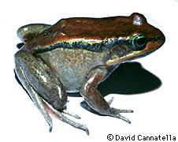
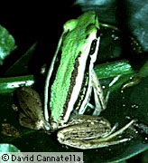
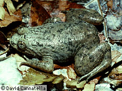
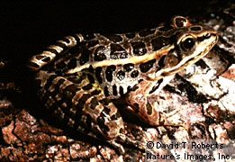

# [[Ranidae]] 

True Frogs 

 

## #has_/text_of_/abstract 

> True frogs is the common name for the frog family **Ranidae**. 
> They have the widest distribution of any frog family. 
> They are abundant throughout most of the world, occurring on all continents except Antarctica. 
> The true frogs are present in North America, northern South America, 
> Europe, Africa (including Madagascar), and Asia. The Asian range extends across the East Indies to New Guinea and a single species, the Australian wood frog (Hylarana daemelii), has spread into the far north of Australia.
>
> Typically, true frogs are smooth and moist-skinned, with large, powerful legs and extensively webbed feet. The true frogs vary greatly in size, ranging from small—such as the wood frog (Lithobates sylvatica)—to large.
>
> Many of the true frogs are aquatic or live close to water. Most species lay their eggs in the water and go through a tadpole stage. However, as in most families of frogs, there is large variation of habitat within the family. There are also arboreal species of true frogs, and the family includes some of the very few amphibians that can live in brackish water.
>
> [Wikipedia](https://en.wikipedia.org/wiki/True%20frog) 

### Additional Photographs

\
Occidozyga sp; photo © 1995 David Cannatella\
\

\
Rana Palustris; photo © David T. Roberts, Nature\'s Images, Inc.\

## Phylogeny 

-   « Ancestral Groups  
    -   [Neobatrachia](../Neobatrachia.md)
    -   [Salientia](../../Salientia.md)
    -   [Living Amphibians](Living_Amphibians)
    -   [Terrestrial Vertebrates](../../../../Terrestrial.md)
    -   [Sarcopterygii](../../../../../Sarc.md)
    -   [Gnathostomata](../../../../../../Gnath.md)
    -   [Vertebrata](../../../../../../../Vertebrata.md)
    -   [Craniata](../../../../../../../../Craniata.md)
    -   [Chordata](../../../../../../../../../Chordata.md)
    -   [Deuterostomia](../../../../../../../../../../Deutero.md)
    -   [Bilateria](Bilateria)
    -   [Animals](Animals)
    -   [Eukaryotes](Eukaryotes)
    -   [Tree of Life](../../../../../../../../../../../../../Tree_of_Life.md)

-   ◊ Sibling Groups of  Neobatrachia
    -   [Allophryne ruthveni](Allophryne_ruthveni.md)
    -   [Brachycephalidae](Brachycephalidae.md)
    -   [Bufonidae](Bufonidae.md)
    -   [Heleophryne](Heleophryne.md)
    -   [\'Leptodactylidae\'](%27Leptodactylidae%27)
    -   [Limnodynastinae](Limnodynastinae.md)
    -   [Myobatrachinae](Myobatrachinae.md)
    -   [Sooglossidae](Sooglossidae.md)
    -   [Rhinoderma](Rhinoderma.md)
    -   [Dendrobatidae](Dendrobatidae.md)
    -   [Pseudidae](Pseudidae.md)
    -   [Hylidae](Hylidae.md)
    -   [Centrolenidae](Centrolenidae.md)
    -   [Microhylidae](Microhylidae.md)
    -   [Hemisus](Hemisus.md)
    -   [Arthroleptidae](Arthroleptidae.md)
    -   \'Ranidae\'
    -   [Hyperoliidae](Hyperoliidae.md)
    -   [Rhacophoridae](Rhacophoridae.md)

-   » Sub-Groups
    -   [Rana](Ranidae/Rana.md)
	-   *Raninae*
	    -   *Altirana*
	    -   *Amolops*
	    -   *Aubria*
	    -   *Batrachylodes*
	    -   *Ceratobatrachus*
	    -   *Conraua*
	    -   *Discodeles*
	    -   *Elachyglossa*
	    -   *Hildebrandtia*
	    -   *Lanzarana*
	    -   *Micrixalus*
	    -   *Nannophrys*
	    -   *Nyctibatrachus*
	    -   *Nannobatrachus*
	    -   *Nanorana*
	    -   *Occidozyga*
	    -   *Palmatorappia*
	    -   *Platymantis*
	    -   *Ptychadena*
	    -   *Pyxicephalus*
	    -   *[Rana](Ranidae/Rana.md "go to ToL page")*
	    -   *Staurois*
	    -   *Strongylopus*
	    -   *Tomopterna*
	-   *Petropedetinae*
	    -   *Anhydrophryne*
	    -   *Arthroleptella*
	    -   *Arthroleptides*
	    -   *Cacosterum*
	    -   *Dimorphognathus*
	    -   *Microbatrachella*
	    -   *Natalobatrachus*
	    -   *Nothophryne*
	    -   *Petropedetes*
	    -   *Phrynobatrachus*
	    -   *Phrynodon*
	-   *Mantellinae*
	    -   *Laurentomantis*
	    -   *Mantella*
	    -   *Mantidactylus*

## Title Illustrations

------------------------------------------------------------------------
1. Rana vibicaria, Costa Rica; photo © 1995 David Cannatella\

------------------------------------------------------------------------
2. Rana erythrea; photo © 1995 David Cannatella\

