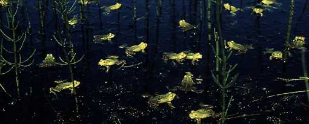

# Rana (Pelophylax)
[Fitzinger 1883]

A group of water-bound frogs inhabiting Eurasia. 

## #has_/text_of_/abstract 

> **Pelophylax** is a genus of true frogs widespread in Eurasia, with a few species ranging into northern Africa. This genus was erected by Leopold Fitzinger in 1843 to accommodate the green frogs of the Old World, which he considered distinct from the brown pond frogs of Carl Linnaeus' genus Rana.
>
> They are also known as water frogs, as they spend much of the summer living in aquatic habitat; the pond frogs can be found more often, by comparison, on dry land, as long as there is sufficient humidity. Yet there are species of Eurasian green frogs – the Central Asian P. terentievi, or the Sahara frog (P. saharicus) – which inhabit waterholes in the desert.
>
> [Wikipedia](https://en.wikipedia.org/wiki/Pelophylax) 
### Information on the Internet

[Peter Beerli\'s Water Frog Info-Pool](http://waterfrogs.csit.fsu.edu/)

## Phylogeny 

-   « Ancestral Groups  
    -   [Rana](../Rana.md)
    -   [\'Ranidae\'](%27Ranidae%27)
    -   [Neobatrachia](../../../Neobatrachia.md)
    -   [Salientia](../../../../Salientia.md)
    -   [Living Amphibians](Living_Amphibians)
    -   [Terrestrial Vertebrates](../../../../../../Terrestrial.md)
    -   [Sarcopterygii](../../../../../../../Sarc.md)
    -   [Gnathostomata](../../../../../../../../Gnath.md)
    -   [Vertebrata](../../../../../../../../../Vertebrata.md)
    -   [Craniata](../../../../../../../../../../Craniata.md)
    -   [Chordata](../../../../../../../../../../../Chordata.md)
    -   [Deuterostomia](../../../../../../../../../../../../Deutero.md)
    -   [Bilateria](Bilateria)
    -   [Animals](Animals)
    -   [Eukaryotes](Eukaryotes)
    -   [Tree of Life](../../../../../../../../../../../../../../../Tree_of_Life.md)

-   ◊ Sibling Groups of  Rana
    -   Rana (Pelophylax)

-   » Sub-Groups
    -   [Western Palearctic water         frogs](Western_Palearctic_water_frogs)
    -   

## Title Illustrations

---------
Group of calling males of *Rana lessonae* (Western Palearctic water frogs)\
Photograph copyright © 1995, Thomas Uzzell.

## Confidential Links & Embeds: 

### #is_/same_as :: [Pelophylax](/_Standards/bio/bio~Domain/Eukaryotes/Animals/Bilateria/Deutero/Chordata/Craniata/Vertebrata/Gnath/Sarc/Tetrapods/Amphibians/Salientia/Neobatrachia/Ranidae/Rana/Pelophylax.md) 

### #is_/same_as :: [Pelophylax.public](/_public/bio/bio~Domain/Eukaryotes/Animals/Bilateria/Deutero/Chordata/Craniata/Vertebrata/Gnath/Sarc/Tetrapods/Amphibians/Salientia/Neobatrachia/Ranidae/Rana/Pelophylax.public.md) 

### #is_/same_as :: [Pelophylax.internal](/_internal/bio/bio~Domain/Eukaryotes/Animals/Bilateria/Deutero/Chordata/Craniata/Vertebrata/Gnath/Sarc/Tetrapods/Amphibians/Salientia/Neobatrachia/Ranidae/Rana/Pelophylax.internal.md) 

### #is_/same_as :: [Pelophylax.protect](/_protect/bio/bio~Domain/Eukaryotes/Animals/Bilateria/Deutero/Chordata/Craniata/Vertebrata/Gnath/Sarc/Tetrapods/Amphibians/Salientia/Neobatrachia/Ranidae/Rana/Pelophylax.protect.md) 

### #is_/same_as :: [Pelophylax.private](/_private/bio/bio~Domain/Eukaryotes/Animals/Bilateria/Deutero/Chordata/Craniata/Vertebrata/Gnath/Sarc/Tetrapods/Amphibians/Salientia/Neobatrachia/Ranidae/Rana/Pelophylax.private.md) 

### #is_/same_as :: [Pelophylax.personal](/_personal/bio/bio~Domain/Eukaryotes/Animals/Bilateria/Deutero/Chordata/Craniata/Vertebrata/Gnath/Sarc/Tetrapods/Amphibians/Salientia/Neobatrachia/Ranidae/Rana/Pelophylax.personal.md) 

### #is_/same_as :: [Pelophylax.secret](/_secret/bio/bio~Domain/Eukaryotes/Animals/Bilateria/Deutero/Chordata/Craniata/Vertebrata/Gnath/Sarc/Tetrapods/Amphibians/Salientia/Neobatrachia/Ranidae/Rana/Pelophylax.secret.md)

