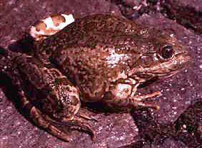
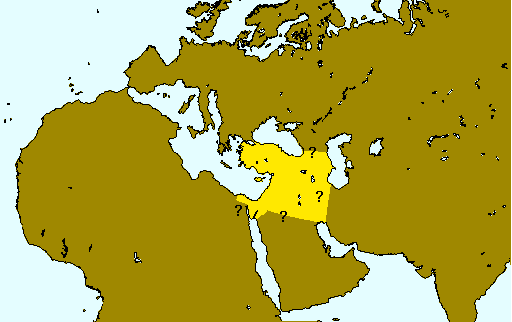

## Phylogeny 

-   « Ancestral Groups  
    -   [Western Palearctic water         frogs](Western_Palearctic_water_frogs)
    -   [Rana (Pelophylax)](Rana_%28Pelophylax%29)
    -   [Rana](../../../../Rana.md)
    -   [\'Ranidae\'](%27Ranidae%27)
    -   [Neobatrachia](../../../../../../Neobatrachia.md)
    -   [Salientia](../../../../../../../Salientia.md)
    -   [Living Amphibians](Living_Amphibians)
    -   [Terrestrial Vertebrates](../../../../../../../../../Terrestrial.md)
    -   [Sarcopterygii](../../../../../../../../../../Sarc.md)
    -   [Gnathostomata](../../../../../../../../../../../Gnath.md)
    -   [Vertebrata](../../../../../../../../../../../../Vertebrata.md)
    -   [Craniata](../../../../../../../../../../../../../Craniata.md)
    -   [Chordata](../../../../../../../../../../../../../../Chordata.md)
    -   [Deuterostomia](../../../../../../../../../../../../../../../Deutero.md)
    -   [Bilateria](Bilateria)
    -   [Animals](Animals)
    -   [Eukaryotes](Eukaryotes)
    -   [Tree of Life](../../../../../../../../../../../../../../../../../../Tree_of_Life.md)

-   ◊ Sibling Groups of  Western Palearctic water frogs
    -   [Rana saharica](Rana_saharica)
    -   [Rana perezi](Rana_perezi)
    -   [Rana epeirotica](Rana_epeirotica)
    -   [Rana shqiperica](Rana_shqiperica)
    -   [Rana lessonae](Rana_lessonae)
    -   [Rana cretensis](Rana_cretensis)
    -   [Rana cerigensis](Rana_cerigensis)
    -   Rana bedriagae
    -   [Rana ridibunda](Rana_ridibunda)

-   » Sub-Groups 

# *Rana bedriagae* [Camerano 1882] 

[Peter Beerli](http://www.tolweb.org/)

Containing group: [Western Palearctic water frogs](../../Western Palearctic water frogs)

### Information on the Internet

[Peter Beerli\'s Water Frog Info-Pool](http://waterfrogs.csit.fsu.edu/)

## Introduction

A member of the water frog group with green to brown backs, this taxon
is very similar to [*Rana ridibunda*](tree?group=Rana_ridibunda&contgroup=Western_Palearctic_water_frogs).
They are distinct mostly in frequency differences of electrophoretic
alleles (e.g a-GDH:*b* (a slow allele) is predominant compared to the
*a* (a fast allele) *Rana ridibunda*) and voice parameters.

### Distribution

The distribution of this species is not well known, in the west it
occupies whole Anatolia, probably parts of Thracia (Greece), the frogs
from El-Fayum (near Cairo) belongs to this taxon, but their extension to
the South and East are unknown.

The map is a transverse Mercator projection and was created with GMT 3.0
([Wessel and Smith, 1995](http://www.agu.org/eos_elec/95154e.html)) and
postprocessed in Virtuoso on a NeXT, and then converted from eps to gif.
\[If you need maps, take a look at [GMT](http://gmt.soest.hawaii.edu/)
and create them yourself\]

### Voice

The following recordings a short sequences of longer recordings. These
files are size reduced (MULAW 8-bit encoded) from 16-bit encoded sound
files. \[[A single call](http://www.tolweb.org/tree/eukaryotes/animals/chordata/salientia/ranidae/rana_%28pelophylax%29/pbsounds/bedriagae.short.au),
[Several calls](http://www.tolweb.org/tree/eukaryotes/animals/chordata/salientia/ranidae/rana_%28pelophylax%29/pbsounds/bedriagae.au)\].

### Synonyms

Valid name: *Rana (Pelophylax) bedriagae* Camerano 1882

Synonyms: Rana esculenta var. bedriagae Camerano 1882, Rana ridibunda
caralitana Arikan 1988, Rana levantina Schneider, Sinsch, and Nevo 1993.

### References

Beerli, P. 1994. Genetic isolation and calibration of an average protein
clock in western Palearctic water frogs of the Aegean region.
Dissertation Universität Zürich 1994.
\[[Summary](http://www.tolweb.org/accessory/Genetic_Isolation_in_Western_Palearctic_Water_Frogs?acc_id=580)\]

Camerano, L. 1882. Recherches sur les variations de la *Rana esculenta*
et du *Bufo viridis* dans le bassin del la Méditerranée. C. r. Soc. fr.
Av. Sci. 10: 680-692.

Dubois, A. 1992. Note sur la classification des Ranidae (Amphibiens
Anoures). Bulletin mensuel de la société linnéenne de Lyon 61(10):
305-352.

Schneider, H. and T.S. Sofianidou. 1985. The mating call of *Rana
ridibunda* (Amphibia, Anura) in northern Greece as compared with those
of Yugoslavian and Israeli populations: proposal of a new subspecies.
Zoologischer Anzeiger 214(5/6): 309-319.

Schneider, H., U. Sinsch, and E. Nevo. 1993. The lake frog in Israel
represent a new species. Zoologischer Anzeiger 1/2: 97 \-- 106.

## Title Illustrations



  --------------------------------------------------------------------------
  Scientific Name ::  Rana bedriagae
  Location ::        Center of Anatolia \[locality Beyshehir\]
  Copyright ::         © 1995 [Peter Beerli](http://www.csit.fsu.edu/%7Ebeerli) 
  --------------------------------------------------------------------------
