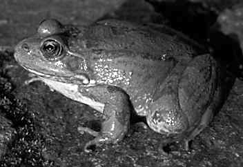
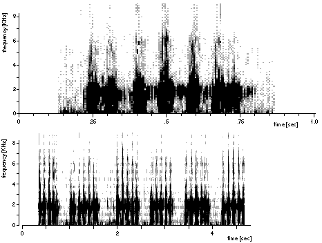

## Phylogeny 

-   « Ancestral Groups  
    -   [Western Palearctic water         frogs](Western_Palearctic_water_frogs)
    -   [Rana (Pelophylax)](Rana_%28Pelophylax%29)
    -   [Rana](../../../../Rana.md)
    -   [\'Ranidae\'](%27Ranidae%27)
    -   [Neobatrachia](../../../../../../Neobatrachia.md)
    -   [Salientia](../../../../../../../Salientia.md)
    -   [Living Amphibians](Living_Amphibians)
    -   [Terrestrial Vertebrates](../../../../../../../../../Terrestrial.md)
    -   [Sarcopterygii](../../../../../../../../../../Sarc.md)
    -   [Gnathostomata](../../../../../../../../../../../Gnath.md)
    -   [Vertebrata](../../../../../../../../../../../../Vertebrata.md)
    -   [Craniata](../../../../../../../../../../../../../Craniata.md)
    -   [Chordata](../../../../../../../../../../../../../../Chordata.md)
    -   [Deuterostomia](../../../../../../../../../../../../../../../Deutero.md)
    -   [Bilateria](Bilateria)
    -   [Animals](Animals)
    -   [Eukaryotes](Eukaryotes)
    -   [Tree of Life](../../../../../../../../../../../../../../../../../../Tree_of_Life.md)

-   ◊ Sibling Groups of  Western Palearctic water frogs
    -   [Rana saharica](Rana_saharica)
    -   [Rana perezi](Rana_perezi)
    -   [Rana epeirotica](Rana_epeirotica)
    -   [Rana shqiperica](Rana_shqiperica)
    -   [Rana lessonae](Rana_lessonae)
    -   [Rana cretensis](Rana_cretensis)
    -   Rana cerigensis
    -   [Rana bedriagae](Rana_bedriagae)
    -   [Rana ridibunda](Rana_ridibunda)

-   » Sub-Groups 

# *Rana cerigensis* [Beerli, Hotz, Tunner, Heppich, and Uzzell 1994] 

[Peter Beerli](http://www.tolweb.org/)

Containing group: [Western Palearctic water frogs](../../Western Palearctic water frogs)

### Information on the Internet

[Peter Beerli\'s Water Frog Info-Pool](http://waterfrogs.csit.fsu.edu/)

## Introduction

Excerpt of the original description ([Beerli et al. 1994](http://www.tolweb.org/accessory/Two_New_European_Water_Frog_Species?acc_id=581)):

A member of the western Palearctic water frog group, distinguished from
the Palearctic brown frog group by paired external lateral vocal sacs in
males, extension of webbing of feet to the toe tips, absence of a black
face mask from the eye to the tympanum, and presence of dark mottling on
the inner thigh surfaces; distinguished from the eastern Palearctic
water frog group by protein electrophoresis: among the loci sharing no
alleles with eastern Palearctic water frogs, those at aGDH, LDH-B, sMDH,
MPI, and 6PGDH are shared with one to several species of western
Palearctic water frogs, whereas those at LDH-A, mMDH, and sSOD are
shared with all.

*Rana cerigensis* is discriminated from all other western Palearctic
water frog species by a unique multilocus combination of
electrophoretically detected alleles: among alleles shared with other
species, our samples are fixed for mACO *b*, sACO *b*, ALB *b*, CK-A
*b*, EST-6 *b*, \[\[alpha\]\]GDH *b*, GPI *d*, sIDH *b*, mIDH *c*, LDH-B
*a*, sMDH *b*, MPI *q*; 6PGDH *e*, PGM-2 *d*, sSOD *a*. Except that they
segregate in the water frog population of Rhodos, *Rana cerigensis* has
unique alleles, fixed in our sample, for sAAT (*l*) and AHH (*c*).

Morphologically, among western Palearctic water frogs *Rana cerigensis*
is medium-sized (mean ± SD of body length 54.5±12.2 mm for 8 adults).
Tibia relatively long (body length/tibia length 1.85±0.08, N=8). Callus
internus relatively short (body length/callus internus length 18.5±2.2,
N=7), of medium height (callus length/height 3.2±0.3, N=3). Digitus
primus medium-sized (body length/digitus primus length 7.4±1.1, N=7;
digitus primus length/callus internus length 2.5±0.3, N=7). Dorsal
coloration light brownish gray to olive, with or without light brown
spots. No vertebral stripe in our samples. Venter cream-colored with
gray mottling. Vocal sacs of males dark gray.

### Distribution

The distribution of this species is restricted to Karpathos and Rhodos
(Greece). It is the only water frog species known so far on these
islands. Problems concerning Rhodos are discussed in Beerli 1994

The map is a transverse Mercator projection and was created with GMT 3.0
([Wessel and Smith, 1995](http://www.agu.org/eos_elec/95154e.html)) and
postprocessed in Virtuoso on a NeXT, and then converted from eps to gif.
\[If you need maps, take a look at [GMT](http://gmt.soest.hawaii.edu/)
and create them yourself\]

### Voice

### Synonyms

Valid name: *Rana (Pelophylax) cerigensis* Beerli, Hotz, Tunner,
Heppich, and Uzzell 1994\
Synonyms: -

### References

Beerli, P. 1994. Genetic isolation and calibration of an average protein
clock in western Palearctic water frogs of the Aegean region.
Dissertation Universität Zürich 1994.
\[[Summary](http://www.tolweb.org/accessory/Genetic_Isolation_in_Western_Palearctic_Water_Frogs?acc_id=580)\]

Beerli H. Hotz, H. Tunner, S. Heppich, and T. Uzzell. 1994. Two new
water frog species from the Aegean islands Crete and Karpathos
(Amphibia, Salientia, Ranidae). Notulae Naturae, Academy of Natural
Sciences of Philadelphia 470:1-9.

\[see [full text](http://www.tolweb.org/accessory/Two_New_European_Water_Frog_Species?acc_id=581)\]

## Title Illustrations



  --------------------------------------------------------------------------
  Scientific Name ::  Rana cerigensis
  Type              Paratype
  Copyright ::         © 1995 [Peter Beerli](http://www.csit.fsu.edu/%7Ebeerli) 
  --------------------------------------------------------------------------

## Confidential Links & Embeds: 

### [cerigensis](/_Standards/bio/bio~Domain/Eukaryotes/Animals/Bilateria/Deutero/Chordata/Craniata/Vertebrata/Gnath/Sarc/Tetrapods/Amphibians/Salientia/Neobatrachia/Ranidae/Rana/Pelophylax/Western_Water_Frogs/Rana/cerigensis.md) 

### [cerigensis.public](/_public/bio/bio~Domain/Eukaryotes/Animals/Bilateria/Deutero/Chordata/Craniata/Vertebrata/Gnath/Sarc/Tetrapods/Amphibians/Salientia/Neobatrachia/Ranidae/Rana/Pelophylax/Western_Water_Frogs/Rana/cerigensis.public.md) 

### [cerigensis.internal](/_internal/bio/bio~Domain/Eukaryotes/Animals/Bilateria/Deutero/Chordata/Craniata/Vertebrata/Gnath/Sarc/Tetrapods/Amphibians/Salientia/Neobatrachia/Ranidae/Rana/Pelophylax/Western_Water_Frogs/Rana/cerigensis.internal.md) 

### [cerigensis.protect](/_protect/bio/bio~Domain/Eukaryotes/Animals/Bilateria/Deutero/Chordata/Craniata/Vertebrata/Gnath/Sarc/Tetrapods/Amphibians/Salientia/Neobatrachia/Ranidae/Rana/Pelophylax/Western_Water_Frogs/Rana/cerigensis.protect.md) 

### [cerigensis.private](/_private/bio/bio~Domain/Eukaryotes/Animals/Bilateria/Deutero/Chordata/Craniata/Vertebrata/Gnath/Sarc/Tetrapods/Amphibians/Salientia/Neobatrachia/Ranidae/Rana/Pelophylax/Western_Water_Frogs/Rana/cerigensis.private.md) 

### [cerigensis.personal](/_personal/bio/bio~Domain/Eukaryotes/Animals/Bilateria/Deutero/Chordata/Craniata/Vertebrata/Gnath/Sarc/Tetrapods/Amphibians/Salientia/Neobatrachia/Ranidae/Rana/Pelophylax/Western_Water_Frogs/Rana/cerigensis.personal.md) 

### [cerigensis.secret](/_secret/bio/bio~Domain/Eukaryotes/Animals/Bilateria/Deutero/Chordata/Craniata/Vertebrata/Gnath/Sarc/Tetrapods/Amphibians/Salientia/Neobatrachia/Ranidae/Rana/Pelophylax/Western_Water_Frogs/Rana/cerigensis.secret.md)

