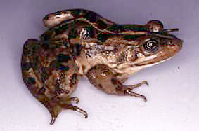
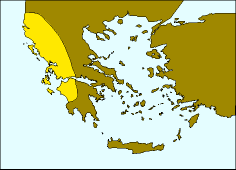

## Phylogeny 

-   « Ancestral Groups  
    -   [Western Palearctic water         frogs](Western_Palearctic_water_frogs)
    -   [Rana (Pelophylax)](Rana_%28Pelophylax%29)
    -   [Rana](../../../../Rana.md)
    -   [\'Ranidae\'](%27Ranidae%27)
    -   [Neobatrachia](../../../../../../Neobatrachia.md)
    -   [Salientia](../../../../../../../Salientia.md)
    -   [Living Amphibians](Living_Amphibians)
    -   [Terrestrial Vertebrates](../../../../../../../../../Terrestrial.md)
    -   [Sarcopterygii](../../../../../../../../../../Sarc.md)
    -   [Gnathostomata](../../../../../../../../../../../Gnath.md)
    -   [Vertebrata](../../../../../../../../../../../../Vertebrata.md)
    -   [Craniata](../../../../../../../../../../../../../Craniata.md)
    -   [Chordata](../../../../../../../../../../../../../../Chordata.md)
    -   [Deuterostomia](../../../../../../../../../../../../../../../Deutero.md)
    -   [Bilateria](Bilateria)
    -   [Animals](Animals)
    -   [Eukaryotes](Eukaryotes)
    -   [Tree of Life](../../../../../../../../../../../../../../../../../../Tree_of_Life.md)

-   ◊ Sibling Groups of  Western Palearctic water frogs
    -   [Rana saharica](Rana_saharica)
    -   [Rana perezi](Rana_perezi)
    -   Rana epeirotica
    -   [Rana shqiperica](Rana_shqiperica)
    -   [Rana lessonae](Rana_lessonae)
    -   [Rana cretensis](Rana_cretensis)
    -   [Rana cerigensis](Rana_cerigensis)
    -   [Rana bedriagae](Rana_bedriagae)
    -   [Rana ridibunda](Rana_ridibunda)

-   » Sub-Groups 

# *Rana epeirotica* 

[Peter Beerli](http://www.tolweb.org/)

Containing group: [Western Palearctic water frogs](../../Western Palearctic water frogs)

### Information on the Internet

[Peter Beerli\'s Water Frog Info-Pool](http://waterfrogs.csit.fsu.edu/)

## Introduction

Mid sized frogs (females 83±7.5 mm; males 74.4±7.4 mm) with mostly
greenish brown backs with many black spots, the flanks are yellowish.
Morphological features are distinct from other water frog species, but
are, as in all water frog species very variable (cf. Schneider et al.
1984). In biochemical characters (protein electrophoresis) the
distinction from other species is easy: private alleles so far known are
ALB:e, EST-5:a, MPI:b, 6PGDH:g, and sAAT:k (Hotz and Uzzell 1982, Beerli
1994).

### Distribution

The distribution of this species is restricted to the northwest of
Greece and the southern parts of Albania. The presence of this species
on the island Zakynthos has to be confirmed. *Rana epeirotica* lives in
sympatry with [*Rana ridibunda*](tree?group=Rana_ridibunda&contgroup=Western_Palearctic_water_frogs).

The map is a transverse Mercator projection and was created with GMT 3.0
([Wessel and Smith, 1995](http://www.agu.org/eos_elec/95154e.html)) and
postprocessed in Virtuoso on a NeXT, and then converted from eps to gif.
\[If you need maps, take a look at [GMT](http://gmt.soest.hawaii.edu/)
and create them yourself\]

### Voice

The following recordings a short sequences of longer recordings. These
files are size reduced (MULAW 8-bit encoded) from 16-bit encoded sound
files. \[[A single call](http://www.tolweb.org/tree/eukaryotes/animals/chordata/salientia/ranidae/rana_%28pelophylax%29/pbsounds/epeirotica.short.au),
[Several calls](http://www.tolweb.org/tree/eukaryotes/animals/chordata/salientia/ranidae/rana_%28pelophylax%29/pbsounds/epeirotica.au)\].

### Synonyms

Valid name: *Rana (Pelophylax) epeirotica* Schneider, Sofianidou, and
Kyriakopoulou 1984\
Synonyms: -

### References

Beerli, P. 1994. Genetic isolation and calibration of an average protein
clock in western Palearctic water frogs of the Aegean region.
Dissertation Universität Zürich 1994.
\[[Summary](http://www.tolweb.org/accessory/Genetic_Isolation_in_Western_Palearctic_Water_Frogs?acc_id=580)\]

Hotz, H. and T. Uzzell. 1982. Biochemically detected sympatry of two
water frog species: two different cases in the Adriatic Balkans
(Amphibia, Ranidae). Proceedings of the Academy of Natural Sciences of
Philadelphia 134: 50-79.

Schneider, H., T. S. Sofianidou and P. Kyriakopoulou-Sklavounou. 1984.
Bioacoustic and morphometric studies in water frogs (genus Rana) of Lake
Ioannina in Greece, and description of a new species (Anura, Amphibia).
Zeitschrift für zoologische Systematik und Evolutionsforschung 22(4):
349-366.

Sofianidou, T. S., and H. Schneider. 1989. Distribution range of the
Epeirus frog *Rana epeirotica* (Amphibia: Anura) and the composition of
the water frog populations in western Greece. Zoologischer Anzeiger
223(1/2): 13-25.

## Title Illustrations



  ----------
  Scientific Name ::  Rana epeirotica
  Copyright ::         © 1995 Hansjürg Hotz
  ----------
