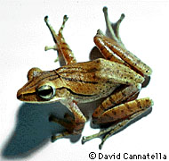
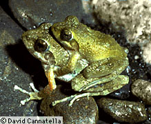

---
title: Rhacophoridae
---

# [[Rhacophoridae]]

Old World Treefrogs 

## #has_/text_of_/abstract 

> The **Rhacophoridae** are a family of frogs in tropical sub-Saharan Africa, South India and Sri Lanka, Japan, northeastern India to eastern China and Taiwan, south through the Philippines and Greater Sundas, and Sulawesi. They are commonly known as shrub frogs, or more ambiguously as "moss frogs" or "bush frogs". Some Rhacophoridae are called "tree frogs". Among the most spectacular members of this family are numerous "flying frogs".
>
> Although a few groups are primarily terrestrial, rhacophorids are predominantly arboreal treefrogs. Mating frogs, while in amplexus, hold on to a branch, and beat their legs to form a foam. The eggs are laid in the foam and covered with seminal fluid before the foam hardens into a protective casing. In certain species, this process occurs collectively. The foam is deposited above a water source, ensuring that the tadpoles drop into the water upon hatching.
>
> The species within this family vary in size from 1.5 to 12 cm (0.59 to 4.72 in). Like other arboreal frogs, they have toe discs, and those of the genus Chiromantis have two opposable fingers on each hand. This family also contains the Old World flying frogs, including Wallace's flying frog (Rhacophorus nigropalmatus). These frogs have extensive webbing between their fore and hind limbs, allowing them to glide through the air.
>
> [Wikipedia](https://en.wikipedia.org/wiki/Rhacophoridae)

## Introduction

[David Cannatella](http://www.tolweb.org/)

These Old World treefrogs are found in India, Sri Lanka, China, SE Asia,
Indonesia, Japan, the East Indes, and Madagascar; only Chiromantis is
found on continental Africa. Sometimes the mantelline ranids are
included in Rhacophoridae.

In general rhacophorids are much larger than hyperoliids, some up to 12
cm. These frogs are mostly arboreal, with flattened bodies. Many species
have broad, flat, relatively bony skulls. In many species the eggs are
laid in arboreal foam nests, and the newly hatched tadpoles fall into
water below to complete development. Some species have direct
development. Rhacophorus nigropalmatus is known to be a glider, using
its heavily webbed hands and feet to control its descent. Two
subfamilies are recognized: Philautinae and Rhacophorinae.

### Discussion of Phylogenetic Relationships

Ford and Cannatella (1993) defined Rhacophoridae to be the most recent
common ancestor of the ten genera listed in Duellman and Trueb (1986),
and all the descendants of that ancestor. Liem (1970) included the
mantellines (Laurentomantis, Mantella, and Mantidactylus) as part of
Rhacophoridae. However, BlommersSchlösser (1979) and Dubois (1981)
treated the mantellines as part of Ranidae. Channing\'s (1989) analysis
of Liem\'s (1970) data indicated that mantellines were nested within
rhacophorids. Therefore, if mantellines are excluded from Rhacophoridae,
as in Duellman and Trueb (1986), the latter is not monophyletic. If at
some later time the mantellines are demonstrated to be not nested within
Rhacophoridae, the taxon as we have defined it will still be
monophyletic, but it will not include mantellines.

Channing\'s (1989) analysis listed six synapomorphies of Rhacophoridae,
including mantelline ranids. Two of these are the fusion of the carpals
and fusion of the tarsals. However, the polarity of these states is
incorrect, given the widespread occurrence of these states in most
ranids, except for arthroleptines and astylosternines. The other four
synapomorphies are (1) only one slip of the extensor digitorum communis
longus muscle, inserting on distal portion of fourth metatarsal, (2)
outermost slip of the palmaris longus muscle inserting on the
proximolateral rim of the aponeurosis palmaris, (3) frontoparietal
trapezoidal, and (4) bifurcate terminal phalanx. The first two of these
show limited homoplasy consistency index of 0.5 for both, and neither
state is found in hyperoliids. The latter two show greater homoplasy
(consistency indices of 0.33 and 0.2, respectively), and also occur in
hyperoliids. If hyperoliids are not the sister-group of rhacophorids,
then the presence of intercalary elements is a synapomorphy of
Rhacophoridae, including mantellines.

Channing (1989) listed seven synapomorphies uniting the hyperoliids and
rhacophorids. However, given that his analysis assumed the monophyly of
these two groups, these apparent synapomorphies may be simply be an
artifact of the analysis. Three of these are related to arboreality
(modifications of the muscles to the fingers and toes, and expansion of
the digital tips). Two others (anterior process of the hyoid and shape
of the eighth vertebra) have the plesiomorphic state widely distributed
among both hyperoliids and rhacophorids. The last two of the seven are
part of one transformation series, and describe the degree of exposure
of the sphenethmoid.

## Phylogeny 

-   « Ancestral Groups  
    -   [Neobatrachia](../Neobatrachia.md)
    -   [Salientia](../../Salientia.md)
    -   [Living Amphibians](Living_Amphibians)
    -   [Terrestrial Vertebrates](../../../../Terrestrial.md)
    -   [Sarcopterygii](../../../../../Sarc.md)
    -   [Gnathostomata](../../../../../../Gnath.md)
    -   [Vertebrata](../../../../../../../Vertebrata.md)
    -   [Craniata](../../../../../../../../Craniata.md)
    -   [Chordata](../../../../../../../../../Chordata.md)
    -   [Deuterostomia](../../../../../../../../../../Deutero.md)
    -   [Bilateria](Bilateria)
    -   [Animals](Animals)
    -   [Eukaryotes](Eukaryotes)
    -   [Tree of Life](../../../../../../../../../../../../../Tree_of_Life.md)

-   ◊ Sibling Groups of  Neobatrachia
    -   [Allophryne ruthveni](Allophryne_ruthveni.md)
    -   [Brachycephalidae](Brachycephalidae.md)
    -   [Bufonidae](Bufonidae.md)
    -   [Heleophryne](Heleophryne.md)
    -   [\'Leptodactylidae\'](%27Leptodactylidae%27)
    -   [Limnodynastinae](Limnodynastinae.md)
    -   [Myobatrachinae](Myobatrachinae.md)
    -   [Sooglossidae](Sooglossidae.md)
    -   [Rhinoderma](Rhinoderma.md)
    -   [Dendrobatidae](Dendrobatidae.md)
    -   [Pseudidae](Pseudidae.md)
    -   [Hylidae](Hylidae.md)
    -   [Centrolenidae](Centrolenidae.md)
    -   [Microhylidae](Microhylidae.md)
    -   [Hemisus](Hemisus.md)
    -   [Arthroleptidae](Arthroleptidae.md)
    -   [\'Ranidae\'](%27Ranidae%27)
    -   [Hyperoliidae](Hyperoliidae.md)
    -   Rhacophoridae

-   » Sub-Groups 
	-   *Philautinae*
	    -   *Philautus*
	-   *Rhacophorinae*
	    -   *Aglyptodactylus*
	    -   *Boophis*
	    -   *Buergeria*
	    -   *Chirixalus*
	    -   *Chiromantis*
	    -   *Nyctixalus*
	    -   *Polypedates*
	    -   *Rhacophorus*
	    -   *Theloderma*

## Title Illustrations

------------------------------------------------------------------------

1\. Polypedates sp.; Thailand; photo © 1995 David Cannatella\
Copyright ::   © 1995 [David Cannatella](http://www.catfishlab.org/) 

------------------------------------------------------------------------
2. Buergeria japanicus, Taiwan; photo © 1995 David Cannatella
Copyright ::   © 1995 [David Cannatella](http://www.catfishlab.org/) 

## Confidential Links & Embeds: 

### #is_/same_as :: [Rhacophoridae](/_Standards/bio/bio~Domain/Eukaryotes/Animals/Bilateria/Deutero/Chordata/Craniata/Vertebrata/Gnath/Sarc/Tetrapods/Amphibians/Salientia/Neobatrachia/Rhacophoridae.md) 

### #is_/same_as :: [Rhacophoridae.public](/_public/bio/bio~Domain/Eukaryotes/Animals/Bilateria/Deutero/Chordata/Craniata/Vertebrata/Gnath/Sarc/Tetrapods/Amphibians/Salientia/Neobatrachia/Rhacophoridae.public.md) 

### #is_/same_as :: [Rhacophoridae.internal](/_internal/bio/bio~Domain/Eukaryotes/Animals/Bilateria/Deutero/Chordata/Craniata/Vertebrata/Gnath/Sarc/Tetrapods/Amphibians/Salientia/Neobatrachia/Rhacophoridae.internal.md) 

### #is_/same_as :: [Rhacophoridae.protect](/_protect/bio/bio~Domain/Eukaryotes/Animals/Bilateria/Deutero/Chordata/Craniata/Vertebrata/Gnath/Sarc/Tetrapods/Amphibians/Salientia/Neobatrachia/Rhacophoridae.protect.md) 

### #is_/same_as :: [Rhacophoridae.private](/_private/bio/bio~Domain/Eukaryotes/Animals/Bilateria/Deutero/Chordata/Craniata/Vertebrata/Gnath/Sarc/Tetrapods/Amphibians/Salientia/Neobatrachia/Rhacophoridae.private.md) 

### #is_/same_as :: [Rhacophoridae.personal](/_personal/bio/bio~Domain/Eukaryotes/Animals/Bilateria/Deutero/Chordata/Craniata/Vertebrata/Gnath/Sarc/Tetrapods/Amphibians/Salientia/Neobatrachia/Rhacophoridae.personal.md) 

### #is_/same_as :: [Rhacophoridae.secret](/_secret/bio/bio~Domain/Eukaryotes/Animals/Bilateria/Deutero/Chordata/Craniata/Vertebrata/Gnath/Sarc/Tetrapods/Amphibians/Salientia/Neobatrachia/Rhacophoridae.secret.md)

