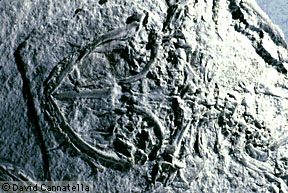

# [[Palaeobatrachidae]]  

 

## #has_/text_of_/abstract 

> **Palaeobatrachidae** is an extinct family of frogs known from the Late Cretaceous to the Pleistocene primarily of Europe. They were highly adapted to aquatic life, like other members of the Pipimorpha. The oldest undoubted records of the family are from the lower Campanian (83.6–77.9 million years ago) of France. By far the most abundant genus is Palaeobatrachus, known from the Eocene to Pleistocene of Europe, with most other named genera in the family synonymised with it, the only exception being Albionbatrachus, which is distinguished from Palaeobatrachus by characters of its frontoparietals. The youngest fossils of Palaeobatrachus date to around 500,000 years ago, during the Middle Pleistocene after which they likely became extinct due to increasing aridity and freezing temperatures during the ice ages. Fossils of indeterminate palaeobatrachids are also known from the Pliocene and Early Pleistocene of Western Siberia.
>
> [Wikipedia](https://en.wikipedia.org/wiki/Palaeobatrachidae) 

## Introduction

[David Cannatella](http://www.tolweb.org/)

The †Palaeobatrachidae is an extinct group of frogs. They lived from the
principally from the Eocene through Pliocene in Europe, but some fossils
are known from the Cretaceous (see below under Phylogenetic
Relationships. Like pipids, they were highly aquatic. Even the tadpoles
are well preserved as fossils! Their tadpoles lacked beaks and denticles
(Type 1 tadpoles). Palaeobatrachids resemble pipids in many other
features, such as elongate finger and toe bones, greatly expanded ilia
(hip bones), and elongate, nonpedicellate fanglike teeth. However the
vertebrae of these frogs was procoelous (articulating concavity on the
anterior end) rather than opisthocoelous (articulating concavity
posterior) as in pipids, and some of the vertebrae in the hip region
were fused to form a synsacrum. Some taxa are known to have an
additional bony element in the fourth finger and fifth toe (Estes and
Reig, 1973). Some palaeobatrachids reached a size of 120 mm snout-vent
length.

### Discussion of Phylogenetic Relationships

Ford and Cannatella (1993) defined †Palaeobatrachidae as commonly used:
the node-based name for the most recent common ancestor of
†Palaeobatrachus, †Neusibatrachus, †Pliobatrachus, †Albionbatrachus, and
†Lithobatrachus, and all of its descendants. Estes and Reig (1973)
allied †Palaeobatrachidae to the Pipidae, and Cannatella (1985) and
Cannatella and de Sá (1993) explicitly listed synapomorphies supporting
this relationship. Estes and Reig (1973) distinguished
†Palaeobatrachidae from Pipidae in having procoelous vertebrae
(apomorphic), a synsacrum (apomorphic), and the presence of
mentomeckelian bones (plesiomorphic). †Palaeobatrachus occidentalis
(Estes and Sanchíz, 1982) from the Cretaceous of North America is known
only from ilia, so its inclusion in †Palaeobatrachidae is somewhat
tentative. Likewise, the Jurassic-Cretaceous fossil †Neusibatrachus
(Seiffert, 1972) is procoelous, but lacks a synsacrum and some other
features found in the Tertiary fossils.

## Phylogeny 

-   « Ancestral Groups  
    -   [Salientia](../Salientia.md)
    -   [Living Amphibians](Living_Amphibians)
    -   [Terrestrial Vertebrates](../../../Terrestrial.md)
    -   [Sarcopterygii](../../../../Sarc.md)
    -   [Gnathostomata](../../../../../Gnath.md)
    -   [Vertebrata](../../../../../../Vertebrata.md)
    -   [Craniata](../../../../../../../Craniata.md)
    -   [Chordata](../../../../../../../../Chordata.md)
    -   [Deuterostomia](../../../../../../../../../Deutero.md)
    -   [Bilateria](Bilateria)
    -   [Animals](Animals)
    -   [Eukaryotes](Eukaryotes)
    -   [Tree of Life](../../../../../../../../../../../../Tree_of_Life.md)

-   ◊ Sibling Groups of  Salientia
    -   [Triadobatrachus         massinoti](Triadobatrachus_massinoti.md)
    -   [Vieraella herbsti](Vieraella_herbsti.md)
    -   [Notobatrachus degiustoi](Notobatrachus_degiustoi.md)
    -   [Ascaphus truei](Ascaphus_truei.md)
    -   [Leiopelma](Leiopelma.md)
    -   [Eodiscoglossus         santonjae](Eodiscoglossus_santonjae.md)
    -   [Bombinatoridae](Bombinatoridae.md)
    -   [Discoglossidae](Discoglossidae.md)
    -   [Eopelobatinae](Eopelobatinae.md)
    -   [Megophryidae](Megophryidae.md)
    -   [Pelobatidae](Pelobatidae.md)
    -   [Pelodytidae](Pelodytidae.md)
    -   [Rhinophrynidae](Rhinophrynidae.md)
    -   [\'Pipids\'](%27Pipids%27)
    -   Palaeobatrachidae
    -   [Pipidae](Pipidae.md)
    -   [Neobatrachia](Neobatrachia.md)

-   » Sub-Groups 
	-   *Albionbatrachus* †
	-   *Lithobatrachus* †
	-   *Neusibatrachus* †
	-   *Palaeobatrachus* †
	-   *Pliobatrachus* †

## Title Illustrations

--------------------------------------------------------------------------

Scientific Name ::     Palaeobatrachus
Comments             cast
Specimen Condition   Fossil
Copyright ::            © 1995 [David Cannatella](http://www.catfishlab.org/) 

## Confidential Links & Embeds: 

### [Palaeobatrachidae](/_Standards/bio/bio~Domain/Eukaryotes/Animals/Bilateria/Deutero/Chordata/Craniata/Vertebrata/Gnath/Sarc/Tetrapods/Amphibians/Salientia/Palaeobatrachidae.md) 

### [Palaeobatrachidae.public](/_public/bio/bio~Domain/Eukaryotes/Animals/Bilateria/Deutero/Chordata/Craniata/Vertebrata/Gnath/Sarc/Tetrapods/Amphibians/Salientia/Palaeobatrachidae.public.md) 

### [Palaeobatrachidae.internal](/_internal/bio/bio~Domain/Eukaryotes/Animals/Bilateria/Deutero/Chordata/Craniata/Vertebrata/Gnath/Sarc/Tetrapods/Amphibians/Salientia/Palaeobatrachidae.internal.md) 

### [Palaeobatrachidae.protect](/_protect/bio/bio~Domain/Eukaryotes/Animals/Bilateria/Deutero/Chordata/Craniata/Vertebrata/Gnath/Sarc/Tetrapods/Amphibians/Salientia/Palaeobatrachidae.protect.md) 

### [Palaeobatrachidae.private](/_private/bio/bio~Domain/Eukaryotes/Animals/Bilateria/Deutero/Chordata/Craniata/Vertebrata/Gnath/Sarc/Tetrapods/Amphibians/Salientia/Palaeobatrachidae.private.md) 

### [Palaeobatrachidae.personal](/_personal/bio/bio~Domain/Eukaryotes/Animals/Bilateria/Deutero/Chordata/Craniata/Vertebrata/Gnath/Sarc/Tetrapods/Amphibians/Salientia/Palaeobatrachidae.personal.md) 

### [Palaeobatrachidae.secret](/_secret/bio/bio~Domain/Eukaryotes/Animals/Bilateria/Deutero/Chordata/Craniata/Vertebrata/Gnath/Sarc/Tetrapods/Amphibians/Salientia/Palaeobatrachidae.secret.md)

