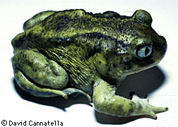
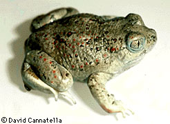
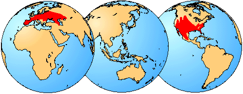

# [[Pelobatidae]]

## Spadefoot Toads 

    

## #has_/text_of_/abstract 

> The European spadefoot toads are a family of frogs, the **Pelobatidae**, 
> with only one extant genus Pelobates, containing six species. 
> They are native to Europe, the Mediterranean, northwestern Africa, and western Asia.
>
> [Wikipedia](https://en.wikipedia.org/wiki/European%20spadefoot%20toad) 
## Introduction

[David Cannatella](http://www.tolweb.org/) 

Pelobatidae are the European and American Spadefoot Toads. The content
of the family as used here is more restricted than many others use it.
The Asian megophryines and pelodytines were recognized as full families,
Megophryidae and Pelodytidae, by Cannatella (1985).

Living pelobatids are rotund with short limbs and large eyes with
vertical pupils. However, it is possible (but not yet demonstrated) that
the morphology of the living forms is convergent, because some fossil
pelobatids of the genus Eopelobates are rather gracile, lightly-built
animals. In order to burrow, spadefoot toads use the spade, a bony
element of the hindfoot capped with a keratinous cover. They do so
rear-first into the ground (most burrowing frogs do so rear-first, only
a very few such as Hemisus, enter the ground head-first).

The North American species have been placed in either one genus
(Scaphiopus) or two (Spea, for the smaller species). Each group is
monophyletic, so the division is somewhat arbitrary. However, the two
groups are different in morphology and ecology, so recognition of two
genera emphasizes the distinctiveness of each.

Pelobates are also well known as fossils from as far back as the Eocene
and extend to the present. Scaphiopus is known from the early Oligocene.
Macropelobates is from the Middle Oligocene.

### Geographic Distribution

The distribution of living members of the family Pelobatidae is
indicated in red.\

### Discussion of Phylogenetic Relationships

As generally used, Pelobatidae (for megophryines and pelobatines) is not
demonstrably monophyletic, because of the ambiguous relationships of
Pelodytes. Cannatella (1985) removed megophryids from Pelobatidae. The
name Pelobatidae was defined by Ford and Cannatella (1993) as the node
that is the most recent common ancestor of living Pelobates, Scaphiopus,
and Spea, and all of its descendants. Each of the aforementioned taxa is
monophyletic (Cannatella, 1985). Synapomorphies of Pelobatidae include
fusion of the joint between the sacrum and coccyx, exostosed
frontoparietals, and the presence of a metatarsal spade supported by a
well-ossified prehallux.

The definition of this name differs from that used by most other
workers, in that megophryines are excluded from Pelobatidae. The extinct
subfamily †Eopelobatinae\* (Spinar, 1972) is not included in the
definition because of uncertainty concerning the relationships and
monophyly of that taxon. Some †Eopelobates appear to be more closely
related to the living Pelobates than are Scaphiopus and Spea, so the
subfamily may be an artifact of placing a group of extinct forms into a
taxon. It is a metataxon of uncertain placement, either within
Pelobatoidea, or the sister taxon of Pelobatoidea.

## Phylogeny 

-   « Ancestral Groups  
    -   [Salientia](../Salientia.md)
    -   [Living Amphibians](Living_Amphibians)
    -   [Terrestrial Vertebrates](../../../Terrestrial.md)
    -   [Sarcopterygii](../../../../Sarc.md)
    -   [Gnathostomata](../../../../../Gnath.md)
    -   [Vertebrata](../../../../../../Vertebrata.md)
    -   [Craniata](../../../../../../../Craniata.md)
    -   [Chordata](../../../../../../../../Chordata.md)
    -   [Deuterostomia](../../../../../../../../../Deutero.md)
    -   [Bilateria](Bilateria)
    -   [Animals](Animals)
    -   [Eukaryotes](Eukaryotes)
    -   [Tree of Life](../../../../../../../../../../../../Tree_of_Life.md)

-   ◊ Sibling Groups of  Salientia
    -   [Triadobatrachus         massinoti](Triadobatrachus_massinoti.md)
    -   [Vieraella herbsti](Vieraella_herbsti.md)
    -   [Notobatrachus degiustoi](Notobatrachus_degiustoi.md)
    -   [Ascaphus truei](Ascaphus_truei.md)
    -   [Leiopelma](Leiopelma.md)
    -   [Eodiscoglossus         santonjae](Eodiscoglossus_santonjae.md)
    -   [Bombinatoridae](Bombinatoridae.md)
    -   [Discoglossidae](Discoglossidae.md)
    -   [Eopelobatinae](Eopelobatinae.md)
    -   [Megophryidae](Megophryidae.md)
    -   Pelobatidae
    -   [Pelodytidae](Pelodytidae.md)
    -   [Rhinophrynidae](Rhinophrynidae.md)
    -   [\'Pipids\'](%27Pipids%27)
    -   [Palaeobatrachidae](Palaeobatrachidae.md)
    -   [Pipidae](Pipidae.md)
    -   [Neobatrachia](Neobatrachia.md)

-   » Sub-Groups 

## Title Illustrations

-------------------------------------------------------------------------

Scientific Name ::  Scaphiopus holbrookii hurteri
Copyright ::         © 1995 [David Cannatella](http://www.catfishlab.org/) 

-------------------------------------------------------------------------

Scientific Name ::     Spea multiplicata
Specimen Condition   Live Specimen
Copyright ::            © 1995 [David Cannatella](http://www.catfishlab.org/) 

## Confidential Links & Embeds: 

### [Pelobatidae](/_Standards/bio/bio~Domain/Eukaryotes/Animals/Bilateria/Deutero/Chordata/Craniata/Vertebrata/Gnath/Sarc/Tetrapods/Amphibians/Salientia/Pelobatidae.md) 

### [Pelobatidae.public](/_public/bio/bio~Domain/Eukaryotes/Animals/Bilateria/Deutero/Chordata/Craniata/Vertebrata/Gnath/Sarc/Tetrapods/Amphibians/Salientia/Pelobatidae.public.md) 

### [Pelobatidae.internal](/_internal/bio/bio~Domain/Eukaryotes/Animals/Bilateria/Deutero/Chordata/Craniata/Vertebrata/Gnath/Sarc/Tetrapods/Amphibians/Salientia/Pelobatidae.internal.md) 

### [Pelobatidae.protect](/_protect/bio/bio~Domain/Eukaryotes/Animals/Bilateria/Deutero/Chordata/Craniata/Vertebrata/Gnath/Sarc/Tetrapods/Amphibians/Salientia/Pelobatidae.protect.md) 

### [Pelobatidae.private](/_private/bio/bio~Domain/Eukaryotes/Animals/Bilateria/Deutero/Chordata/Craniata/Vertebrata/Gnath/Sarc/Tetrapods/Amphibians/Salientia/Pelobatidae.private.md) 

### [Pelobatidae.personal](/_personal/bio/bio~Domain/Eukaryotes/Animals/Bilateria/Deutero/Chordata/Craniata/Vertebrata/Gnath/Sarc/Tetrapods/Amphibians/Salientia/Pelobatidae.personal.md) 

### [Pelobatidae.secret](/_secret/bio/bio~Domain/Eukaryotes/Animals/Bilateria/Deutero/Chordata/Craniata/Vertebrata/Gnath/Sarc/Tetrapods/Amphibians/Salientia/Pelobatidae.secret.md)

